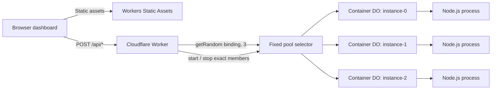

# Warm Pool POC Internal Braindump

> Internal working notes. This is intentionally more detailed and less polished than the public README. It records what was built, why decisions were made, what failed, how failures were fixed, what was installed on the development machine, and what was verified. Do not treat measured timings as Cloudflare platform benchmarks.

## Document Purpose

This document is source material for:

- The public project README.
- An internal architecture decision record.
- A demo runbook and presenter talk track.
- A test and validation report.
- An operations and troubleshooting guide.
- A future blog post or internal enablement article.
- Phase-two planning.

Implementation occurred on 2026-08-20 local time, with some logs and deployed events dated 2026-08-21 UTC.

## Executive Summary

We built and deployed a working proof of concept for an application-managed fixed warm pool using Cloudflare Workers Containers.

The implementation has:

- One Cloudflare Worker.
- One Container-enabled Durable Object class named `DemoContainer`.
- Three fixed `lite` instances.
- Deterministic lifecycle control over `instance-0`, `instance-1`, and `instance-2`.
- Random job routing across the same set with `getRandom(env.WARM_POOL, 3)`.
- Parallel prewarming with readiness checks.
- Graceful stop plus explicit waiting for the process to exit.
- A dependency-free Node.js container process.
- A disclosed three-second simulated application initialization delay.
- A disclosed 500 ms simulated job.
- A responsive, framework-free dashboard.
- Structured Worker and container logs.
- A comprehensive lifecycle smoke test.
- Local Docker/Colima validation on Apple Silicon.
- A deployed `workers.dev` demonstration.

Live deployment:

<https://warm-pool-poc.ramin-s-se-account.workers.dev>

Final verification status:

| Area | Result |
| --- | --- |
| TypeScript | Passed |
| Generated Wrangler binding types | Current and passed |
| Dependency audit | Zero vulnerabilities reported |
| Worker dry-run | Passed |
| Direct Node.js container contract | Passed |
| `linux/amd64` Docker image | Built and passed |
| Local smoke run 1 | Passed |
| Local smoke run 2 with 60-second hold | Passed |
| Deployed smoke run 1 | Passed |
| Deployed smoke run 2 with 60-second hold | Passed |
| Desktop rendering | Passed at 1440 px |
| Mobile rendering | Passed at 390 px |
| Worker and Durable Object live tail | Passed |
| Final production stop cleanup | Passed |

## Product Truth

Use this exact statement in public or customer-facing material:

> Cloudflare Containers does not currently provide managed stateless autoscaling or a managed warm-pool mode. This POC implements a fixed warm pool in application code, prewarms its members, and routes work across them.

Important accuracy language:

- The three-second delay is simulated application initialization.
- It can represent model loading, index construction, dependency initialization, or another expensive application startup task.
- It is not Cloudflare's native container startup time.
- Reported cold timings include synthetic initialization plus platform, Durable Object, container, and network overhead.
- Reported warm timings include the 500 ms synthetic job plus platform and network overhead.
- The POC demonstrates a relative cold-versus-warm pattern, not a platform benchmark.
- This is not managed autoscaling.
- This is not a managed warm-pool product mode.
- Warm availability is not an uptime guarantee because the platform may replace an instance.

## Original Goal

The goal was to build the smallest useful repository that visibly proves:

1. A fixed set of container instances can be started before work arrives.
2. Requests can be randomly distributed across that fixed set.
3. Warm requests reuse already-running processes.
4. Prewarming moves application initialization cost out of the user-facing job path.
5. The pool can be stopped and restarted for a repeatable demonstration.

## Scope That Was Implemented

- One Worker and one Container Durable Object class.
- Three fixed `lite` instances.
- `max_instances: 3` as the production ceiling.
- Parallel prewarm of all deterministic members.
- Random routing using the pinned helper.
- Explicit stop/reset behavior.
- Graceful process shutdown.
- Stable process identity through boot IDs.
- Container and Worker timing measurements.
- Static dashboard assets served with Workers Static Assets.
- Worker-first routing for `/api/*`.
- Structured JSON logs and full observability sampling for the low-volume POC.
- Local and deployed end-to-end smoke testing.
- Documentation and demo guidance.

## Deliberate Non-Goals

The following did not enter phase one:

- R2 input or output.
- Queues.
- Retries or a dead-letter queue.
- Persistent job state.
- D1 or KV.
- Cron Triggers.
- Durable Object alarms for keep-alive behavior.
- Dynamic pool sizing.
- Managed autoscaling claims.
- A real ML model or video workload.
- Throughput, bandwidth, or cost benchmarking.
- Placement controls.
- Multi-region orchestration.
- Production authentication or authorization.
- Production availability guarantees.

## Repository State

The project directory contains:

```text
warm-pool-poc/
|-- container/
|   `-- server.mjs
|-- public/
|   |-- app.js
|   |-- index.html
|   `-- styles.css
|-- scripts/
|   `-- smoke.mjs
|-- src/
|   `-- index.ts
|-- .dockerignore
|-- .gitignore
|-- Dockerfile
|-- INTERNAL-BRAINDUMP.md
|-- package-lock.json
|-- package.json
|-- README.md
|-- sprint.md
|-- tsconfig.json
|-- worker-configuration.d.ts
`-- wrangler.jsonc
```

The workspace was not a Git repository during implementation. No commits or tags were created.

## Key File Responsibilities

| File | Responsibility |
| --- | --- |
| `src/index.ts` | Worker routing, Container class, fixed member names, prewarm, stop, jobs, validation, and logs |
| `container/server.mjs` | Synthetic application process, identity, health, work, delays, counters, logs, and shutdown |
| `public/index.html` | Semantic dashboard structure and all accuracy disclosures |
| `public/styles.css` | Editorial control-room visual design and responsive layouts |
| `public/app.js` | Dashboard state, API calls, controls, summaries, distribution, errors, and tables |
| `scripts/smoke.mjs` | End-to-end contract, lifecycle, timing, identity, hold, and cleanup assertions |
| `Dockerfile` | Non-root Node.js image constrained to `linux/amd64` |
| `wrangler.jsonc` | Worker, container, Durable Object, static assets, migration, and observability configuration |
| `worker-configuration.d.ts` | Generated runtime and binding types |
| `README.md` | Public setup, deployment, API, demo, cleanup, and troubleshooting guide |
| `sprint.md` | Original scope, acceptance criteria, work plan, and phase-two backlog |

## Architecture



Request flows:

```text
Prewarm:
Browser -> Worker -> instance-0, instance-1, instance-2 concurrently
                  -> startAndWaitForPorts()
                  -> GET /health

Job:
Browser -> Worker -> getRandom(WARM_POOL, 3)
                  -> selected Durable Object
                  -> selected process POST /work

Stop:
Browser -> Worker -> instance-0, instance-1, instance-2 concurrently
                  -> stop()
                  -> wait until container state is stopped
```

## Fixed Pool Contract

The fixed pool is intentionally defined in one Worker module:

```text
POOL_SIZE = 3
instance-0
instance-1
instance-2
```

The package source for `@cloudflare/containers@0.3.7` was inspected. Its `getRandom(binding, instances)` implementation selects a number from `0` through `instances - 1` and resolves the Durable Object name `instance-${id}`.

This creates an important coupling:

- Deterministic prewarm must target those exact names.
- Deterministic stop must target those exact names.
- Random job routing must use the same pool size.
- The package must remain pinned.
- Any package upgrade requires source revalidation and a full smoke test.

If the helper naming contract changes, replace both lifecycle and routing selection with one explicit shared selector rather than allowing the sets to diverge.

## Worker Implementation

The Worker exports `DemoContainer`, which extends `Container<Env>`.

Container class settings:

| Setting | Value |
| --- | --- |
| `defaultPort` | `8080` |
| `sleepAfter` | `10m` |
| `enableInternet` | `false` |

The Worker provides these endpoints:

| Method | Path | Behavior |
| --- | --- | --- |
| `GET` | `/api/health` | Returns Worker health without contacting the container binding |
| `POST` | `/api/pool/prewarm` | Starts and health-checks all three members concurrently |
| `POST` | `/api/pool/stop` | Gracefully stops and waits for all three members concurrently |
| `POST` | `/api/jobs` | Normalizes and randomly routes one job |

All API responses:

- Use JSON.
- Set `Cache-Control: no-store`.
- Set `Content-Type: application/json; charset=utf-8`.
- Return structured errors.
- Avoid returning browser-visible stack traces.

Request validation:

- Job bodies are limited to 4096 bytes.
- Missing bodies are accepted.
- Malformed JSON returns `400`.
- JSON must be an object.
- `jobId` must be a string when supplied.
- `jobId` is limited to 128 characters.
- Missing or blank job IDs are generated with `crypto.randomUUID()`.
- Unsupported methods return `405` with an `Allow` header.
- Unknown `/api/*` paths return structured `404` responses.

Container response validation:

- Identity responses must include `ok`, `instanceId`, `bootId`, and `startedAt`.
- Work responses must also include the expected `jobId`, `requestCount`, and `processingMs`.
- Invalid or failed container responses become generic structured `502` responses.
- Detailed failure messages remain in structured logs.

## Parallel Prewarm Design

Prewarm behavior:

1. Build one stub for each deterministic name.
2. Launch all member operations before awaiting completion.
3. Use `Promise.allSettled()` so one failure does not hide the other results.
4. Call `startAndWaitForPorts()` for port 8080.
5. Allow up to 30 seconds for port readiness.
6. Fetch `/health` from every successfully started process.
7. Validate process identity.
8. Return member-level timing and status.
9. Require three unique boot IDs for top-level success.
10. Return `503` if the complete pool is not ready.

Parallelism is verified by comparing total prewarm time with the slowest member startup time. A serialized implementation would approach the sum of all member startup times instead.

## Stop and Restart Design

The final stop design has an important custom method:

```text
DemoContainer.stopAndWait()
```

Behavior:

1. Call the inherited graceful `stop()`, which sends `SIGTERM`.
2. Poll `getState()` every 100 ms.
3. Return only after the state becomes `stopped` or `stopped_with_code`.
4. Fail after 10 seconds if the process does not stop.

Why this exists:

- The inherited `stop()` resolves after sending the signal and processing already-pending stop events.
- It does not necessarily mean the process has exited by the time the RPC returns.
- A rapid stop-then-start sequence can otherwise race the old process shutdown.
- This race occurred in the first complete local smoke run and produced a real partial prewarm failure.
- Waiting for terminal state made the automated and dashboard workflows repeatable.

The process still receives `SIGTERM`; this is not a forced `SIGKILL` reset.

## Job Routing Design

Job behavior:

1. Validate and normalize the request body.
2. Create a job ID when one is absent.
3. Log `job.started`.
4. Await `getRandom(env.WARM_POOL, 3)`.
5. Forward a new normalized `POST http://container/work` request.
6. Parse and validate the response.
7. Add `workerElapsedMs`.
8. Log `job.completed` or `job.failed`.

The Worker does not expose which deterministic member name was selected because the helper returns a stub, not the selected name. Process identity is demonstrated through `bootId` and `instanceId` instead.

## Container Application

The application uses only Node.js standard library modules:

- `node:crypto` for process UUID generation.
- `node:http` for the HTTP server.
- `node:os` for the hostname.

No npm dependencies are installed inside the image.

Process-level state:

| Value | Behavior |
| --- | --- |
| `bootId` | Generated once with `randomUUID()` |
| `startedAt` | Recorded once before initialization |
| `instanceId` | Read once from the OS hostname |
| `requestCount` | Incremented after each completed work delay |

Startup behavior:

1. Read `STARTUP_DELAY_MS`, defaulting to 3000.
2. Read `WORK_DELAY_MS`, defaulting to 500.
3. Log `container.initializing`.
4. Wait for the startup delay without opening port 8080.
5. Listen on `0.0.0.0:8080`.
6. Log `container.ready`.

`GET /health` behavior:

- Returns identity metadata immediately.
- Does not wait 500 ms.
- Does not increment `requestCount`.
- Rejects unsupported methods.

`POST /work` behavior:

- Reads at most 4096 bytes.
- Requires valid JSON object syntax.
- Uses only the job ID from the request.
- Logs one start and one completion event.
- Waits asynchronously for the configured work interval.
- Supports concurrent requests without blocking the event loop.
- Increments the process-level counter.
- Returns identity, timing, job ID, and count.

Shutdown behavior:

- Handles `SIGTERM` and `SIGINT`.
- Logs `container.stopping` once.
- Stops accepting new requests.
- Waits for active requests through `server.close()`.
- Forces connection closure after a five-second safety timeout.
- Exits cleanly when active requests finish.

## Docker Image

Image design:

| Property | Value |
| --- | --- |
| Base | `node:22-alpine` |
| Target OS | Linux |
| Target architecture | `amd64` |
| Runtime user | `node` |
| Exposed port | `8080/tcp` |
| Package installation | None |
| Copied application | Only `container/server.mjs` |

The Dockerfile currently uses:

```dockerfile
FROM --platform=linux/amd64 node:22-alpine
```

BuildKit emits `FromPlatformFlagConstDisallowed` because the platform value is constant. This warning is currently accepted intentionally because:

- Cloudflare Containers requires a `linux/amd64` image.
- The development host is Apple Silicon.
- Wrangler did not pass an explicit platform to the build command.
- Removing the constant would risk producing an ARM image locally.
- The built image was inspected and confirmed as `linux/amd64`.

Potential future cleanup:

- Use a Wrangler-supported explicit image platform option if one becomes available.
- Use a build pipeline that always passes `--platform linux/amd64`.
- Pin the base image by digest if fully reproducible builds become a priority.

Observed local image details:

| Check | Result |
| --- | --- |
| Architecture | `amd64` |
| OS | `linux` |
| User | `node` |
| Exposed ports | Only `8080/tcp` |
| Approximate disk usage | 232 MB in the local Docker store |
| Approximate content size | 58 MB |

## Dashboard

The dashboard is intentionally framework-free and dependency-free.

Visual direction:

- Editorial operations control room.
- Dark header with warm paper content area.
- Orange signal color and yellow accent.
- Serif display type mixed with condensed and monospace system fonts.
- No external fonts or frontend package downloads.
- No generic card-dashboard framework.

Controls:

- Stop Pool.
- Send One Job.
- Prewarm Pool.
- Run 12 Jobs.
- Clear Results.

Behavior:

- Calls Worker health on page load without starting a container.
- Disables all controls while a lifecycle or job action is active.
- Uses a 120-second browser request timeout.
- Always restores controls in a `finally` path.
- Runs 12 jobs concurrently with `Promise.all()`.
- Keeps results only in memory.
- Does not use local storage, KV, D1, or Durable Object storage.
- Clears stale browser state on reload.
- Uses DOM text nodes instead of injecting API content as HTML.
- Displays structured API errors.

Displayed evidence:

- Fixed pool size.
- Application-managed product statement.
- Simulated initialization disclosure.
- Current action and status.
- Browser-observed latency.
- Worker-observed latency.
- Container processing time.
- Instance ID.
- Shortened boot ID with full value in a tooltip.
- Process start time.
- Process request count.
- Cold/new-boot average.
- Warm/reused average.
- Latest prewarm time.
- Jobs grouped by boot ID.
- Per-process random distribution bars.
- One row per job, including failures.

Cold/warm classification in the browser:

- A boot ID returned by prewarm is classified warm.
- A boot ID already observed by the browser is classified reused/warm.
- A boot ID not previously observed is classified new/cold.
- On a fresh page load against an already-running process, the first observed ID may be labeled new because browser state is intentionally not persisted.
- The prescribed demo begins with Stop Pool, so the primary demo classification remains accurate.

Concurrent request-count rendering uses the maximum observed value so an out-of-order response cannot make the displayed count move backward.

Responsive verification:

- Desktop full-page rendering was checked at 1440 by 900.
- Mobile full-page rendering was checked at 390 by 844.
- Controls stack vertically on mobile.
- Summary cards stack vertically.
- Pool-member panels stack vertically.
- Result-table rows become labeled mobile cards.
- Focus styles, semantic headings, buttons, status regions, and a skip link are present.
- Reduced-motion preferences are respected.

Screenshots were created in a temporary test directory and were not committed to the project.

## Smoke Test

The smoke runner is `scripts/smoke.mjs`.

Usage:

```bash
npm run smoke -- http://localhost:8787
npm run smoke -- http://localhost:8787 --hold-seconds 60
npm run smoke -- https://warm-pool-poc.ramin-s-se-account.workers.dev
npm run smoke -- https://warm-pool-poc.ramin-s-se-account.workers.dev --hold-seconds 60
```

Sequence:

1. Check Worker health.
2. Assert pool size is three.
3. Verify wrong-method behavior.
4. Verify malformed JSON behavior.
5. Verify unknown API behavior.
6. Verify every API response uses `Cache-Control: no-store`.
7. Fetch the static dashboard.
8. Verify the dashboard includes both accuracy disclosures.
9. Stop the complete pool.
10. Send one cold job.
11. Assert cold Worker timing includes at least the three-second synthetic delay.
12. Stop the pool again.
13. Prewarm all members.
14. Assert exactly three successful member records.
15. Assert three unique prewarmed boot IDs.
16. Assert the post-stop prewarm IDs differ from the previous cold boot.
17. Assert prewarm approximates one parallel startup window.
18. Send 12 jobs concurrently.
19. Assert every returned boot ID belongs to the prewarmed set.
20. Assert container processing does not include the three-second startup interval.
21. Assert average warm Worker time is below cold Worker time.
22. Optionally wait and verify boot reuse after a hold interval.
23. Stop the pool in `finally`, on success or failure.
24. Print progress, a human summary, and compact JSON.

An early version of the smoke test required every warm end-to-end Worker request to complete under three seconds. That was removed because platform and network scheduling can increase end-to-end time without replaying application initialization. The more accurate assertions are:

- Container-reported processing remains below the synthetic initialization interval.
- Every warm boot ID belongs to the prewarmed set.
- Average warm Worker time remains below cold Worker time.

This change reduces false failures without weakening the core proof.

## Structured Logging

Worker event names:

```text
pool.prewarm.started
pool.prewarm.member.ready
pool.prewarm.member.failed
pool.prewarm.completed
pool.stop.started
pool.stop.member.completed
pool.stop.completed
job.started
job.completed
job.failed
```

Additional Worker error event:

```text
api.failed
```

Container event names:

```text
container.initializing
container.ready
container.work.started
container.work.completed
container.stopping
```

Additional container error event:

```text
container.request.failed
```

Logging rules implemented:

- Job IDs are logged where useful.
- Full request bodies are not logged.
- Authorization headers are not logged by application code.
- Secrets are not logged.
- Worker errors include names and internal messages in logs.
- Browser errors remain generic.
- Actions have one start and one completion event.

Production live-tail verification showed:

- Stateless Worker request events.
- `job.started` and `job.completed` structured logs.
- Durable Object execution events.
- `DemoContainer` fetch events.
- `stopAndWait` RPC events.
- Pool stop member and completion logs.
- No Worker or Durable Object exceptions for the validation request.

Container stdout was directly verified locally. Production container logging is enabled in the deployed application and is intended to be inspected in the Containers dashboard.

## Wrangler Configuration

Key values:

| Field | Value |
| --- | --- |
| Worker name | `warm-pool-poc` |
| Main module | `src/index.ts` |
| Compatibility date | `2026-08-20` |
| Compatibility flags | `nodejs_compat` |
| Container class | `DemoContainer` |
| Image | `./Dockerfile` |
| Instance type | `lite` |
| Maximum instances | `3` |
| Durable Object binding | `WARM_POOL` |
| Migration | SQLite-backed `DemoContainer` in `v1` |
| Static directory | `./public` |
| Static binding | `ASSETS` |
| Worker-first routes | `/api/*` |
| Logs sampling | `1` |
| Traces sampling | `1` |

Full sampling is suitable for this low-volume temporary POC. It should be reviewed before any meaningful production traffic.

## Project Dependencies

All project dependencies are exact pins:

| Package | Version | Purpose |
| --- | --- | --- |
| `@cloudflare/containers` | `0.3.7` | Container Durable Object class and helper functions |
| `wrangler` | `4.125.0` | Local development, generated types, deployment, and tailing |
| `typescript` | `7.0.2` | Strict Worker type checking |
| `@types/node` | `26.2.0` | Node types required with `nodejs_compat` generation |

Node engine declaration:

```text
>=22
```

Development machine versions observed:

| Tool | Version |
| --- | --- |
| Node.js | `26.0.0` |
| npm | `11.12.1` |
| Docker CLI | `29.7.2` |
| Docker Engine in Colima | `29.5.2` |
| Colima | `0.10.3` |
| Docker Buildx | `0.36.1` |
| Lima | `2.2.0` |

## Development Machine Setup

Host characteristics:

- macOS.
- Apple Silicon `arm64`.
- Homebrew installed at `/opt/homebrew`.
- Wrangler already authenticated through OAuth.
- The authenticated account had Workers and Containers write permissions.
- Docker was not installed at the start of the session.

Homebrew packages installed during implementation:

```bash
brew install docker colima
brew install docker-buildx
```

Docker Buildx plugin discovery was added to `~/.docker/config.json`:

```json
{
  "cliPluginsExtraDirs": [
    "/opt/homebrew/lib/docker/cli-plugins"
  ]
}
```

Existing Docker configuration values were preserved.

Colima was started with:

```bash
colima start --cpus 2 --memory 4 --disk 20 --vm-type vz --vz-rosetta
```

Why these settings:

- Two CPUs and 4 GiB were sufficient for the POC.
- A 20 GiB data disk avoided the larger default allocation.
- Apple Virtualization Framework provided the VM.
- Rosetta enabled execution of `linux/amd64` containers on Apple Silicon.
- Colima also configured foreign-architecture emulation.

Current local engine state:

- Colima is installed.
- Its configuration and VM disk persist.
- Colima was stopped after final verification.
- Restart with `colima start` or the explicit command above before local development.

## Corporate TLS Trust Setup

The first Docker Hub pull failed inside the new Colima VM:

```text
x509: certificate signed by unknown authority
```

Root cause:

- Host HTTPS traffic was being inspected by the existing Cloudflare Corporate Zero Trust root.
- macOS trusted that root.
- The newly-created Linux VM did not yet trust it.
- Docker Engine runs inside the VM, so host keychain trust alone was insufficient.

Resolution:

1. Locate the existing `Cloudflare Corporate Zero Trust` root in the macOS System keychain.
2. Export that existing trusted root.
3. Add it to the Colima VM at `/usr/local/share/ca-certificates/cloudflare-corporate.crt`.
4. Run `update-ca-certificates` inside the VM.
5. Restart Docker inside the VM.
6. Confirm a Docker Hub TLS request returns the expected authenticated-registry `401`, not a certificate error.
7. Confirm `docker run --rm hello-world` succeeds.

TLS verification was not disabled. No insecure registry setting was added.

If the Colima VM is deleted and recreated, this trust step may need to be repeated.

## Docker and Wrangler Setup Lessons

Wrangler local Containers development required more than a Docker CLI binary.

Observed sequence:

1. `docker` and Colima were installed.
2. Docker Engine became healthy.
3. A direct legacy `docker build` succeeded.
4. `wrangler dev` failed because it invokes a Buildx-style build with `--load`.
5. The Homebrew Docker package did not include Buildx automatically.
6. `docker-buildx` was installed.
7. The Docker CLI plugin directory was added to Docker configuration.
8. `docker buildx version` succeeded.
9. `wrangler dev` built the image and launched correctly.

Representative failure:

```text
unknown flag: --load
Docker build exited with code: 125
```

The general lesson is to test `docker buildx version`, not only `docker --version`, before debugging Wrangler image builds.

## Other Implementation Lessons

### Wrangler Validates Referenced Image Paths Early

`wrangler types` initially failed because `wrangler.jsonc` referenced `./Dockerfile` before the Dockerfile existed.

Lesson:

- Create the referenced Dockerfile before generated types or configuration validation.
- Wrangler performs meaningful configuration validation even for commands that do not deploy.

### A Normal Dry-Run Still Builds Containers

`wrangler deploy --dry-run` attempted to build the configured image and therefore required Docker.

For Worker-only validation without changing or building the container image:

```bash
npx wrangler deploy --dry-run --containers-rollout=none
```

This validates Worker bundling and bindings but does not validate image changes.

### Stop Means Signal Sent, Not Necessarily Process Gone

This was the most important runtime discovery.

First full local smoke behavior:

- API contract checks passed.
- Initial stop passed.
- Cold job passed.
- Second stop returned success.
- Immediate prewarm returned `503`.
- One member failed almost immediately with `Container is not listening to port 8080`.
- The other two members became ready.
- Smoke cleanup still ran and passed.

Root cause:

- The previous process was still exiting after `stop()` returned.
- Immediate restart raced shutdown on the same deterministic instance.

Fix:

- Add `stopAndWait()` and wait for terminal container state.

Result:

- All subsequent local and deployed smoke tests passed.

### Random Routing Is Visibly Uneven

The 12-job samples were often uneven:

- `3 / 1 / 8`
- `2 / 3 / 7`
- `1 / 2 / 9`
- `1 / 7 / 4`

This is expected from random selection and reinforces the demo guidance:

- Say random, not round robin.
- Do not promise equal distribution over a small sample.
- Increase sample size if visual balance matters.
- The correctness assertion is set membership, not evenness.

### Container CLI Counts Need Careful Interpretation

After stopping the pool, `wrangler containers list` still displayed three live instances for the application. Detailed application info showed `active: 0` while the application remained ready with three known/healthy instance slots.

Lesson:

- Do not use the summary count alone as proof that application processes are actively running.
- Use API lifecycle results, process boot IDs, request behavior, detailed active counts, and logs together.
- The fixed set can remain known to the application even when processes have been signaled to stop.

### Preview URLs Are Not the Final Validation Path

Container Workers use Durable Objects. Normal Worker preview URLs are not generated for this use case.

Required validation paths:

- Local `wrangler dev` with Docker.
- An actual deployment.

### Initial Production Provisioning Is Slower

The first deployed cold and prewarm actions were materially slower than direct process initialization and local development.

This is expected because measurements include provisioning and network overhead. It is another reason not to present the three-second synthetic interval as Cloudflare cold-start performance.

## Direct Container Verification

The Node.js process was tested directly before Docker was available.

Accelerated contract test:

- Startup delay overridden to 100 ms.
- Work delay overridden to 50 ms.
- Health identity remained stable.
- Work counts incremented from 1 to 2.
- Work completed near 50 ms.
- `SIGTERM` produced `container.stopping`.

Default timing test:

| Measurement | Observed |
| --- | --- |
| Port ready | 3225 ms |
| Container processing | 501 ms |
| Client work request | 507 ms |
| Request count | 1 |
| Boot ID stability | Passed |
| Shutdown event | Passed |

The test also confirmed port 8080 was unavailable before initialization finished.

## Docker Image Verification

Standalone build command:

```bash
docker build --platform linux/amd64 -t warm-pool-poc:test .
```

Three concurrent work requests against the running image produced:

| Request | Processing | Count |
| --- | --- | --- |
| 1 | 502 ms | 1 |
| 2 | 503 ms | 2 |
| 3 | 504 ms | 3 |

This verified:

- The image runs under AMD64 emulation.
- The server handles concurrent work.
- Work delays overlap instead of serially blocking the event loop.
- One stable boot ID is shared by the process.
- Counters remain process local.
- Graceful shutdown logging works inside Docker.

## Local End-to-End Results

### Local Passing Run 1

| Measurement | Result |
| --- | --- |
| Cold Worker elapsed | 4089 ms |
| Parallel prewarm total | 4171 ms |
| Unique prewarmed boot IDs | 3 |
| Warm jobs | 12 |
| Average warm Worker elapsed | 527 ms |
| Maximum warm Worker elapsed | 533 ms |
| Random distribution | `3 / 1 / 8` |
| Cleanup | 103 ms, passed |

### Local Passing Run 2 With 60-Second Hold

| Measurement | Result |
| --- | --- |
| Cold Worker elapsed | 4072 ms |
| Parallel prewarm total | 3923 ms |
| Unique prewarmed boot IDs | 3 |
| Warm jobs | 12 |
| Average warm Worker elapsed | 518 ms |
| Maximum warm Worker elapsed | 524 ms |
| Random distribution | `2 / 3 / 7` |
| Hold interval | 60 seconds |
| Held-job Worker elapsed | 514 ms |
| Held boot ID in prewarmed set | Passed |
| Cleanup | 103 ms, passed |

## Deployed End-to-End Results

### Deployed Passing Run 1

| Measurement | Result |
| --- | --- |
| Cold Worker elapsed | 8000 ms |
| Parallel prewarm total | 10467 ms |
| Unique prewarmed boot IDs | 3 |
| Warm jobs | 12 |
| Average warm Worker elapsed | 628 ms |
| Maximum warm Worker elapsed | 674 ms |
| Random distribution | `1 / 2 / 9` |
| Cleanup | 177 ms, passed |

### Deployed Passing Run 2 With 60-Second Hold

| Measurement | Result |
| --- | --- |
| Cold Worker elapsed | 5262 ms |
| Parallel prewarm total | 12618 ms |
| Unique prewarmed boot IDs | 3 |
| Warm jobs | 12 |
| Average warm Worker elapsed | 633 ms |
| Maximum warm Worker elapsed | 672 ms |
| Random distribution | `1 / 7 / 4` |
| Hold interval | 60 seconds |
| Held-job Worker elapsed | 642 ms |
| Held boot ID in prewarmed set | Passed |
| Cleanup | 354 ms, passed |

Additional production tail-check request:

| Measurement | Result |
| --- | --- |
| Cold Worker elapsed | 5830 ms |
| Worker structured logs | Passed |
| Durable Object event | Passed |
| Stop RPC events | Passed |
| Cleanup | 775 ms, passed |

## How To Interpret the Measurements

Direct process readiness near 3.2 seconds proves the configured synthetic startup delay is behaving correctly.

Local Worker cold timing near 4.1 seconds includes:

- Synthetic initialization.
- Local Durable Object and container orchestration.
- Local proxy overhead.
- The 500 ms work interval.

Production cold timing between roughly 5.3 and 8.0 seconds includes:

- Synthetic initialization.
- Platform provisioning or startup.
- Worker and Durable Object routing.
- Container networking.
- The 500 ms work interval.
- Client network overhead outside `workerElapsedMs`.

Production parallel prewarm between roughly 10.5 and 12.6 seconds does not mean three starts were serialized. All starts were launched concurrently, and each can incur independent platform provisioning delay.

Warm jobs near 0.5 to 0.7 seconds demonstrate:

- The process was already running.
- The boot ID belonged to the prewarmed set.
- Container processing remained close to the 500 ms synthetic job.
- The three-second initialization was not repeated in the job path.

Do not derive pricing, throughput limits, placement guarantees, or native cold-start claims from these values.

## Deployment

Deployment command:

```bash
npm run deploy
```

Deployment result:

- Three static assets uploaded.
- Worker startup time reported as 5 ms.
- Worker binding to `WARM_POOL` created.
- Static assets binding created.
- Container image built locally.
- Image pushed to Cloudflare Registry.
- Container application created.
- Durable Object migration applied.
- `max_instances` confirmed as three.
- Instance type confirmed as `lite`.
- Container network confirmed private with no public IP assignment.
- Worker deployed to the live URL.

Sensitive account, application, namespace, and version identifiers are intentionally omitted from this document.

## Registry Credential Cleanup

Wrangler authenticated Docker to Cloudflare Registry during deployment. Docker warned that credentials were stored unencrypted in `~/.docker/config.json`.

After deployment and verification, the registry credential was removed with:

```bash
docker logout registry.cloudflare.com
```

Lesson:

- Treat local Docker configuration as credential-bearing after Wrangler pushes an image.
- Log out after one-off deployments when persistent registry login is unnecessary.
- Consider a macOS Docker credential helper if this becomes a recurring workflow.

No registry credentials are stored in the project repository.

## Security and Cost Guardrails

Implemented safeguards:

- Production maximum is three concurrent instances.
- The container has outbound Internet disabled.
- The container runs as a non-root user.
- API request bodies are bounded.
- Job IDs are bounded.
- Browser-visible errors are generic.
- Secrets and request bodies are not logged.
- API responses are not cacheable.
- Smoke tests stop the pool in cleanup.
- The final manual production action was another successful stop.

Known exposure:

- Stop, prewarm, and job endpoints are public.
- Anyone with the URL can trigger starts, stops, and usage.
- The deployment should remain temporary or low-profile until protected.

Recommended protection before broad sharing:

- Put Cloudflare Access in front of the deployment.
- Add a short-lived demo token.
- Add rate limiting.
- Restrict lifecycle operations more tightly than job submission.
- Reduce observability sampling if traffic increases.

## Current Operational State

At the end of implementation:

- The Worker deployment is live and healthy.
- `GET /api/health` returns `200` and pool size three.
- The final production stop operation succeeded for all three members.
- The last validation request was followed by stop cleanup.
- Local `wrangler dev` is not running.
- No local Docker containers are running.
- Colima is stopped.
- Docker Registry credentials for Cloudflare were removed.
- The project dependency audit reports zero vulnerabilities.
- The Worker binding types are current.
- The README contains the live URL.
- The deployment remains publicly reachable and unauthenticated.

## Daily Command Cheat Sheet

Start the local container engine:

```bash
colima start
docker info
docker buildx version
```

Install project dependencies:

```bash
npm install
```

Regenerate and verify types:

```bash
npm run types
npm run typecheck
npx wrangler types --check
```

Run locally:

```bash
npm run dev
```

Run local smoke tests:

```bash
npm run smoke -- http://localhost:8787
npm run smoke -- http://localhost:8787 --hold-seconds 60
```

Build the image directly:

```bash
docker build --platform linux/amd64 -t warm-pool-poc:test .
```

Validate Worker configuration without rebuilding the container:

```bash
npx wrangler deploy --dry-run --containers-rollout=none
```

Deploy:

```bash
npm run deploy
```

Run deployed smoke tests:

```bash
npm run smoke -- https://warm-pool-poc.ramin-s-se-account.workers.dev
npm run smoke -- https://warm-pool-poc.ramin-s-se-account.workers.dev --hold-seconds 60
```

Tail Worker and Durable Object events:

```bash
npm run tail
```

Stop the production pool:

```bash
curl -X POST https://warm-pool-poc.ramin-s-se-account.workers.dev/api/pool/stop
```

Stop the local engine when finished:

```bash
colima stop
```

Remove temporary registry login:

```bash
docker logout registry.cloudflare.com
```

## Demo Runbook

Pre-demo:

1. Open the deployed dashboard.
2. Confirm the health badge says Worker ready and pool three.
3. Run the deployed smoke test.
4. Stop the pool.
5. Clear dashboard results.
6. Optionally open live logs.

Live sequence:

1. Explain that this is a fixed, application-managed pool.
2. Point to the three-second simulated application initialization disclosure.
3. Click Stop Pool.
4. Click Send One Job.
5. Show the new boot ID and higher cold-path timing.
6. Click Stop Pool again.
7. Click Prewarm Pool.
8. Show all three unique boot IDs and one parallel prewarm operation.
9. Click Run 12 Jobs.
10. Show lower latency, reused IDs, counters, and random distribution.
11. Wait 60 seconds while discussing architecture.
12. Click Run 12 Jobs again.
13. Show that returned IDs still belong to the same prewarmed set.
14. Click Stop Pool.

Suggested talk track:

> The application explicitly starts three known container instances before work arrives. Once ready, normal jobs use `getRandom` to route across that fixed set. The first initialization cost is moved into the prewarm operation, so the jobs themselves reuse running processes. The ten-minute idle timeout keeps them available across a batch gap. This is an application pattern, not managed autoscaling.

## Troubleshooting Notes

| Symptom | Likely Cause | Action |
| --- | --- | --- |
| Docker command is missing | No local CLI | Install Docker Desktop or Docker plus Colima |
| Docker cannot verify registry TLS | Colima VM lacks corporate CA | Add the existing corporate root to VM trust; do not disable TLS |
| Wrangler reports unknown `--load` | Buildx plugin missing | Install `docker-buildx` and configure plugin directory |
| `wrangler types` rejects image path | Dockerfile missing or invalid | Create or fix the referenced Dockerfile |
| Normal dry-run asks for Docker | Container build is part of dry-run | Use `--containers-rollout=none` for Worker-only validation |
| Prewarm partially fails immediately after stop | Shutdown/start race | Ensure `stopAndWait()` is deployed and inspect lifecycle logs |
| Random sample is heavily skewed | Expected random variance | Increase sample size and avoid round-robin claims |
| Warm job returns a new ID | Platform replacement or stale browser context | Prewarm again and treat warm availability as non-guaranteed |
| Preview URL is absent | Container Worker uses Durable Objects | Use local development or actual deployment |
| Types no longer match config | Generated file is stale | Run `npm run types` and `npm run typecheck` |
| Registry credentials warning appears | Wrangler logged Docker into registry | Deploy, then run `docker logout registry.cloudflare.com` |

## Definition of Done Assessment

| Requirement | Status | Evidence |
| --- | --- | --- |
| Fixed size of three | Passed | Worker constant, names, config maximum, logs, smoke tests |
| Parallel complete prewarm | Passed | Three unique IDs and timing assertion |
| Visible cold path | Passed | Local and deployed cold measurements |
| Visible warm path | Passed | Warm averages near synthetic work interval |
| Process reuse | Passed | Warm boot IDs belong to prewarmed set |
| 60-second hold | Passed | Local and deployed hold runs |
| Stop and restart identity change | Passed | Cold ID excluded from post-stop prewarm set |
| Work distribution | Passed | Multiple boot IDs observed; skew correctly described as random |
| Repeatable smoke workflow | Passed | Two local and two deployed passing runs |
| Public dashboard and API | Passed | Live URL and deployed smoke checks |
| Accurate claims | Passed | UI, README, smoke, and product statement |
| Desktop and mobile dashboard | Passed | Full-page rendering checks |
| Structured Worker logs | Passed | Local logs and production tail |
| Structured container logs | Passed locally | Container stdout verified; production logging enabled |
| Documentation | Passed | README plus this internal document |
| Cleanup | Passed | Smoke `finally` plus final explicit production stop |
| No phase-two scope leak | Passed | No R2, Queues, job tracker, or keep-alive scheduler |

## Known Caveats

- Public lifecycle endpoints can create cost or disrupt a demo.
- A platform event may replace a process even inside the ten-minute idle window.
- Random routing does not ensure even utilization.
- `max_instances` is enforced in production, not as a local development ceiling.
- Browser state is intentionally ephemeral.
- A fresh browser cannot know whether the first observed boot was already warm before page load.
- Container application disk is ephemeral.
- The current synthetic workload does not test CPU-heavy behavior.
- Full log and trace sampling should not be copied blindly to higher-volume deployments.
- The base image tag is not pinned by digest.
- The Dockerfile platform constant produces a warning.
- Corporate CA trust is local-machine specific and not part of the repository.
- The current workspace has no Git history.

## Recommended Immediate Follow-Ups

Priority-zero hardening:

- Protect the deployed dashboard and lifecycle endpoints with Cloudflare Access or a demo token.
- Initialize a Git repository and create a clean baseline commit if this project will be maintained.
- Decide how long the public deployment should remain available.

Priority-one engineering:

- Add CI for install, generated-type checking, type checking, syntax checking, and Worker dry-run.
- Decide whether deployed smoke tests belong in CI, given that they start and stop real instances.
- Add a credential helper for recurring Cloudflare Registry deployments.
- Pin the base image by digest if reproducibility matters.
- Capture approved desktop and mobile screenshots under a documentation directory.
- Add a short architecture decision record for helper-name coupling and `stopAndWait()`.
- Add production container-log verification instructions using the Containers dashboard.

Priority-two product work:

- R2 input and output.
- Presigned object access.
- Queue producer and consumer.
- Retry and dead-letter behavior.
- Durable job tracking.
- Scheduled keep-alive for longer gaps.
- Representative model or data initialization.
- Configurable pool size.
- Throughput and concurrency testing.
- Placement observations.

## Content Reuse Guide

Use these sections for a public README:

- Executive Summary.
- Product Truth.
- Architecture.
- Repository State.
- Daily Command Cheat Sheet.
- Demo Runbook.
- Known Caveats.

Use these sections for an architecture decision record:

- Fixed Pool Contract.
- Parallel Prewarm Design.
- Stop and Restart Design.
- Docker Image.
- Other Implementation Lessons.

Use these sections for a test report:

- Smoke Test.
- Direct Container Verification.
- Docker Image Verification.
- Local End-to-End Results.
- Deployed End-to-End Results.
- Definition of Done Assessment.

Use these sections for an internal enablement article:

- Product Truth.
- Original Goal.
- How To Interpret the Measurements.
- Docker and Wrangler Setup Lessons.
- Demo Runbook.

Use these sections for an operations guide:

- Development Machine Setup.
- Corporate TLS Trust Setup.
- Current Operational State.
- Daily Command Cheat Sheet.
- Troubleshooting Notes.
- Registry Credential Cleanup.

## Reference Links

- Containers overview: <https://developers.cloudflare.com/containers/>
- Get started: <https://developers.cloudflare.com/containers/get-started/>
- Container class: <https://developers.cloudflare.com/containers/container-class/>
- Stateless instances: <https://developers.cloudflare.com/containers/examples/stateless/>
- Scaling and routing: <https://developers.cloudflare.com/containers/platform-details/scaling-and-routing/>
- Local development: <https://developers.cloudflare.com/containers/local-dev/>
- Deployment: <https://developers.cloudflare.com/containers/deploy/>
- Containers FAQ: <https://developers.cloudflare.com/containers/faq/>
- Wrangler configuration: <https://developers.cloudflare.com/workers/wrangler/configuration/#containers>
- Workers Static Assets: <https://developers.cloudflare.com/workers/static-assets/>
- Workers best practices: <https://developers.cloudflare.com/workers/best-practices/workers-best-practices/>
- Package source: <https://github.com/cloudflare/containers>

## Final Takeaways

The core pattern works:

- Explicitly start a bounded set of named container instances.
- Wait for actual readiness before accepting the pool as warm.
- Route normal work only across that same set.
- Prove reuse with process-level identity, not latency alone.
- Wait for actual process termination when a repeatable stop/start cycle matters.
- Keep synthetic initialization claims separate from platform startup claims.
- Expect random samples to be uneven.
- Test both locally and in a real deployment.
- Always clean up running instances and temporary registry credentials.

The most important engineering lesson was that lifecycle APIs can have precise but narrower semantics than a demo workflow needs. `stop()` meant the stop signal had been issued; repeatability required waiting for the terminal state. The most important product lesson was that boot identity is stronger evidence than timing alone. Timing demonstrates the experience, while stable boot IDs prove process reuse.
