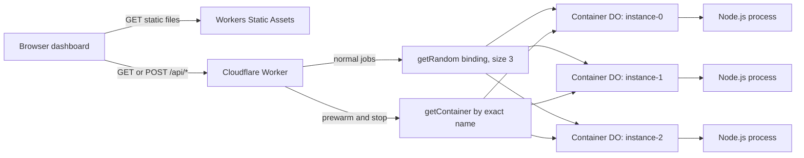

# Cloudflare Workers Containers Warm Pool POC

A repeatable cold-versus-warm demonstration that uses one Cloudflare Worker to manage a fixed pool of three logical Cloudflare Container members.

**Live demo:** <https://warm-pool-poc.ramin-s-se-account.workers.dev>

> [!IMPORTANT]
> Cloudflare Containers does not currently provide managed stateless autoscaling or a managed warm-pool mode. This POC implements a fixed warm pool in application code, prewarms its members, and routes work across them.

> [!CAUTION]
> The live deployment has intentionally unauthenticated lifecycle endpoints. Anyone with the URL can start containers, stop them, and submit synthetic jobs. Treat it as a temporary demonstration, stop the pool when finished, and add Cloudflare Access or application authentication before sharing it broadly.

The container intentionally waits **3,000 ms before opening port 8080** and then spends **500 ms on each job**. The startup delay represents application initialization such as loading a model, building an index, or creating an expensive in-memory dependency. It is synthetic and is **not** a measurement of Cloudflare's native container startup time.

## Contents

- [Goal and Objective](#goal-and-objective)
- [What the POC Proves](#what-the-poc-proves)
- [Scope and Non-Goals](#scope-and-non-goals)
- [Architecture](#architecture)
- [How the Lifecycle Works](#how-the-lifecycle-works)
- [Technical Design](#technical-design)
- [Repository Layout](#repository-layout)
- [Prerequisites](#prerequisites)
- [Quick Start](#quick-start)
- [Local Development](#local-development)
- [API Reference](#api-reference)
- [Automated Validation](#automated-validation)
- [Observed Results](#observed-results)
- [Deployment](#deployment)
- [Observability](#observability)
- [Five-Minute Demo](#five-minute-demo)
- [Security and Cost Guardrails](#security-and-cost-guardrails)
- [Cleanup](#cleanup)
- [Troubleshooting](#troubleshooting)
- [Limitations and Tradeoffs](#limitations-and-tradeoffs)
- [Phase-Two Ideas](#phase-two-ideas)
- [References](#references)

## Goal and Objective

Containerized applications often perform expensive work before they can accept a request. Examples include loading model weights, opening a large index, compiling templates, warming a dependency graph, or constructing an in-memory cache. If the first user request starts the process, that request pays the initialization cost.

This project asks a narrow engineering question:

> Can an application explicitly start a bounded set of Cloudflare Containers before jobs arrive, route later work only to that set, and prove that those jobs reuse the already-running processes?

The hypothesis is that an application-managed prewarm step can move initialization out of the user-facing job path:

```text
Without prewarm:
job arrives -> select process -> start process -> initialize -> run job -> respond

With prewarm:
prewarm     -> start three processes in parallel -> initialize -> verify readiness
job arrives -> select an already-running process -> run job -> respond
```

The objective is not merely to show a lower timing. Timing alone can be ambiguous. The POC also records a process-level UUID, startup timestamp, host identity, and request counter so that process reuse can be demonstrated directly.

### Definition of warm

For this project, a pool member is considered warm when all of the following are true:

- Its container process is running.
- Port `8080` is accepting connections.
- `GET /health` returns a valid process identity.
- A later job returns the same `bootId` without repeating the 3,000 ms synthetic initialization.

Warm means ready for this demo workload. It does not imply an availability guarantee. An idle timeout, deployment, failure, or platform lifecycle event can replace a process.

## What the POC Proves

| Requirement | Evidence | Pass condition |
| --- | --- | --- |
| Bounded pool | `POOL_SIZE`, deterministic names, and `max_instances` | At most three production processes run concurrently |
| Complete prewarm | `POST /api/pool/prewarm` | Three successful members return three unique boot IDs |
| Parallel startup | Per-member and total prewarm timing | Total time approximates one startup window rather than three serialized windows |
| Visible cold path | First job after a full stop | Worker timing includes at least the 3,000 ms synthetic initialization |
| Visible warm path | Jobs after prewarm | Processing remains near the 500 ms synthetic job duration |
| Process reuse | Boot IDs and startup timestamps | Every warm job uses a boot ID from the prewarmed set |
| Warm hold | Optional 60-second smoke-test wait | A later job still uses a prewarmed boot ID |
| Repeatable restart | Stop followed by another start | The replacement process has a new boot ID |
| Fixed-set routing | `getRandom(WARM_POOL, 3)` and smoke assertions | Job boot IDs always belong to the same logical pool |
| Repeatable workflow | `scripts/smoke.mjs` | Contract, cold, prewarm, warm, hold, and cleanup phases pass |

The central proof is **identity continuity**. A stable `bootId` proves that a job reused the same Node.js process. Lower latency demonstrates the user experience, but identity establishes why it happened.

## Scope and Non-Goals

### Included

- One Cloudflare Worker.
- One Container-enabled Durable Object class named `DemoContainer`.
- Three fixed logical member names: `instance-0`, `instance-1`, and `instance-2`.
- Up to three concurrently running `lite` container instances in production.
- Deterministic, parallel prewarming of the complete pool.
- Random job routing with `getRandom(env.WARM_POOL, 3)`.
- Explicit stop/reset behavior for repeatable demonstrations.
- A dependency-free Node.js container application.
- Transparent 3,000 ms initialization and 500 ms job simulations.
- A responsive framework-free dashboard.
- Structured Worker and container logs.
- Local Docker development and a deployed `workers.dev` demonstration.
- An end-to-end smoke test that cleans up the pool.

### Not included

- Built-in or application-built dynamic autoscaling.
- A managed Cloudflare warm-pool feature.
- Native Cloudflare cold-start benchmarking.
- Throughput, bandwidth, placement, or cost benchmarking.
- Production authentication, authorization, or rate limiting.
- Durable job state, queues, retries, or a dead-letter queue.
- R2 input/output or a real model/data initialization workload.
- Cron Triggers, Durable Object alarms, or scheduled keep-alives.
- Multi-region orchestration or placement guarantees.
- Production availability guarantees.

## Architecture



Each logical member is a named Durable Object associated with a container. The names are stable, but the underlying process is lazy, stoppable, ephemeral, and replaceable. The diagram is logical; it does not assert physical co-location between a Durable Object and its container host.

### Components

| Component | Responsibility |
| --- | --- |
| Workers Static Assets | Serves `index.html`, `app.js`, and `styles.css` |
| Worker fetch handler | Routes APIs, validates jobs, records timing, and returns structured JSON |
| `DemoContainer` | Configures port, idle behavior, egress policy, and reliable stop semantics |
| Durable Object binding | Gives each logical name a stable control plane for its container |
| `getContainer()` | Selects exact members for prewarm and stop operations |
| `getRandom()` | Selects one member from the three-member logical set for normal jobs |
| Node.js process | Exposes health/work endpoints and emits process identity evidence |
| Browser dashboard | Runs the demo and visualizes timing, identities, and distribution |
| Smoke script | Executes and asserts the complete lifecycle from the command line |

## How the Lifecycle Works

### 1. Cold job

```text
Browser or smoke script
  -> POST /api/jobs
  -> Worker validates and normalizes jobId
  -> getRandom(WARM_POOL, 3)
  -> selected logical member has no running process
  -> container starts
  -> Node.js records identity, then waits 3,000 ms
  -> port 8080 opens
  -> POST /work waits 500 ms
  -> response includes a new bootId
```

The cold request pays synthetic initialization, process startup, platform orchestration, Worker/Durable Object routing, container networking, job processing, and client network overhead.

### 2. Parallel prewarm

```text
POST /api/pool/prewarm
  -> instance-0: startAndWaitForPorts(8080) -> GET /health
  -> instance-1: startAndWaitForPorts(8080) -> GET /health
  -> instance-2: startAndWaitForPorts(8080) -> GET /health
  -> validate all three identities and unique boot IDs
```

All three branches start together with `Promise.allSettled()`. A successful response requires all members to become ready and to report three distinct process UUIDs. A partial pool returns `503` rather than silently claiming success.

### 3. Warm job

```text
POST /api/jobs
  -> getRandom(WARM_POOL, 3)
  -> selected process is already listening
  -> POST /work waits 500 ms
  -> response includes an existing prewarmed bootId
```

The 3,000 ms initialization is absent from this path. The request still includes Worker, Durable Object, container, and network overhead.

### 4. Stop and reset

```text
POST /api/pool/stop
  -> signal all three members concurrently
  -> poll each member until it reaches a terminal state
  -> return only after all members stop or a timeout/failure occurs
```

Waiting for the terminal state is important. The first implementation used `stop()` directly. It reported success after the stop signal was issued, but an immediate prewarm could race the process that was still exiting. `stopAndWait()` removed that race and made the demo repeatable.

## Technical Design

### Fixed logical pool contract

The Worker defines one pool size and generates the complete logical set:

```ts
const POOL_SIZE = 3;
const POOL_MEMBERS = Array.from(
  { length: POOL_SIZE },
  (_, index) => `instance-${index}`,
);
```

Lifecycle operations address those names with `getContainer()`. Normal work uses `getRandom(env.WARM_POOL, POOL_SIZE)`. The pinned `@cloudflare/containers@0.3.7` helper selects from the same `instance-0` through `instance-2` naming scheme.

This coupling is intentional and tested, but it is also a maintenance boundary:

- Keep `@cloudflare/containers` pinned to an exact version.
- Reinspect helper behavior before upgrading it.
- Keep lifecycle names and routing names aligned.
- Run the smoke test after every package or pool-size change.
- Treat membership in the prewarmed boot-ID set as the correctness assertion.

Routing is random, not round robin. A 12-job sample can be visibly uneven and does not need to touch every member to be valid.

### Container class

`DemoContainer` extends the Cloudflare `Container` class with these settings:

| Setting | Value | Reason |
| --- | --- | --- |
| `defaultPort` | `8080` | The Node.js application listens on this port |
| `sleepAfter` | `10m` | Keeps processes available through a short demo gap |
| `enableInternet` | `false` | The synthetic application requires no outbound network access |
| Stop timeout | `10,000 ms` | Bounds the Worker-side terminal-state wait |
| Stop poll interval | `100 ms` | Detects process completion without a tight loop |

`sleepAfter` is an idle policy, not an uptime promise. The platform can still replace a process.

### Prewarm implementation

For every logical member, the Worker:

1. Gets the member by deterministic name.
2. Calls `startAndWaitForPorts()` for port `8080`.
3. Uses a 30-second port-readiness timeout.
4. Fetches `GET /health` after the port is ready.
5. Parses and validates `instanceId`, `bootId`, and `startedAt`.
6. Records per-member startup timing and a structured log event.

The Worker launches all member operations before awaiting them. `Promise.allSettled()` retains per-member errors so the API can report which member failed. Overall success requires three successful members and three unique boot IDs.

### Job routing and validation

`POST /api/jobs` accepts an optional JSON object:

```json
{
  "jobId": "demo-123"
}
```

Validation behavior:

- The body can contain at most 4,096 bytes.
- An empty body is accepted.
- Non-empty input must be a JSON object.
- A missing, empty, or whitespace-only ID becomes `job-<UUID>`.
- A supplied ID must be a string.
- IDs are trimmed and limited to 128 characters.
- Extra JSON properties are ignored.

After validation, the Worker chooses a member with `getRandom()`, sends a normalized `POST /work` request, validates the container response, and returns Worker-side timing. A container job failure becomes a generic `502` response; the detailed exception remains in structured logs.

### Reliable stop behavior

`DemoContainer.stopAndWait()` performs the following sequence:

1. Calls the underlying `stop()` operation.
2. Polls `getState()` every 100 ms.
3. Returns after `stopped` or `stopped_with_code` is observed.
4. Throws if a terminal state is not observed within 10 seconds.

The pool endpoint applies that sequence to all three logical members concurrently. It returns `503` if any member cannot stop cleanly.

### Process identity and timing model

The Node.js process creates identity values once at module startup, before the synthetic initialization delay:

| Field | Meaning |
| --- | --- |
| `instanceId` | Container operating-system hostname |
| `bootId` | UUID generated once for this Node.js process |
| `startedAt` | Process startup timestamp recorded before initialization |
| `requestCount` | Completed work requests handled by this process |

The timing fields measure different intervals:

| Field | Measurement |
| --- | --- |
| `startupMs` | Worker-observed time to start one member and complete its health check |
| `totalMs` | Worker-observed time for the complete parallel prewarm or stop action |
| `processingMs` | Time inside the container's `/work` handler after body parsing |
| `workerElapsedMs` | Worker time from post-validation routing through parsed container response |
| Browser/client timing | Full client request time, including network overhead |

These values should not be compared as though they measure the same boundary.

### Container application

`container/server.mjs` uses only Node.js standard-library modules. It has no package installation step and no runtime dependency on the Worker code.

Startup behavior:

1. Read `STARTUP_DELAY_MS`, defaulting to `3000`.
2. Read `WORK_DELAY_MS`, defaulting to `500`.
3. Generate process identity and log `container.initializing`.
4. Wait for the configured startup delay.
5. Listen on `0.0.0.0:8080` and log `container.ready`.

Runtime endpoints:

| Method | Path | Behavior |
| --- | --- | --- |
| `GET` | `/health` | Returns stable process identity without incrementing the work counter |
| `POST` | `/work` | Waits for the work delay, increments the counter, and returns identity/timing |

Shutdown behavior:

- `SIGTERM` and `SIGINT` stop the server from accepting new requests.
- Active requests are allowed to drain.
- A five-second safety timer closes remaining connections and exits non-zero.
- Clean closure exits with status zero.

### Docker image

The Dockerfile:

- Uses `node:22-alpine`.
- Produces a `linux/amd64` image required by Cloudflare Containers.
- Copies only `container/server.mjs`.
- Sets production delay defaults with environment variables.
- Runs as the non-root `node` user.
- Exposes port `8080` for local testing.
- Installs no application dependencies.

`.dockerignore` excludes everything except the container application, keeping the build context small and preventing unrelated local files from entering the image.

The base image is pinned by major/minor tag, not digest. Pin it by digest if supply-chain reproducibility becomes a requirement.

### Dashboard

The browser interface has five controls:

| Control | Action |
| --- | --- |
| **Stop Pool** | Stops and waits for all three members |
| **Send One Job** | Sends one randomly routed job |
| **Prewarm Pool** | Starts and health-checks all three members in parallel |
| **Run 12 Jobs** | Starts 12 job requests concurrently |
| **Clear Results** | Clears browser-only state without changing containers |

The dashboard records results only in memory. Reloading the page clears them. It groups jobs by process boot ID, displays browser/Worker/container timing, and tracks process identity and counters.

The **New boot** and **Reused** labels are browser heuristics. A fresh browser cannot know whether the first process it observes was already running before page load, so it labels an unknown boot ID as new. The API boot ID and smoke-test set-membership checks are the authoritative evidence.

### Static asset routing

`wrangler.jsonc` sends `/api/*` through the Worker first. Other paths are delegated to the `ASSETS` binding. This lets the same deployment serve both the API and the framework-free dashboard.

## Repository Layout

```text
warm-pool-poc/
|-- container/
|   `-- server.mjs              Dependency-free synthetic application
|-- public/
|   |-- app.js                  Dashboard behavior and browser state
|   |-- index.html              Dashboard structure and accuracy disclosures
|   `-- styles.css              Responsive visual design
|-- scripts/
|   `-- smoke.mjs               End-to-end lifecycle and identity assertions
|-- src/
|   `-- index.ts                Worker API and Container Durable Object class
|-- .dockerignore               Minimal Docker build context
|-- .gitignore                  Local state and secret exclusions
|-- Dockerfile                  Non-root linux/amd64 Node.js image
|-- INTERNAL-BRAINDUMP.md       Detailed implementation and lessons snapshot
|-- package-lock.json           Reproducible dependency graph
|-- package.json                Scripts, exact dependencies, and Node requirement
|-- README.md                   Project guide
|-- sprint.md                   Original planning and acceptance baseline
|-- tsconfig.json               Strict TypeScript configuration
|-- worker-configuration.d.ts   Generated Worker runtime and binding types
`-- wrangler.jsonc              Worker, container, assets, DO, and logs config
```

`sprint.md` preserves the original plan. `INTERNAL-BRAINDUMP.md` records the implementation history, failed attempts, machine setup, measured results, and handoff notes. The current behavior is defined by the source code and configuration.

## Prerequisites

- Node.js 22 or newer.
- npm with lockfile support.
- Docker Desktop or a Docker-compatible CLI and running engine.
- Docker Buildx for the pinned Wrangler image-build workflow.
- Wrangler authentication to a Cloudflare account with Workers Containers access.
- Permission to run three concurrent `lite` instances.
- A configured `workers.dev` subdomain for deployment.

Check the toolchain:

```bash
node --version
npm --version
docker info
docker buildx version
npx wrangler whoami
```

The project pins these direct dependencies:

| Package | Version | Purpose |
| --- | --- | --- |
| `@cloudflare/containers` | `0.3.7` | Container class and routing helpers |
| `wrangler` | `4.125.0` | Local development, types, deploys, and logs |
| `typescript` | `7.0.2` | Strict Worker type checking |
| `@types/node` | `26.2.0` | Node declarations used by generated types |

Do not silently upgrade `@cloudflare/containers`. First verify the helper's member-naming behavior and then run the complete smoke test.

## Quick Start

### 1. Clone and install

```bash
git clone https://github.com/rsedighi/warm-pool-poc.git
cd warm-pool-poc
npm ci
```

### 2. Verify generated types and TypeScript

```bash
npx wrangler types --check
npm run typecheck
```

If `wrangler.jsonc` changed, regenerate the committed binding types before checking:

```bash
npm run types
npm run typecheck
```

### 3. Start the local environment

Make sure Docker is running, then start Wrangler:

```bash
npm run dev
```

Wrangler builds/configures local container support and serves the Worker at <http://localhost:8787>. Container processes are lazy; they start when a job fetches a member or when the pool is explicitly prewarmed.

### 4. Open the dashboard

Open <http://localhost:8787> and run the sequence described in [Five-Minute Demo](#five-minute-demo).

### 5. Run the automated smoke test

In another terminal:

```bash
npm run smoke -- http://localhost:8787
```

Add a 60-second process-reuse assertion:

```bash
npm run smoke -- http://localhost:8787 --hold-seconds 60
```

The test stops all members in its cleanup path after either success or an assertion failure.

## Local Development

### Docker Desktop

Start Docker Desktop and confirm both the engine and Buildx are available:

```bash
docker info
docker buildx version
```

### Colima on Apple Silicon

Docker Desktop is not required. One validated alternative is Docker CLI plus Colima:

```bash
brew install docker colima docker-buildx
colima start --cpus 2 --memory 4 --disk 20 --vm-type vz --vz-rosetta
docker info
docker buildx version
```

Homebrew's Buildx plugin may require adding `/opt/homebrew/lib/docker/cli-plugins` to `cliPluginsExtraDirs` in `~/.docker/config.json`. Merge that key with existing Docker configuration rather than overwriting the file.

On an inspected corporate network, the Colima VM may also need the organization's existing trusted root certificate. Add the root to the VM trust store; do not disable TLS verification or configure an insecure registry. See `INTERNAL-BRAINDUMP.md` for the environment-specific procedure used during the original build.

### Test the container directly

Build the exact target architecture:

```bash
docker build --platform linux/amd64 -t warm-pool-poc:local .
docker run --rm -p 8080:8080 warm-pool-poc:local
```

After the disclosed three-second initialization, test the application:

```bash
curl http://localhost:8080/health
curl -X POST http://localhost:8080/work \
  -H 'Content-Type: application/json' \
  -d '{"jobId":"direct-test"}'
```

A second `/work` request should return the same `bootId` and a higher `requestCount`. Restarting the container should produce a new `bootId`.

The Cloudflare class disables outbound Internet for platform-launched instances. A standalone `docker run` retains Docker's normal network unless `--network none` is supplied.

### Faster process-only testing

The application delays can be overridden without editing source:

```bash
STARTUP_DELAY_MS=100 WORK_DELAY_MS=50 node container/server.mjs
```

This is useful for validating HTTP contracts, counters, identity stability, and signal handling. The Worker smoke script intentionally assumes the committed 3,000 ms startup delay.

### Local development caveats

- Production `max_instances: 3` is not enforced during local development.
- Container source changes require an image rebuild/restart; do not assume frontend-style hot reload.
- `.wrangler/` contains generated local state and is intentionally ignored by Git.
- Local Docker images persist until removed.
- The same smoke test mutates and stops the target pool, so do not run it against a shared demo in progress.

## API Reference

All Worker API responses are JSON and include `Cache-Control: no-store`.

| Method | Path | Purpose | Success |
| --- | --- | --- | --- |
| `GET` | `/api/health` | Check the Worker without contacting a container | `200` |
| `POST` | `/api/pool/prewarm` | Start and health-check all three members concurrently | `200` |
| `POST` | `/api/pool/stop` | Stop all three members and wait for terminal states | `200` |
| `POST` | `/api/jobs` | Validate and route one job through `getRandom()` | `200` |

### `GET /api/health`

```bash
curl http://localhost:8787/api/health
```

```json
{
  "ok": true,
  "service": "warm-pool-poc",
  "poolSize": 3,
  "timestamp": "2026-08-20T00:00:00.000Z"
}
```

This endpoint does not contact the container binding and does not start a process.

### `POST /api/pool/prewarm`

```bash
curl -X POST http://localhost:8787/api/pool/prewarm
```

Representative successful response:

```json
{
  "ok": true,
  "poolSize": 3,
  "totalMs": 4171,
  "members": [
    {
      "name": "instance-0",
      "ok": true,
      "startupMs": 4102,
      "instanceId": "container-host-a",
      "bootId": "11111111-1111-4111-8111-111111111111",
      "startedAt": "2026-08-20T00:00:00.000Z"
    },
    {
      "name": "instance-1",
      "ok": true,
      "startupMs": 4164,
      "instanceId": "container-host-b",
      "bootId": "22222222-2222-4222-8222-222222222222",
      "startedAt": "2026-08-20T00:00:00.010Z"
    },
    {
      "name": "instance-2",
      "ok": true,
      "startupMs": 4138,
      "instanceId": "container-host-c",
      "bootId": "33333333-3333-4333-8333-333333333333",
      "startedAt": "2026-08-20T00:00:00.020Z"
    }
  ]
}
```

Member timings are illustrative. A successful response always contains three successful records and three unique boot IDs.

### `POST /api/pool/stop`

```bash
curl -X POST http://localhost:8787/api/pool/stop
```

```json
{
  "ok": true,
  "totalMs": 103,
  "members": [
    { "name": "instance-0", "ok": true },
    { "name": "instance-1", "ok": true },
    { "name": "instance-2", "ok": true }
  ]
}
```

Success means each logical member reached a terminal container state, not merely that a stop signal was sent.

### `POST /api/jobs`

```bash
curl -X POST http://localhost:8787/api/jobs \
  -H 'Content-Type: application/json' \
  -d '{"jobId":"demo-123"}'
```

```json
{
  "ok": true,
  "jobId": "demo-123",
  "instanceId": "container-host-a",
  "bootId": "11111111-1111-4111-8111-111111111111",
  "startedAt": "2026-08-20T00:00:00.000Z",
  "requestCount": 4,
  "processingMs": 501,
  "workerElapsedMs": 527
}
```

### Error behavior

| Status | Condition |
| --- | --- |
| `400` | Malformed JSON, non-object JSON, wrong job ID type, or invalid job ID length |
| `404` | Unknown `/api/*` route |
| `405` | Unsupported method; response includes an `Allow` header |
| `413` | Job request body exceeds 4,096 bytes |
| `500` | Unexpected Worker/API failure |
| `502` | Selected container cannot complete a job |
| `503` | Complete prewarm or complete stop cannot be achieved |

Client-facing `5xx` messages are intentionally generic. Structured logs contain error names and internal diagnostic messages.

## Automated Validation

### Smoke-test sequence

`scripts/smoke.mjs` performs six phases:

1. Validate Worker health, selected error contracts, the dashboard, and accuracy disclosures.
2. Stop all members and wait for terminal states.
3. Send one cold job and assert at least 3,000 ms of Worker time.
4. Stop again, prewarm in parallel, and require three new unique boot IDs.
5. Send 12 concurrent jobs and require every boot ID to belong to the prewarmed set.
6. Optionally wait and require another job to reuse a prewarmed boot ID.

The script also asserts:

- Prewarm total time stays within `slowest member * 1.5 + 1,000 ms`.
- Container `processingMs` stays below the 3,000 ms initialization interval.
- Average warm Worker time is below the cold Worker time.
- Every API response is non-cacheable JSON.
- Cleanup stops the pool after success or a caught test failure.

The test does not require even random distribution or require every member to receive a job in a 12-request sample.

### Validation commands

Install exactly from the lockfile:

```bash
npm ci
```

Check generated bindings and TypeScript:

```bash
npx wrangler types --check
npm run typecheck
```

Audit dependencies:

```bash
npm audit
```

Validate Worker bundling and bindings without rebuilding the container:

```bash
npx wrangler deploy --dry-run --containers-rollout=none
```

A normal container-aware dry-run still needs Docker because Wrangler builds the configured image.

Run lifecycle validation locally or against a deployment:

```bash
npm run smoke -- http://localhost:8787
npm run smoke -- http://localhost:8787 --hold-seconds 60
npm run smoke -- https://warm-pool-poc.<your-subdomain>.workers.dev
```

The smoke test starts and stops real processes. Do not run it against a shared environment without coordinating with its users.

## Observed Results

The implementation was validated on 2026-08-20 local time and 2026-08-21 UTC. These measurements are historical evidence that the pattern worked in that environment. They are not service-level objectives or Cloudflare platform benchmarks.

| Environment/run | Cold Worker | Parallel prewarm | Warm average | Warm max | Distribution | Hold check |
| --- | ---: | ---: | ---: | ---: | --- | --- |
| Local run 1 | 4,089 ms | 4,171 ms | 527 ms | 533 ms | `3 / 1 / 8` | Not run |
| Local run 2 | 4,072 ms | 3,923 ms | 518 ms | 524 ms | `2 / 3 / 7` | 514 ms after 60 s |
| Deployed run 1 | 8,000 ms | 10,467 ms | 628 ms | 674 ms | `1 / 2 / 9` | Not run |
| Deployed run 2 | 5,262 ms | 12,618 ms | 633 ms | 672 ms | `1 / 7 / 4` | 642 ms after 60 s |

Additional validation completed:

- Three unique process boot IDs were returned by every successful prewarm.
- Held-job boot IDs remained in the prewarmed set.
- Two local and two deployed lifecycle runs passed.
- Direct Node.js and `linux/amd64` Docker tests passed.
- Desktop rendering at 1,440 px and mobile rendering at 390 px passed.
- Worker and Durable Object live-tail correlation passed.
- Dependency audit reported zero known vulnerabilities at validation time.
- Final production stop cleanup passed.

### Interpreting the values

- Direct process readiness near 3.2 seconds confirms the configured synthetic delay.
- Local cold values include synthetic initialization plus local orchestration and the 500 ms job.
- Deployed cold values include synthetic initialization plus platform provisioning, routing, networking, work, and client overhead.
- Deployed prewarm can exceed one synthetic interval because each parallel member can incur independent provisioning delay.
- Warm values near 0.5 to 0.7 seconds show that the 3,000 ms application initialization was not repeated in the job path.
- Uneven distributions are expected from random selection and are not a correctness failure.

Do not infer native startup latency, pricing, throughput limits, placement, or availability guarantees from these values.

## Deployment

### 1. Authenticate and verify the target account

```bash
npx wrangler whoami
```

Confirm the selected account is the intended target before creating billable resources.

### 2. Review configuration

`wrangler.jsonc` defines:

| Configuration | Value |
| --- | --- |
| Worker name | `warm-pool-poc` |
| Entry point | `src/index.ts` |
| Compatibility date | `2026-08-20` |
| Compatibility flag | `nodejs_compat` |
| Container class | `DemoContainer` |
| Image source | `./Dockerfile` |
| Instance type | `lite` |
| Production max instances | `3` |
| Durable Object binding | `WARM_POOL` |
| Durable Object migration | SQLite class, tag `v1` |
| Static asset directory | `./public` |
| Worker-first routes | `/api/*` |
| Log sampling | `1` |
| Trace sampling | `1` |

Full sampling is appropriate for this low-volume POC but should be reconsidered before meaningful production traffic.

### 3. Deploy

Docker must be running because the configuration points to a local Dockerfile:

```bash
npm run deploy
```

Current Cloudflare rollout behavior is important:

1. Wrangler uploads and activates the new Worker version.
2. Wrangler builds and pushes the Dockerfile image when needed.
3. Cloudflare starts the container-configuration rollout.

These steps are not transactional. Worker code can be active before image/rollout work finishes, and a later failure can leave that Worker version active. Existing processes can temporarily run the previous image during a gradual rollout. Keep Worker and image changes backward compatible across that window or select an appropriate rollout strategy.

### 4. Verify the deployed service

Use the exact URL printed by Wrangler:

```bash
curl https://warm-pool-poc.<your-subdomain>.workers.dev/api/health
npm run smoke -- https://warm-pool-poc.<your-subdomain>.workers.dev
npm run smoke -- https://warm-pool-poc.<your-subdomain>.workers.dev --hold-seconds 60
```

Workers that implement Durable Objects, including Container Workers, do not receive normal versioned preview URLs. Validate with local development and an actual deployment.

### 5. Remove temporary registry authentication

If Wrangler logs Docker into Cloudflare Registry during deployment, remove the temporary local credential afterward:

```bash
docker logout registry.cloudflare.com
```

## Observability

Tail Worker and Durable Object events:

```bash
npm run tail
```

Worker events:

```text
pool.prewarm.started
pool.prewarm.member.ready
pool.prewarm.member.failed
pool.prewarm.completed
pool.stop.started
pool.stop.member.completed
pool.stop.completed
job.started
job.completed
job.failed
api.failed
```

Container stdout events:

```text
container.initializing
container.ready
container.work.started
container.work.completed
container.request.failed
container.stopping
```

Useful correlation fields include `jobId`, `memberName`, `bootId`, `elapsedMs`, `status`, and `errorName`. The application does not log raw request bodies or authorization headers, but job IDs are caller-controlled and do appear in logs.

The Containers dashboard also exposes instance status, health, metrics, and logs. A summary instance count alone does not prove that application processes are active; use detailed active state, API lifecycle results, boot IDs, request behavior, and logs together.

## Five-Minute Demo

### Preparation

1. Open the deployed dashboard.
2. Confirm the health badge reports Worker ready and pool size three.
3. Optionally run the deployed smoke test and open `npm run tail`.
4. Click **Stop Pool** to establish a known terminal state.
5. Click **Clear Results**.

### Live sequence

1. Explain that the project controls three fixed logical members in application code.
2. Point out the transparent 3,000 ms simulated initialization and 500 ms work delay.
3. Click **Send One Job**.
4. Show the new boot ID and the higher cold-path timing.
5. Click **Stop Pool** again.
6. Click **Prewarm Pool**.
7. Show three unique boot IDs and one parallel startup window.
8. Click **Run 12 Jobs**.
9. Show reused boot IDs, lower job latency, increasing counters, and random distribution.
10. Wait 60 seconds while discussing the architecture.
11. Click **Run 12 Jobs** or send one more job.
12. Show that returned IDs still belong to the prewarmed set.
13. Click **Stop Pool** when the demonstration is complete.

Suggested talk track:

> The application explicitly starts three known logical container members before work arrives. Once all three are ready, normal jobs use `getRandom` to route across that fixed set. The initialization cost is paid by the prewarm operation, so jobs reuse already-running processes. Stable boot IDs prove process reuse. The ten-minute idle setting supports this short demo window, but this is an application pattern, not managed autoscaling or an uptime guarantee.

If the 12-job distribution is uneven, explain that selection is random rather than round robin. The proof is that all job boot IDs belong to the prewarmed set, not that every process receives exactly four jobs.

## Security and Cost Guardrails

Implemented safeguards:

- Production concurrency is bounded by `max_instances: 3`.
- Platform-launched containers have outbound Internet disabled.
- The image runs as a non-root user.
- Job request bodies and IDs are bounded.
- API responses are marked `no-store`.
- Client-facing server errors omit stack traces and internal messages.
- Structured logs omit raw bodies and authorization headers.
- The smoke test attempts to stop the pool during cleanup.

Known exposure:

- Prewarm, stop, and job endpoints are public and unauthenticated.
- There is no application rate limit.
- Anyone with the URL can create cost, disrupt a demo, or generate logs.
- API responses expose operational process metadata for demonstration purposes.
- Full log and trace sampling can become expensive at higher volume.

Before broad or production-like use:

- Put Cloudflare Access in front of the deployment.
- Add authentication and authorize lifecycle operations separately from job submission.
- Add rate limiting and abuse controls.
- Reduce observability sampling based on traffic and retention needs.
- Replace synthetic payloads with a reviewed data contract.
- Decide whether host/process identity should remain client-visible.

Never commit API tokens, account identifiers, certificates, `.env*`, `.dev.vars*`, `.wrangler/`, or Docker registry credentials. The repository ignore rules exclude generated local state and common secret files.

## Cleanup

### Stop running processes

```bash
curl -X POST https://warm-pool-poc.<your-subdomain>.workers.dev/api/pool/stop
```

This stops the pool processes. It does not delete the Worker, Durable Object namespace/state, image, application configuration, local images, or local Wrangler state.

### Delete the Worker deployment

```bash
npx wrangler delete warm-pool-poc
```

Review the Cloudflare dashboard afterward if complete account-level cleanup is required. Worker deletion should not be treated as proof that every registry image or related resource has been removed.

### Clean the local environment

```bash
docker image rm warm-pool-poc:local
docker logout registry.cloudflare.com
colima stop
```

Remove `.wrangler/` only when you intentionally want to discard local Durable Object, cache, and observability state.

## Troubleshooting

| Symptom | Likely cause | Resolution |
| --- | --- | --- |
| `docker` is missing | No local Docker CLI | Install Docker Desktop or Docker CLI plus Colima |
| Cannot connect to Docker daemon | Engine is stopped | Start Docker Desktop or run `colima start`, then retry `docker info` |
| Wrangler reports unknown `--load` | Buildx is missing/not discovered | Install Buildx, configure the CLI plugin directory, and run `docker buildx version` |
| Registry pull reports `x509: certificate signed by unknown authority` | VM does not trust the corporate root | Add the existing root to the VM trust store; do not disable TLS |
| `wrangler whoami` is unauthenticated | OAuth session is missing/expired | Run `npx wrangler login` and verify the target account |
| `wrangler types` rejects the image path | Dockerfile path is missing/invalid | Restore or fix `./Dockerfile` before config/type validation |
| A normal dry-run tries to use Docker | Container image is part of deploy validation | Use `--containers-rollout=none` only for Worker-side dry-run validation |
| Prewarm returns `503` immediately after stop | Older code has a shutdown/start race | Deploy `stopAndWait()`, stop again, and inspect lifecycle logs |
| One prewarm member times out | Provisioning/readiness failed | Stop the complete pool, retry, and inspect `pool.prewarm.member.failed` |
| Warm job reports an unknown boot ID | Process was replaced or browser context is stale | Prewarm again and treat warm availability as non-guaranteed |
| Twelve jobs look heavily skewed | Expected random variance | Increase the sample; do not describe routing as round robin |
| Instance summary still shows three after stop | Logical/known slots differ from active processes | Inspect detailed active counts, lifecycle APIs, boot IDs, and logs |
| No preview URL is generated | Container Worker implements Durable Objects | Use `wrangler dev` or deploy to an actual environment |
| Container source edit is not visible locally | Existing image/process is still running | Stop Wrangler/containers, rebuild, and restart local development |
| Generated binding types drift | `wrangler.jsonc` changed | Run `npm run types`, inspect the diff, then run `npm run typecheck` |
| Smoke test interrupts another user | Test owns lifecycle state | Use a dedicated target or coordinate before running it |
| Deployment succeeds but old image appears briefly | Gradual rollout is still in progress | Check rollout status and keep Worker/image versions compatible |

## Limitations and Tradeoffs

- The pool contains fixed logical names, not permanently allocated processes.
- Built-in stateless autoscaling is not part of this design.
- Production `max_instances` is a concurrency ceiling and is not enforced locally.
- The ten-minute idle setting does not prevent platform replacement.
- Random routing does not guarantee even utilization or locality.
- The dashboard's first-seen cold/warm classification is heuristic.
- Browser results are ephemeral and have no durable state.
- The container filesystem is ephemeral.
- The synthetic workload does not model CPU, memory, disk, or network-heavy initialization.
- There is no queue, backpressure, retry, deduplication, or job-status model.
- Lifecycle endpoints are unauthenticated and can disrupt concurrent users.
- Smoke cleanup is best effort and cannot run after every possible process termination.
- Pool size, delays, and expected behavior are repeated across source, UI, tests, config, and docs; changes require coordinated updates.
- A Worker and image deployment is non-transactional and can temporarily mix versions.
- The base image is not pinned by digest.
- There is currently no CI workflow or unit-test suite; validation is type, build, direct-container, and integration focused.

## Phase-Two Ideas

| Priority | Improvement | Intended outcome |
| --- | --- | --- |
| P0 | Cloudflare Access or application auth | Protect lifecycle and job endpoints |
| P0 | CI validation | Automate install, type drift, typecheck, audit, syntax, and dry-run checks |
| P1 | R2 input and output | Process representative objects and persist results |
| P1 | Queue-based dispatch | Add buffering, backpressure, and producer/consumer separation |
| P1 | Retry and dead-letter handling | Make failed jobs observable and recoverable |
| P1 | Durable job tracking | Persist queued, running, completed, and failed states |
| P1 | Representative initialization | Replace the synthetic delay with a model, index, or dataset load |
| P2 | Configurable pool size | Compare pool sizes and centralize duplicated constants |
| P2 | Scheduled keep-alive | Support demo windows longer than `sleepAfter` where justified |
| P2 | Base-image digest pinning | Improve image reproducibility |
| P2 | Auth-aware smoke tests | Validate protected deployments without exposing secrets |
| P3 | Throughput/concurrency study | Measure workload-specific behavior without conflating startup claims |
| P3 | Placement observations | Explore location and latency effects without promising placement |

## References

Cloudflare documentation was rechecked on 2026-08-21. Product capabilities can change, so verify time-sensitive statements before reusing them externally.

- [Cloudflare Containers overview](https://developers.cloudflare.com/containers/)
- [Getting started with Containers](https://developers.cloudflare.com/containers/get-started/)
- [Containers FAQ](https://developers.cloudflare.com/containers/faq/)
- [Container class reference](https://developers.cloudflare.com/containers/container-class/)
- [Scaling and routing](https://developers.cloudflare.com/containers/platform-details/scaling-and-routing/)
- [Container rollouts](https://developers.cloudflare.com/containers/platform-details/rollouts/)
- [Local development](https://developers.cloudflare.com/containers/local-dev/)
- [Deploying Containers](https://developers.cloudflare.com/containers/deploy/)
- [Wrangler container configuration](https://developers.cloudflare.com/workers/wrangler/configuration/#containers)
- [Workers Static Assets](https://developers.cloudflare.com/workers/static-assets/)
- [Worker preview URL limitations](https://developers.cloudflare.com/workers/versions-and-deployments/preview-urls/#limitations)
- [`@cloudflare/containers` source](https://github.com/cloudflare/containers)

For implementation history, failed attempts, exact validation records, local tooling setup, and handoff notes, see [`INTERNAL-BRAINDUMP.md`](INTERNAL-BRAINDUMP.md).
