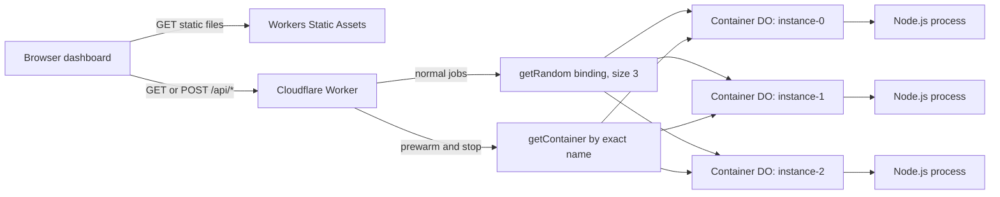
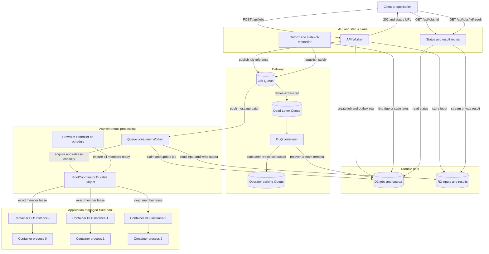
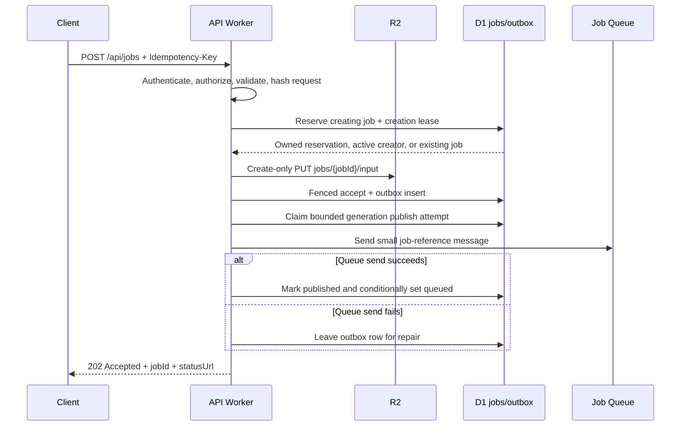
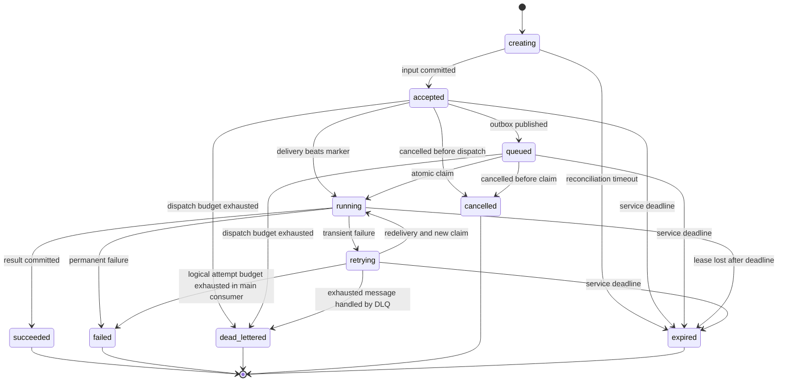

# Cloudflare Workers Containers Warm Pool POC

A repeatable cold-versus-warm demonstration that uses one Cloudflare Worker to manage a fixed pool of three logical Cloudflare Container members.

**Live demo:** <https://warm-pool-poc.ramin-s-se-account.workers.dev>

> [!IMPORTANT]
> Cloudflare Containers does not currently provide managed stateless autoscaling or a managed warm-pool mode. This POC implements a fixed warm pool in application code, prewarms its members, and routes work across them.

> [!CAUTION]
> The live deployment has intentionally unauthenticated lifecycle endpoints. Anyone with the URL can start containers, stop them, and submit synthetic jobs. Treat it as a temporary demonstration, stop the pool when finished, and add Cloudflare Access or application authentication before sharing it broadly.

The container intentionally waits **3,000 ms before opening port 8080** and then spends **500 ms on each job**. The startup delay represents application initialization such as loading a model, building an index, or creating an expensive in-memory dependency. It is synthetic and is **not** a measurement of Cloudflare's native container startup time.

## Contents

- [Goal and Objective](#goal-and-objective)
- [What the POC Proves](#what-the-poc-proves)
- [Scope and Non-Goals](#scope-and-non-goals)
- [Architecture](#architecture)
- [How the Lifecycle Works](#how-the-lifecycle-works)
- [Technical Design](#technical-design)
- [Repository Layout](#repository-layout)
- [Prerequisites](#prerequisites)
- [Quick Start](#quick-start)
- [Local Development](#local-development)
- [API Reference](#api-reference)
- [Automated Validation](#automated-validation)
- [Observed Results](#observed-results)
- [Deployment](#deployment)
- [Observability](#observability)
- [Five-Minute Demo](#five-minute-demo)
- [Security and Cost Guardrails](#security-and-cost-guardrails)
- [Cleanup](#cleanup)
- [Troubleshooting](#troubleshooting)
- [Limitations and Tradeoffs](#limitations-and-tradeoffs)
- [Taking It Further: Queue-Backed Architecture](#taking-it-further-queue-backed-architecture)
- [Phase-Two Ideas](#phase-two-ideas)
- [References](#references)

## Goal and Objective

Containerized applications often perform expensive work before they can accept a request. Examples include loading model weights, opening a large index, compiling templates, warming a dependency graph, or constructing an in-memory cache. If the first user request starts the process, that request pays the initialization cost.

This project asks a narrow engineering question:

> Can an application explicitly start a bounded set of Cloudflare Containers before jobs arrive, route later work only to that set, and prove that those jobs reuse the already-running processes?

The hypothesis is that an application-managed prewarm step can move initialization out of the user-facing job path:

```text
Without prewarm:
job arrives -> select process -> start process -> initialize -> run job -> respond

With prewarm:
prewarm     -> start three processes in parallel -> initialize -> verify readiness
job arrives -> select an already-running process -> run job -> respond
```

The objective is not merely to show a lower timing. Timing alone can be ambiguous. The POC also records a process-level UUID, startup timestamp, host identity, and request counter so that process reuse can be demonstrated directly.

### Definition of warm

For this project, a pool member is considered warm when all of the following are true:

- Its container process is running.
- Port `8080` is accepting connections.
- `GET /health` returns a valid process identity.
- A later job returns the same `bootId` without repeating the 3,000 ms synthetic initialization.

Warm means ready for this demo workload. It does not imply an availability guarantee. An idle timeout, deployment, failure, or platform lifecycle event can replace a process.

## What the POC Proves

| Requirement | Evidence | Pass condition |
| --- | --- | --- |
| Bounded pool | `POOL_SIZE`, deterministic names, and `max_instances` | At most three production processes run concurrently |
| Complete prewarm | `POST /api/pool/prewarm` | Three successful members return three unique boot IDs |
| Parallel startup | Per-member and total prewarm timing | Total time approximates one startup window rather than three serialized windows |
| Visible cold path | First job after a full stop | Worker timing includes at least the 3,000 ms synthetic initialization |
| Visible warm path | Jobs after prewarm | Processing remains near the 500 ms synthetic job duration |
| Process reuse | Boot IDs and startup timestamps | Every warm job uses a boot ID from the prewarmed set |
| Warm hold | Optional 60-second smoke-test wait | A later job still uses a prewarmed boot ID |
| Repeatable restart | Stop followed by another start | The replacement process has a new boot ID |
| Fixed-set routing | `getRandom(WARM_POOL, 3)` and smoke assertions | Job boot IDs always belong to the same logical pool |
| Repeatable workflow | `scripts/smoke.mjs` | Contract, cold, prewarm, warm, hold, and cleanup phases pass |

The central proof is **identity continuity**. A stable `bootId` proves that a job reused the same Node.js process. Lower latency demonstrates the user experience, but identity establishes why it happened.

## Scope and Non-Goals

### Included

- One Cloudflare Worker.
- One Container-enabled Durable Object class named `DemoContainer`.
- Three fixed logical member names: `instance-0`, `instance-1`, and `instance-2`.
- Up to three concurrently running `lite` container instances in production.
- Deterministic, parallel prewarming of the complete pool.
- Random job routing with `getRandom(env.WARM_POOL, 3)`.
- Explicit stop/reset behavior for repeatable demonstrations.
- A dependency-free Node.js container application.
- Transparent 3,000 ms initialization and 500 ms job simulations.
- A responsive framework-free dashboard.
- Structured Worker and container logs.
- Local Docker development and a deployed `workers.dev` demonstration.
- An end-to-end smoke test that cleans up the pool.

### Not included

- Built-in or application-built dynamic autoscaling.
- A managed Cloudflare warm-pool feature.
- Native Cloudflare cold-start benchmarking.
- Throughput, bandwidth, placement, or cost benchmarking.
- Production authentication, authorization, or rate limiting.
- Durable job state, queues, retries, or a dead-letter queue.
- R2 input/output or a real model/data initialization workload.
- Cron Triggers, Durable Object alarms, or scheduled keep-alives.
- Multi-region orchestration or placement guarantees.
- Production availability guarantees.

## Architecture



Each logical member is a named Durable Object associated with a container. The names are stable, but the underlying process is lazy, stoppable, ephemeral, and replaceable. The diagram is logical; it does not assert physical co-location between a Durable Object and its container host.

### Components

| Component | Responsibility |
| --- | --- |
| Workers Static Assets | Serves `index.html`, `app.js`, and `styles.css` |
| Worker fetch handler | Routes APIs, validates jobs, records timing, and returns structured JSON |
| `DemoContainer` | Configures port, idle behavior, egress policy, and reliable stop semantics |
| Durable Object binding | Gives each logical name a stable control plane for its container |
| `getContainer()` | Selects exact members for prewarm and stop operations |
| `getRandom()` | Selects one member from the three-member logical set for normal jobs |
| Node.js process | Exposes health/work endpoints and emits process identity evidence |
| Browser dashboard | Runs the demo and visualizes timing, identities, and distribution |
| Smoke script | Executes and asserts the complete lifecycle from the command line |

## How the Lifecycle Works

### 1. Cold job

```text
Browser or smoke script
  -> POST /api/jobs
  -> Worker validates and normalizes jobId
  -> getRandom(WARM_POOL, 3)
  -> selected logical member has no running process
  -> container starts
  -> Node.js records identity, then waits 3,000 ms
  -> port 8080 opens
  -> POST /work waits 500 ms
  -> response includes a new bootId
```

The cold request pays synthetic initialization, process startup, platform orchestration, Worker/Durable Object routing, container networking, job processing, and client network overhead.

### 2. Parallel prewarm

```text
POST /api/pool/prewarm
  -> instance-0: startAndWaitForPorts(8080) -> GET /health
  -> instance-1: startAndWaitForPorts(8080) -> GET /health
  -> instance-2: startAndWaitForPorts(8080) -> GET /health
  -> validate all three identities and unique boot IDs
```

All three branches start together with `Promise.allSettled()`. A successful response requires all members to become ready and to report three distinct process UUIDs. A partial pool returns `503` rather than silently claiming success.

### 3. Warm job

```text
POST /api/jobs
  -> getRandom(WARM_POOL, 3)
  -> selected process is already listening
  -> POST /work waits 500 ms
  -> response includes an existing prewarmed bootId
```

The 3,000 ms initialization is absent from this path. The request still includes Worker, Durable Object, container, and network overhead.

### 4. Stop and reset

```text
POST /api/pool/stop
  -> signal all three members concurrently
  -> poll each member until it reaches a terminal state
  -> return only after all members stop or a timeout/failure occurs
```

Waiting for the terminal state is important. The first implementation used `stop()` directly. It reported success after the stop signal was issued, but an immediate prewarm could race the process that was still exiting. `stopAndWait()` removed that race and made the demo repeatable.

## Technical Design

### Fixed logical pool contract

The Worker defines one pool size and generates the complete logical set:

```ts
const POOL_SIZE = 3;
const POOL_MEMBERS = Array.from(
  { length: POOL_SIZE },
  (_, index) => `instance-${index}`,
);
```

Lifecycle operations address those names with `getContainer()`. Normal work uses `getRandom(env.WARM_POOL, POOL_SIZE)`. The pinned `@cloudflare/containers@0.3.7` helper selects from the same `instance-0` through `instance-2` naming scheme.

This coupling is intentional and tested, but it is also a maintenance boundary:

- Keep `@cloudflare/containers` pinned to an exact version.
- Reinspect helper behavior before upgrading it.
- Keep lifecycle names and routing names aligned.
- Run the smoke test after every package or pool-size change.
- Treat membership in the prewarmed boot-ID set as the correctness assertion.

Routing is random, not round robin. A 12-job sample can be visibly uneven and does not need to touch every member to be valid.

### Container class

`DemoContainer` extends the Cloudflare `Container` class with these settings:

| Setting | Value | Reason |
| --- | --- | --- |
| `defaultPort` | `8080` | The Node.js application listens on this port |
| `sleepAfter` | `10m` | Keeps processes available through a short demo gap |
| `enableInternet` | `false` | The synthetic application requires no outbound network access |
| Stop timeout | `10,000 ms` | Bounds the Worker-side terminal-state wait |
| Stop poll interval | `100 ms` | Detects process completion without a tight loop |

`sleepAfter` is an idle policy, not an uptime promise. The platform can still replace a process.

### Prewarm implementation

For every logical member, the Worker:

1. Gets the member by deterministic name.
2. Calls `startAndWaitForPorts()` for port `8080`.
3. Uses a 30-second port-readiness timeout.
4. Fetches `GET /health` after the port is ready.
5. Parses and validates `instanceId`, `bootId`, and `startedAt`.
6. Records per-member startup timing and a structured log event.

The Worker launches all member operations before awaiting them. `Promise.allSettled()` retains per-member errors so the API can report which member failed. Overall success requires three successful members and three unique boot IDs.

### Job routing and validation

`POST /api/jobs` accepts an optional JSON object:

```json
{
  "jobId": "demo-123"
}
```

Validation behavior:

- The body can contain at most 4,096 bytes.
- An empty body is accepted.
- Non-empty input must be a JSON object.
- A missing, empty, or whitespace-only ID becomes `job-<UUID>`.
- A supplied ID must be a string.
- IDs are trimmed and limited to 128 characters.
- Extra JSON properties are ignored.

After validation, the Worker chooses a member with `getRandom()`, sends a normalized `POST /work` request, validates the container response, and returns Worker-side timing. A container job failure becomes a generic `502` response; the detailed exception remains in structured logs.

### Reliable stop behavior

`DemoContainer.stopAndWait()` performs the following sequence:

1. Calls the underlying `stop()` operation.
2. Polls `getState()` every 100 ms.
3. Returns after `stopped` or `stopped_with_code` is observed.
4. Throws if a terminal state is not observed within 10 seconds.

The pool endpoint applies that sequence to all three logical members concurrently. It returns `503` if any member cannot stop cleanly.

### Process identity and timing model

The Node.js process creates identity values once at module startup, before the synthetic initialization delay:

| Field | Meaning |
| --- | --- |
| `instanceId` | Container operating-system hostname |
| `bootId` | UUID generated once for this Node.js process |
| `startedAt` | Process startup timestamp recorded before initialization |
| `requestCount` | Completed work requests handled by this process |

The timing fields measure different intervals:

| Field | Measurement |
| --- | --- |
| `startupMs` | Worker-observed time to start one member and complete its health check |
| `totalMs` | Worker-observed time for the complete parallel prewarm or stop action |
| `processingMs` | Time inside the container's `/work` handler after body parsing |
| `workerElapsedMs` | Worker time from post-validation routing through parsed container response |
| Browser/client timing | Full client request time, including network overhead |

These values should not be compared as though they measure the same boundary.

### Container application

`container/server.mjs` uses only Node.js standard-library modules. It has no package installation step and no runtime dependency on the Worker code.

Startup behavior:

1. Read `STARTUP_DELAY_MS`, defaulting to `3000`.
2. Read `WORK_DELAY_MS`, defaulting to `500`.
3. Generate process identity and log `container.initializing`.
4. Wait for the configured startup delay.
5. Listen on `0.0.0.0:8080` and log `container.ready`.

Runtime endpoints:

| Method | Path | Behavior |
| --- | --- | --- |
| `GET` | `/health` | Returns stable process identity without incrementing the work counter |
| `POST` | `/work` | Waits for the work delay, increments the counter, and returns identity/timing |

Shutdown behavior:

- `SIGTERM` and `SIGINT` stop the server from accepting new requests.
- Active requests are allowed to drain.
- A five-second safety timer closes remaining connections and exits non-zero.
- Clean closure exits with status zero.

### Docker image

The Dockerfile:

- Uses `node:22-alpine`.
- Produces a `linux/amd64` image required by Cloudflare Containers.
- Copies only `container/server.mjs`.
- Sets production delay defaults with environment variables.
- Runs as the non-root `node` user.
- Exposes port `8080` for local testing.
- Installs no application dependencies.

`.dockerignore` excludes everything except the container application, keeping the build context small and preventing unrelated local files from entering the image.

The base image is pinned by major/minor tag, not digest. Pin it by digest if supply-chain reproducibility becomes a requirement.

### Dashboard

The browser interface has five controls:

| Control | Action |
| --- | --- |
| **Stop Pool** | Stops and waits for all three members |
| **Send One Job** | Sends one randomly routed job |
| **Prewarm Pool** | Starts and health-checks all three members in parallel |
| **Run 12 Jobs** | Starts 12 job requests concurrently |
| **Clear Results** | Clears browser-only state without changing containers |

The dashboard records results only in memory. Reloading the page clears them. It groups jobs by process boot ID, displays browser/Worker/container timing, and tracks process identity and counters.

The **New boot** and **Reused** labels are browser heuristics. A fresh browser cannot know whether the first process it observes was already running before page load, so it labels an unknown boot ID as new. The API boot ID and smoke-test set-membership checks are the authoritative evidence.

### Static asset routing

`wrangler.jsonc` sends `/api/*` through the Worker first. Other paths are delegated to the `ASSETS` binding. This lets the same deployment serve both the API and the framework-free dashboard.

## Repository Layout

```text
warm-pool-poc/
|-- container/
|   `-- server.mjs              Dependency-free synthetic application
|-- public/
|   |-- app.js                  Dashboard behavior and browser state
|   |-- index.html              Dashboard structure and accuracy disclosures
|   `-- styles.css              Responsive visual design
|-- scripts/
|   `-- smoke.mjs               End-to-end lifecycle and identity assertions
|-- src/
|   `-- index.ts                Worker API and Container Durable Object class
|-- .dockerignore               Minimal Docker build context
|-- .gitignore                  Local state and secret exclusions
|-- Dockerfile                  Non-root linux/amd64 Node.js image
|-- INTERNAL-BRAINDUMP.md       Detailed implementation and lessons snapshot
|-- package-lock.json           Reproducible dependency graph
|-- package.json                Scripts, exact dependencies, and Node requirement
|-- README.md                   Project guide
|-- sprint.md                   Original planning and acceptance baseline
|-- tsconfig.json               Strict TypeScript configuration
|-- worker-configuration.d.ts   Generated Worker runtime and binding types
`-- wrangler.jsonc              Worker, container, assets, DO, and logs config
```

`sprint.md` preserves the original plan. `INTERNAL-BRAINDUMP.md` records the implementation history, failed attempts, machine setup, measured results, and handoff notes. The current behavior is defined by the source code and configuration.

## Prerequisites

- Node.js 22 or newer.
- npm with lockfile support.
- Docker Desktop or a Docker-compatible CLI and running engine.
- Docker Buildx for the pinned Wrangler image-build workflow.
- Wrangler authentication to a Cloudflare account with Workers Containers access.
- Permission to run three concurrent `lite` instances.
- A configured `workers.dev` subdomain for deployment.

Check the toolchain:

```bash
node --version
npm --version
docker info
docker buildx version
npx wrangler whoami
```

The project pins these direct dependencies:

| Package | Version | Purpose |
| --- | --- | --- |
| `@cloudflare/containers` | `0.3.7` | Container class and routing helpers |
| `wrangler` | `4.125.0` | Local development, types, deploys, and logs |
| `typescript` | `7.0.2` | Strict Worker type checking |
| `@types/node` | `26.2.0` | Node declarations used by generated types |

Do not silently upgrade `@cloudflare/containers`. First verify the helper's member-naming behavior and then run the complete smoke test.

## Quick Start

### 1. Clone and install

```bash
git clone https://github.com/rsedighi/warm-pool-poc.git
cd warm-pool-poc
npm ci
```

### 2. Verify generated types and TypeScript

```bash
npx wrangler types --check
npm run typecheck
```

If `wrangler.jsonc` changed, regenerate the committed binding types before checking:

```bash
npm run types
npm run typecheck
```

### 3. Start the local environment

Make sure Docker is running, then start Wrangler:

```bash
npm run dev
```

Wrangler builds/configures local container support and serves the Worker at <http://localhost:8787>. Container processes are lazy; they start when a job fetches a member or when the pool is explicitly prewarmed.

### 4. Open the dashboard

Open <http://localhost:8787> and run the sequence described in [Five-Minute Demo](#five-minute-demo).

### 5. Run the automated smoke test

In another terminal:

```bash
npm run smoke -- http://localhost:8787
```

Add a 60-second process-reuse assertion:

```bash
npm run smoke -- http://localhost:8787 --hold-seconds 60
```

The test stops all members in its cleanup path after either success or an assertion failure.

## Local Development

### Docker Desktop

Start Docker Desktop and confirm both the engine and Buildx are available:

```bash
docker info
docker buildx version
```

### Colima on Apple Silicon

Docker Desktop is not required. One validated alternative is Docker CLI plus Colima:

```bash
brew install docker colima docker-buildx
colima start --cpus 2 --memory 4 --disk 20 --vm-type vz --vz-rosetta
docker info
docker buildx version
```

Homebrew's Buildx plugin may require adding `/opt/homebrew/lib/docker/cli-plugins` to `cliPluginsExtraDirs` in `~/.docker/config.json`. Merge that key with existing Docker configuration rather than overwriting the file.

On an inspected corporate network, the Colima VM may also need the organization's existing trusted root certificate. Add the root to the VM trust store; do not disable TLS verification or configure an insecure registry. See `INTERNAL-BRAINDUMP.md` for the environment-specific procedure used during the original build.

### Test the container directly

Build the exact target architecture:

```bash
docker build --platform linux/amd64 -t warm-pool-poc:local .
docker run --rm -p 8080:8080 warm-pool-poc:local
```

After the disclosed three-second initialization, test the application:

```bash
curl http://localhost:8080/health
curl -X POST http://localhost:8080/work \
  -H 'Content-Type: application/json' \
  -d '{"jobId":"direct-test"}'
```

A second `/work` request should return the same `bootId` and a higher `requestCount`. Restarting the container should produce a new `bootId`.

The Cloudflare class disables outbound Internet for platform-launched instances. A standalone `docker run` retains Docker's normal network unless `--network none` is supplied.

### Faster process-only testing

The application delays can be overridden without editing source:

```bash
STARTUP_DELAY_MS=100 WORK_DELAY_MS=50 node container/server.mjs
```

This is useful for validating HTTP contracts, counters, identity stability, and signal handling. The Worker smoke script intentionally assumes the committed 3,000 ms startup delay.

### Local development caveats

- Production `max_instances: 3` is not enforced during local development.
- Container source changes require an image rebuild/restart; do not assume frontend-style hot reload.
- `.wrangler/` contains generated local state and is intentionally ignored by Git.
- Local Docker images persist until removed.
- The same smoke test mutates and stops the target pool, so do not run it against a shared demo in progress.

## API Reference

All Worker API responses are JSON and include `Cache-Control: no-store`.

| Method | Path | Purpose | Success |
| --- | --- | --- | --- |
| `GET` | `/api/health` | Check the Worker without contacting a container | `200` |
| `POST` | `/api/pool/prewarm` | Start and health-check all three members concurrently | `200` |
| `POST` | `/api/pool/stop` | Stop all three members and wait for terminal states | `200` |
| `POST` | `/api/jobs` | Validate and route one job through `getRandom()` | `200` |

### `GET /api/health`

```bash
curl http://localhost:8787/api/health
```

```json
{
  "ok": true,
  "service": "warm-pool-poc",
  "poolSize": 3,
  "timestamp": "2026-08-20T00:00:00.000Z"
}
```

This endpoint does not contact the container binding and does not start a process.

### `POST /api/pool/prewarm`

```bash
curl -X POST http://localhost:8787/api/pool/prewarm
```

Representative successful response:

```json
{
  "ok": true,
  "poolSize": 3,
  "totalMs": 4171,
  "members": [
    {
      "name": "instance-0",
      "ok": true,
      "startupMs": 4102,
      "instanceId": "container-host-a",
      "bootId": "11111111-1111-4111-8111-111111111111",
      "startedAt": "2026-08-20T00:00:00.000Z"
    },
    {
      "name": "instance-1",
      "ok": true,
      "startupMs": 4164,
      "instanceId": "container-host-b",
      "bootId": "22222222-2222-4222-8222-222222222222",
      "startedAt": "2026-08-20T00:00:00.010Z"
    },
    {
      "name": "instance-2",
      "ok": true,
      "startupMs": 4138,
      "instanceId": "container-host-c",
      "bootId": "33333333-3333-4333-8333-333333333333",
      "startedAt": "2026-08-20T00:00:00.020Z"
    }
  ]
}
```

Member timings are illustrative. A successful response always contains three successful records and three unique boot IDs.

### `POST /api/pool/stop`

```bash
curl -X POST http://localhost:8787/api/pool/stop
```

```json
{
  "ok": true,
  "totalMs": 103,
  "members": [
    { "name": "instance-0", "ok": true },
    { "name": "instance-1", "ok": true },
    { "name": "instance-2", "ok": true }
  ]
}
```

Success means each logical member reached a terminal container state, not merely that a stop signal was sent.

### `POST /api/jobs`

```bash
curl -X POST http://localhost:8787/api/jobs \
  -H 'Content-Type: application/json' \
  -d '{"jobId":"demo-123"}'
```

```json
{
  "ok": true,
  "jobId": "demo-123",
  "instanceId": "container-host-a",
  "bootId": "11111111-1111-4111-8111-111111111111",
  "startedAt": "2026-08-20T00:00:00.000Z",
  "requestCount": 4,
  "processingMs": 501,
  "workerElapsedMs": 527
}
```

### Error behavior

| Status | Condition |
| --- | --- |
| `400` | Malformed JSON, non-object JSON, wrong job ID type, or invalid job ID length |
| `404` | Unknown `/api/*` route |
| `405` | Unsupported method; response includes an `Allow` header |
| `413` | Job request body exceeds 4,096 bytes |
| `500` | Unexpected Worker/API failure |
| `502` | Selected container cannot complete a job |
| `503` | Complete prewarm or complete stop cannot be achieved |

Client-facing `5xx` messages are intentionally generic. Structured logs contain error names and internal diagnostic messages.

## Automated Validation

### Smoke-test sequence

`scripts/smoke.mjs` performs six phases:

1. Validate Worker health, selected error contracts, the dashboard, and accuracy disclosures.
2. Stop all members and wait for terminal states.
3. Send one cold job and assert at least 3,000 ms of Worker time.
4. Stop again, prewarm in parallel, and require three new unique boot IDs.
5. Send 12 concurrent jobs and require every boot ID to belong to the prewarmed set.
6. Optionally wait and require another job to reuse a prewarmed boot ID.

The script also asserts:

- Prewarm total time stays within `slowest member * 1.5 + 1,000 ms`.
- Container `processingMs` stays below the 3,000 ms initialization interval.
- Average warm Worker time is below the cold Worker time.
- Every API response is non-cacheable JSON.
- Cleanup stops the pool after success or a caught test failure.

The test does not require even random distribution or require every member to receive a job in a 12-request sample.

### Validation commands

Install exactly from the lockfile:

```bash
npm ci
```

Check generated bindings and TypeScript:

```bash
npx wrangler types --check
npm run typecheck
```

Audit dependencies:

```bash
npm audit
```

Validate Worker bundling and bindings without rebuilding the container:

```bash
npx wrangler deploy --dry-run --containers-rollout=none
```

A normal container-aware dry-run still needs Docker because Wrangler builds the configured image.

Run lifecycle validation locally or against a deployment:

```bash
npm run smoke -- http://localhost:8787
npm run smoke -- http://localhost:8787 --hold-seconds 60
npm run smoke -- https://warm-pool-poc.<your-subdomain>.workers.dev
```

The smoke test starts and stops real processes. Do not run it against a shared environment without coordinating with its users.

## Observed Results

The implementation was validated on 2026-08-20 local time and 2026-08-21 UTC. These measurements are historical evidence that the pattern worked in that environment. They are not service-level objectives or Cloudflare platform benchmarks.

| Environment/run | Cold Worker | Parallel prewarm | Warm average | Warm max | Distribution | Hold check |
| --- | ---: | ---: | ---: | ---: | --- | --- |
| Local run 1 | 4,089 ms | 4,171 ms | 527 ms | 533 ms | `3 / 1 / 8` | Not run |
| Local run 2 | 4,072 ms | 3,923 ms | 518 ms | 524 ms | `2 / 3 / 7` | 514 ms after 60 s |
| Deployed run 1 | 8,000 ms | 10,467 ms | 628 ms | 674 ms | `1 / 2 / 9` | Not run |
| Deployed run 2 | 5,262 ms | 12,618 ms | 633 ms | 672 ms | `1 / 7 / 4` | 642 ms after 60 s |

Additional validation completed:

- Three unique process boot IDs were returned by every successful prewarm.
- Held-job boot IDs remained in the prewarmed set.
- Two local and two deployed lifecycle runs passed.
- Direct Node.js and `linux/amd64` Docker tests passed.
- Desktop rendering at 1,440 px and mobile rendering at 390 px passed.
- Worker and Durable Object live-tail correlation passed.
- Dependency audit reported zero known vulnerabilities at validation time.
- Final production stop cleanup passed.

### Interpreting the values

- Direct process readiness near 3.2 seconds confirms the configured synthetic delay.
- Local cold values include synthetic initialization plus local orchestration and the 500 ms job.
- Deployed cold values include synthetic initialization plus platform provisioning, routing, networking, work, and client overhead.
- Deployed prewarm can exceed one synthetic interval because each parallel member can incur independent provisioning delay.
- Warm values near 0.5 to 0.7 seconds show that the 3,000 ms application initialization was not repeated in the job path.
- Uneven distributions are expected from random selection and are not a correctness failure.

Do not infer native startup latency, pricing, throughput limits, placement, or availability guarantees from these values.

## Deployment

### 1. Authenticate and verify the target account

```bash
npx wrangler whoami
```

Confirm the selected account is the intended target before creating billable resources.

### 2. Review configuration

`wrangler.jsonc` defines:

| Configuration | Value |
| --- | --- |
| Worker name | `warm-pool-poc` |
| Entry point | `src/index.ts` |
| Compatibility date | `2026-08-20` |
| Compatibility flag | `nodejs_compat` |
| Container class | `DemoContainer` |
| Image source | `./Dockerfile` |
| Instance type | `lite` |
| Production max instances | `3` |
| Durable Object binding | `WARM_POOL` |
| Durable Object migration | SQLite class, tag `v1` |
| Static asset directory | `./public` |
| Worker-first routes | `/api/*` |
| Log sampling | `1` |
| Trace sampling | `1` |

Full sampling is appropriate for this low-volume POC but should be reconsidered before meaningful production traffic.

### 3. Deploy

Docker must be running because the configuration points to a local Dockerfile:

```bash
npm run deploy
```

Current Cloudflare rollout behavior is important:

1. Wrangler uploads and activates the new Worker version.
2. Wrangler builds and pushes the Dockerfile image when needed.
3. Cloudflare starts the container-configuration rollout.

These steps are not transactional. Worker code can be active before image/rollout work finishes, and a later failure can leave that Worker version active. Existing processes can temporarily run the previous image during a gradual rollout. Keep Worker and image changes backward compatible across that window or select an appropriate rollout strategy.

### 4. Verify the deployed service

Use the exact URL printed by Wrangler:

```bash
curl https://warm-pool-poc.<your-subdomain>.workers.dev/api/health
npm run smoke -- https://warm-pool-poc.<your-subdomain>.workers.dev
npm run smoke -- https://warm-pool-poc.<your-subdomain>.workers.dev --hold-seconds 60
```

Workers that implement Durable Objects, including Container Workers, do not receive normal versioned preview URLs. Validate with local development and an actual deployment.

### 5. Remove temporary registry authentication

If Wrangler logs Docker into Cloudflare Registry during deployment, remove the temporary local credential afterward:

```bash
docker logout registry.cloudflare.com
```

## Observability

Tail Worker and Durable Object events:

```bash
npm run tail
```

Worker events:

```text
pool.prewarm.started
pool.prewarm.member.ready
pool.prewarm.member.failed
pool.prewarm.completed
pool.stop.started
pool.stop.member.completed
pool.stop.completed
job.started
job.completed
job.failed
api.failed
```

Container stdout events:

```text
container.initializing
container.ready
container.work.started
container.work.completed
container.request.failed
container.stopping
```

Useful correlation fields include `jobId`, `memberName`, `bootId`, `elapsedMs`, `status`, and `errorName`. The application does not log raw request bodies or authorization headers, but job IDs are caller-controlled and do appear in logs.

The Containers dashboard also exposes instance status, health, metrics, and logs. A summary instance count alone does not prove that application processes are active; use detailed active state, API lifecycle results, boot IDs, request behavior, and logs together.

## Five-Minute Demo

### Preparation

1. Open the deployed dashboard.
2. Confirm the health badge reports Worker ready and pool size three.
3. Optionally run the deployed smoke test and open `npm run tail`.
4. Click **Stop Pool** to establish a known terminal state.
5. Click **Clear Results**.

### Live sequence

1. Explain that the project controls three fixed logical members in application code.
2. Point out the transparent 3,000 ms simulated initialization and 500 ms work delay.
3. Click **Send One Job**.
4. Show the new boot ID and the higher cold-path timing.
5. Click **Stop Pool** again.
6. Click **Prewarm Pool**.
7. Show three unique boot IDs and one parallel startup window.
8. Click **Run 12 Jobs**.
9. Show reused boot IDs, lower job latency, increasing counters, and random distribution.
10. Wait 60 seconds while discussing the architecture.
11. Click **Run 12 Jobs** or send one more job.
12. Show that returned IDs still belong to the prewarmed set.
13. Click **Stop Pool** when the demonstration is complete.

Suggested talk track:

> The application explicitly starts three known logical container members before work arrives. Once all three are ready, normal jobs use `getRandom` to route across that fixed set. The initialization cost is paid by the prewarm operation, so jobs reuse already-running processes. Stable boot IDs prove process reuse. The ten-minute idle setting supports this short demo window, but this is an application pattern, not managed autoscaling or an uptime guarantee.

If the 12-job distribution is uneven, explain that selection is random rather than round robin. The proof is that all job boot IDs belong to the prewarmed set, not that every process receives exactly four jobs.

## Security and Cost Guardrails

Implemented safeguards:

- Production concurrency is bounded by `max_instances: 3`.
- Platform-launched containers have outbound Internet disabled.
- The image runs as a non-root user.
- Job request bodies and IDs are bounded.
- API responses are marked `no-store`.
- Client-facing server errors omit stack traces and internal messages.
- Structured logs omit raw bodies and authorization headers.
- The smoke test attempts to stop the pool during cleanup.

Known exposure:

- Prewarm, stop, and job endpoints are public and unauthenticated.
- There is no application rate limit.
- Anyone with the URL can create cost, disrupt a demo, or generate logs.
- API responses expose operational process metadata for demonstration purposes.
- Full log and trace sampling can become expensive at higher volume.

Before broad or production-like use:

- Put Cloudflare Access in front of the deployment.
- Add authentication and authorize lifecycle operations separately from job submission.
- Add rate limiting and abuse controls.
- Reduce observability sampling based on traffic and retention needs.
- Replace synthetic payloads with a reviewed data contract.
- Decide whether host/process identity should remain client-visible.

Never commit API tokens, account identifiers, certificates, `.env*`, `.dev.vars*`, `.wrangler/`, or Docker registry credentials. The repository ignore rules exclude generated local state and common secret files.

## Cleanup

### Stop running processes

```bash
curl -X POST https://warm-pool-poc.<your-subdomain>.workers.dev/api/pool/stop
```

This stops the pool processes. It does not delete the Worker, Durable Object namespace/state, image, application configuration, local images, or local Wrangler state.

### Delete the Worker deployment

```bash
npx wrangler delete warm-pool-poc
```

Review the Cloudflare dashboard afterward if complete account-level cleanup is required. Worker deletion should not be treated as proof that every registry image or related resource has been removed.

### Clean the local environment

```bash
docker image rm warm-pool-poc:local
docker logout registry.cloudflare.com
colima stop
```

Remove `.wrangler/` only when you intentionally want to discard local Durable Object, cache, and observability state.

## Troubleshooting

| Symptom | Likely cause | Resolution |
| --- | --- | --- |
| `docker` is missing | No local Docker CLI | Install Docker Desktop or Docker CLI plus Colima |
| Cannot connect to Docker daemon | Engine is stopped | Start Docker Desktop or run `colima start`, then retry `docker info` |
| Wrangler reports unknown `--load` | Buildx is missing/not discovered | Install Buildx, configure the CLI plugin directory, and run `docker buildx version` |
| Registry pull reports `x509: certificate signed by unknown authority` | VM does not trust the corporate root | Add the existing root to the VM trust store; do not disable TLS |
| `wrangler whoami` is unauthenticated | OAuth session is missing/expired | Run `npx wrangler login` and verify the target account |
| `wrangler types` rejects the image path | Dockerfile path is missing/invalid | Restore or fix `./Dockerfile` before config/type validation |
| A normal dry-run tries to use Docker | Container image is part of deploy validation | Use `--containers-rollout=none` only for Worker-side dry-run validation |
| Prewarm returns `503` immediately after stop | Older code has a shutdown/start race | Deploy `stopAndWait()`, stop again, and inspect lifecycle logs |
| One prewarm member times out | Provisioning/readiness failed | Stop the complete pool, retry, and inspect `pool.prewarm.member.failed` |
| Warm job reports an unknown boot ID | Process was replaced or browser context is stale | Prewarm again and treat warm availability as non-guaranteed |
| Twelve jobs look heavily skewed | Expected random variance | Increase the sample; do not describe routing as round robin |
| Instance summary still shows three after stop | Logical/known slots differ from active processes | Inspect detailed active counts, lifecycle APIs, boot IDs, and logs |
| No preview URL is generated | Container Worker implements Durable Objects | Use `wrangler dev` or deploy to an actual environment |
| Container source edit is not visible locally | Existing image/process is still running | Stop Wrangler/containers, rebuild, and restart local development |
| Generated binding types drift | `wrangler.jsonc` changed | Run `npm run types`, inspect the diff, then run `npm run typecheck` |
| Smoke test interrupts another user | Test owns lifecycle state | Use a dedicated target or coordinate before running it |
| Deployment succeeds but old image appears briefly | Gradual rollout is still in progress | Check rollout status and keep Worker/image versions compatible |

## Limitations and Tradeoffs

- The pool contains fixed logical names, not permanently allocated processes.
- Built-in stateless autoscaling is not part of this design.
- Production `max_instances` is a concurrency ceiling and is not enforced locally.
- The ten-minute idle setting does not prevent platform replacement.
- Random routing does not guarantee even utilization or locality.
- The dashboard's first-seen cold/warm classification is heuristic.
- Browser results are ephemeral and have no durable state.
- The container filesystem is ephemeral.
- The synthetic workload does not model CPU, memory, disk, or network-heavy initialization.
- There is no queue, backpressure, retry, deduplication, or job-status model.
- Lifecycle endpoints are unauthenticated and can disrupt concurrent users.
- Smoke cleanup is best effort and cannot run after every possible process termination.
- Pool size, delays, and expected behavior are repeated across source, UI, tests, config, and docs; changes require coordinated updates.
- A Worker and image deployment is non-transactional and can temporarily mix versions.
- The base image is not pinned by digest.
- There is currently no CI workflow or unit-test suite; validation is type, build, direct-container, and integration focused.

## Taking It Further: Queue-Backed Architecture

> [!NOTE]
> This section is a proposed next phase, not functionality implemented by the current repository or live demo. It explains how the synchronous POC could become a durable asynchronous job-processing system while retaining the application-managed fixed warm pool.

### Why add a Queue?

The current request path is intentionally synchronous:

```text
client -> Worker -> selected container -> 500 ms job -> response
```

That is ideal for showing the cold-versus-warm difference, but it makes the HTTP request own the entire processing lifetime. A real job platform usually needs a different contract:

```text
submit -> persist intent -> enqueue -> return 202
                              |
                              v
                  process asynchronously
                              |
                              v
                     query status/result
```

Cloudflare Queues would add a durable buffer between job submission and the container pool.

| Current synchronous POC | Queue-backed evolution |
| --- | --- |
| Client waits for processing | Client receives `202 Accepted` after durable submission |
| Traffic spike reaches containers immediately | Queue absorbs the spike and exposes backlog |
| No automatic retry | Transient failures can be retried per message |
| No durable job status | D1 or a Durable Object records lifecycle state |
| Result exists only in the response | R2 stores input and result objects |
| No failed-job holding area | A dead-letter queue retains exhausted messages |
| Random routing is the only load control | A coordinator can lease explicit pool capacity |

Queues do not turn the container pool into managed autoscaling. The Queue can scale its Worker consumers and buffer work, but the application still owns pool size, readiness, routing, saturation, and lifecycle policy.

### Target architecture



The boxes are logical roles. The simplest implementation can keep the HTTP `fetch()` handler and Queue `queue()` handler in the same Worker because one Worker can be both a Queue producer and consumer. A hardened deployment can split the API, processor, and DLQ consumer into separate Workers for independent deployments, permissions, limits, and failure isolation.

### Component responsibilities

| Component | Responsibility |
| --- | --- |
| API Worker | Authenticate, validate, apply quotas, create the job, persist input, enqueue a job reference, and return `202` |
| D1 job table | Record status, tenant ownership, attempts, leases, timing, errors, and object keys |
| D1 outbox table | Repair the non-atomic publish boundary with one fenced row per logical dispatch generation |
| R2 bucket | Store create-only accepted inputs and immutable per-attempt result objects |
| Job Queue | Buffer work, deliver batches, retry transient failures, and route exhausted messages to a DLQ |
| Queue consumer | Claim each job idempotently, obtain pool capacity, invoke the container, and commit the result |
| `PoolCoordinator` Durable Object | Serialize capacity allocation, readiness checks, member leases, and stale-lease recovery |
| Existing Container DOs | Enforce token/boot admission, start, stop, health-check, and proxy requests to the three named processes |
| DLQ consumer | Recover jobs within D1 budgets, mark exhausted jobs terminal, retain diagnostics, alert operators, and support replay tooling |
| Operator parking Queue | Retain DLQ-consumer failures for bounded manual inspection when durable recording is unavailable |
| Status/result routes | Authorize reads and return job state or stream a private R2 result |
| Prewarm controller | Apply the chosen on-demand, scheduled, or backlog-aware warm policy |

### End-to-end submission flow



Recommended submission steps:

1. Authenticate the caller and determine its tenant or owner ID.
2. Require a bounded client-supplied idempotency key for retry-safe submission. A server-generated key cannot deduplicate a client retry after a lost response.
3. Validate the request and compute a canonical request hash before starting work.
4. Atomically reserve a non-sequential canonical `jobId` in D1 with status `creating`, a short `creation_token` lease, and a tenant/idempotency-key record retained for the advertised idempotency window.
5. If the key exists with a different request hash, return `409 Conflict`. Return an accepted or terminal same-hash job; return `202` for an active creator; or atomically take over an expired creation lease and resume the same job.
6. Store the input under `jobs/{jobId}/input` with create-only semantics and record its R2 version, ETag, size, and verified checksum. If a retry finds the object, verify that metadata instead of overwriting it.
7. In one D1 transaction or transactional batch guarded by the live creation token, move the job to `accepted`, clear the creation lease, persist the immutable input metadata, and insert the generation-1 outbox row.
8. Conditionally reserve one bounded publish attempt on the current outbox row, then send its message to the Queue immediately.
9. In one D1 batch after `send()` succeeds, mark that exact generation's outbox row published and update the job to `queued` only with `WHERE status = 'accepted' AND dispatch_generation = :sentGeneration`.
10. Return `202 Accepted` once the canonical job intent is durable.

Representative response:

```http
HTTP/1.1 202 Accepted
Content-Type: application/json
Location: /api/jobs/018f-example
Retry-After: 2
```

```json
{
  "ok": true,
  "jobId": "018f-example",
  "idempotencyKey": "client-request-example",
  "status": "accepted",
  "statusUrl": "/api/jobs/018f-example",
  "resultUrl": "/api/jobs/018f-example/result"
}
```

The Queue publish and D1 write cannot be one cross-product atomic transaction. The outbox closes that failure gap:

- If the API commits D1 but crashes before publishing, a Cron Trigger or Durable Object alarm republishes the pending outbox row.
- If it publishes but crashes before marking the row, repair can publish a duplicate message.
- Duplicate publish is safe because D1 authorizes only the current `jobId` plus dispatch generation; the Queue-generated message ID is never the logical identity.

Queue delivery can beat the post-send D1 marker. The consumer is therefore allowed to claim `accepted` directly. The marker batch must always record successful publication for the exact outbox generation, but its job update must be conditional on both `status = 'accepted'` and the generation that was sent; zero changed job rows is valid when the consumer moved the job forward, cancellation won, or a newer generation superseded it. An unconditional `status = 'queued'` update could regress state or let a stale publisher mutate a newer dispatch.

The R2 write and D1 state transition are another non-atomic boundary. Reserving the canonical job before writing R2 makes retries converge on the same object key. The creation lease lets a same-hash retry resume a crashed submission while fencing a stale creator from accepting it later. A reconciliation task must inspect stale `creating` rows, resume or expire them according to policy, and remove orphaned input objects. An R2 lifecycle rule alone cannot decide whether an incomplete job is safe to delete.

For a direct single-request upload, reserve the job first and presign a PUT that includes `If-None-Match: *` in the signed headers so the URL cannot overwrite an existing canonical input. For multipart or other flows where that condition cannot be enforced end to end, upload to a unique staging key and perform a server-controlled, create-only promotion. In either case, an authenticated finalize call must present an opaque creation token, verify its unexpired reservation plus trusted version, ETag, size, and checksum metadata, and only then create the outbox row. Align the upload URL and reservation expiries; a same-hash idempotent retry can take over an expired reservation and verify the existing create-only object. A still-valid upload URL must never be able to mutate accepted input.

For a minimal prototype, the API can insert the job, call `env.JOB_QUEUE.send()`, and return an error if either operation fails. The reservation plus outbox design is stronger when retries must converge and accepted jobs must not become stranded.

### Queue message contract

Queue messages should contain a small job reference and control metadata, not the complete workload:

```ts
interface JobMessageV1 {
  version: 1;
  jobId: string;
  generation: number;
  submittedAt: string;
  traceId: string;
}
```

```json
{
  "version": 1,
  "jobId": "018f-example",
  "generation": 1,
  "submittedAt": "2026-08-21T12:00:00.000Z",
  "traceId": "trace-example"
}
```

Cloudflare Queue message bodies must be smaller than 128 KB. A small job-reference message keeps delivery inexpensive, makes retries stable, and avoids copying user payloads into logs or the DLQ. Keep consumers compatible with every envelope version that can still exist within Queue or parking retention. An unknown version must be durably quarantined, not merely logged and acknowledged.

Treat D1, not the message body, as authoritative for tenant ownership, status, R2 keys, logical retry budget, and current dispatch generation. After validating the envelope, claim by `jobId` plus `generation` and load `input_key` from the claimed row. This prevents a malformed or stale internal message from turning the consumer into a confused deputy for an arbitrary object key or reviving an obsolete dispatch.

### Job state and idempotency

Cloudflare Queues provides at-least-once delivery. A message can be delivered more than once, and ordering within a batch is best effort rather than guaranteed. The consumer must therefore make each job safe to repeat.

Suggested state machine:



Terminal job rows never reopen. An operator replay creates a new job ID linked to the original row, so delayed main-Queue, DLQ, or parking messages for the old ID remain harmless terminal duplicates.

Illustrative D1 schema:

```sql
CREATE TABLE submission_idempotency (
  tenant_id TEXT NOT NULL,
  idempotency_key TEXT NOT NULL,
  request_hash TEXT NOT NULL,
  job_id TEXT NOT NULL,
  terminal_status TEXT,
  created_at INTEGER NOT NULL,
  expires_at INTEGER NOT NULL,
  PRIMARY KEY (tenant_id, idempotency_key)
);

CREATE TABLE jobs (
  id TEXT PRIMARY KEY,
  tenant_id TEXT NOT NULL,
  idempotency_key TEXT NOT NULL,
  request_hash TEXT NOT NULL,
  status TEXT NOT NULL,
  input_key TEXT NOT NULL,
  input_version TEXT,
  input_etag TEXT,
  input_size INTEGER,
  input_sha256 TEXT,
  output_key TEXT,
  replay_of_job_id TEXT,
  creation_token TEXT,
  creation_lease_expires_at INTEGER,
  dispatch_generation INTEGER NOT NULL DEFAULT 1,
  dispatch_count INTEGER NOT NULL DEFAULT 1,
  dispatch_limit INTEGER NOT NULL,
  attempt_count INTEGER NOT NULL DEFAULT 0,
  attempt_limit INTEGER NOT NULL,
  retry_not_before INTEGER,
  lease_token TEXT,
  lease_expires_at INTEGER,
  last_error_code TEXT,
  created_at INTEGER NOT NULL,
  updated_at INTEGER NOT NULL,
  submission_expires_at INTEGER NOT NULL,
  first_started_at INTEGER,
  completed_at INTEGER,
  UNIQUE (tenant_id, idempotency_key)
);

CREATE INDEX jobs_by_tenant_created
  ON jobs (tenant_id, created_at DESC);

CREATE INDEX jobs_by_status_updated
  ON jobs (status, updated_at);

CREATE TABLE queue_outbox (
  job_id TEXT NOT NULL,
  dispatch_generation INTEGER NOT NULL,
  message_json TEXT NOT NULL,
  publish_count INTEGER NOT NULL DEFAULT 0,
  publish_limit INTEGER NOT NULL,
  next_publish_at INTEGER NOT NULL,
  last_published_at INTEGER,
  last_error_code TEXT,
  superseded_at INTEGER,
  created_at INTEGER NOT NULL,
  updated_at INTEGER NOT NULL,
  published_at INTEGER,
  PRIMARY KEY (job_id, dispatch_generation)
);

CREATE INDEX queue_outbox_pending
  ON queue_outbox (next_publish_at, created_at)
  WHERE published_at IS NULL AND superseded_at IS NULL;
```

Reserve `submission_idempotency` and `jobs` in the same D1 batch. Publish the idempotency-window duration in the API contract and keep the lightweight key/hash/job/final-status tombstone for at least that duration, even if payloads, results, or detailed job history are deleted earlier. A retry for archived detail can return the original identity plus an archived/`410` response; cleanup must never make a still-valid key execute as a new submission.

Repair pending outbox rows in bounded pages using the partial index and a conditional `next_publish_at` claim. Before each send, conditionally increment `publish_count`; publish only when the row is unsuperseded, below `publish_limit`, matches the job's current generation, remains nonterminal, and precedes the service deadline. This bounds send-success/marker-failure duplicates. A separate stale-job pass may compare-and-swap `dispatch_generation`, mark the old row superseded, and create one new outbox row only after the expected lifecycle, with no active lease and within both job-level attempt and dispatch budgets. Archive or delete published outbox rows only after the job is terminal and the audit window has elapsed.

Do not implement idempotency as an unprotected read followed by a write. Two deliveries can both observe `queued` and then process the same job. Claim work with one conditional write:

```sql
UPDATE jobs
SET status = 'running',
    attempt_count = attempt_count + 1,
    retry_not_before = NULL,
    lease_token = ?1,
    lease_expires_at = ?2,
    first_started_at = COALESCE(first_started_at, ?3),
    updated_at = ?3
WHERE id = ?4
  AND dispatch_generation = ?5
  AND attempt_count < attempt_limit
  AND (retry_not_before IS NULL OR retry_not_before <= ?3)
  AND submission_expires_at > ?3
  AND (
    status IN ('accepted', 'queued', 'retrying')
    OR (status = 'running' AND lease_expires_at <= ?3)
  )
RETURNING id, input_key, input_version, input_etag, input_size,
          input_sha256, dispatch_generation, attempt_count, lease_token;
```

Exactly one delivery should receive the returned row. Before this claim, atomically move an overdue `accepted`, `queued`, or `retrying` row, or an overdue `running` row with an expired lease, to `expired`. Atomically move a current, unleased row at `attempt_limit` to `failed` with `attempt_limit_exhausted`; `claimJob()` returns `exhausted` only after that terminal write is durable. A live attempt that started before its start deadline may finish; a hard completion deadline would require cooperative cancellation in the heartbeat policy. A delivery for a stale generation, terminal job, or job already owned by a live lease is redundant and can acknowledge; it must not consume retries while shadowing the active owner. A current generation delivered before `retry_not_before` retries once with the remaining delay rather than bypassing logical backoff.

Use a lease token in the final update as well:

```sql
UPDATE jobs
SET status = 'succeeded',
    output_key = ?1,
    lease_token = NULL,
    lease_expires_at = NULL,
    completed_at = ?2,
    updated_at = ?2
WHERE id = ?3
  AND status = 'running'
  AND lease_token = ?4
  AND lease_expires_at >= ?2
RETURNING id, output_key;
```

Require exactly one returned row to declare this attempt successful. If a fenced transition changes zero rows, re-read authoritative state: acknowledge only if the job is terminal or a newer owner has superseded this delivery; otherwise retry so an expired same-token row cannot become stranded. Every retry, failure, cancellation, renewal, and completion transition must be checked, guarded by the same lease token, and reject an expired lease.

That fencing prevents a stale, timed-out consumer from overwriting a newer D1 attempt, but D1 fencing alone does not protect a shared R2 key. Write each attempt with create-only semantics to `jobs/{jobId}/attempts/{leaseToken}/output`, then conditionally point `jobs.output_key` at the winning object. If a retry finds that attempt key, verify its version, size, and checksum rather than replacing it. A stale attempt can leave an unreferenced object for cleanup, but it cannot overwrite the winner's bytes.

This does not create exactly-once execution. It creates an idempotent logical outcome around at-least-once delivery. Any external side effect performed by the container must also have its own idempotency key or immutable attempt target.

Both the D1 job lease and the pool-capacity lease need token-guarded renewal for work that can outlive the initial lease. If a consumer cannot renew either lease, it must stop treating its output as authoritative, request cooperative cancellation, and not commit the job. Lease expiry alone does not prove that a timed-out process stopped; the member remains quarantined until the container confirms the old token is idle or the process is destroyed and a new boot ID becomes ready. Queue consumer invocations have a 15-minute wall-time limit, so longer processing belongs in a different completion model such as Workflows or a container callback with durable coordination.

### Consumer processing flow

For each delivered message, the consumer should:

1. Inspect and validate the versioned message even though it came from an internal Queue; durably quarantine unsupported or malformed envelopes before acknowledging.
2. Atomically claim the D1 job with a bounded lease, current dispatch generation, logical retry gate, attempt budget, and service deadline.
3. Acknowledge immediately if the job is terminal, stale-generation, or a physical duplicate shadowing a live owner; defer a current generation until `retry_not_before` when necessary.
4. Start token-guarded D1 lease renewal immediately after the claim.
5. Ask `PoolCoordinator` to ensure the pool is ready.
6. Acquire a capacity lease for one exact member and immediately add it to the renewal guard.
7. Revalidate both leases, read and verify the input through the R2 binding, then revalidate before execution.
8. Invoke the leased container by exact name with `getContainer()`, passing its lease token and expected boot ID to container-side admission.
9. Require token/boot completion proof and revalidate both leases after execution.
10. Create the immutable attempt key `jobs/{jobId}/attempts/{leaseToken}/output`, or verify the existing object after an ambiguous retry.
11. Revalidate both leases again immediately before the fenced D1 completion.
12. Conditionally point the job at that output using the job lease token and require one affected row.
13. Stop and await every heartbeat; release the pool lease only after the member proves that token is idle, otherwise quarantine and replace the process.
14. Explicitly acknowledge only after a durable terminal outcome or confirmed superseding owner.

On error, release any pool lease in `finally`, record a bounded diagnostic, and classify the failure:

| Failure | Action |
| --- | --- |
| Invalid message or unsupported version | Durably quarantine; mark the matching job failed only when a safely extracted ID matches its expected outbox envelope; then acknowledge |
| Stale generation or duplicate shadowing a live owner | Acknowledge as redundant without changing the logical job budget |
| Current generation before `retry_not_before` | Use the bounded retry/outbox helper for the remaining logical delay; do not execute early |
| Logical attempt limit reached | Atomically mark `failed` with `attempt_limit_exhausted`, then acknowledge |
| Missing/invalid input object | Mark permanent failure and acknowledge |
| Container unavailable or timed out | Fenced update to `retrying` with `retry_not_before`, then call `message.retry()` with matching delay |
| Pool unexpectedly at capacity | Release the job claim and retry no earlier than expected lease availability |
| D1 or R2 transient failure | Call `message.retry()` with delay; do not acknowledge |
| Successful output write but failed status update | Re-read state; retry an unresolved job without replacing the immutable attempt object |
| Lease lost while container may still run | Cancel by token; quarantine and destroy/restart the member unless it confirms idle |
| Physical message retry budget exhausted | Queue routes that message to the DLQ for D1-authoritative disposition |

Push consumers automatically acknowledge messages without an explicit disposition when the `queue()` handler and all `waitUntil()` promises resolve. If the handler throws, the batch is considered failed and messages without an earlier explicit `ack()` or `retry()` are retried. This design should explicitly acknowledge or retry every message so one failed job does not unintentionally replay successful work.

Illustrative handler shape:

```ts
async function consumeOne(message: Message<unknown>, env: Env): Promise<void> {
  const envelope = inspectJobEnvelope(message.body);
  if (!envelope.supported) {
    const durable = await quarantineRejectedEnvelope(message, envelope, env);
    durable
      ? message.ack()
      : message.retry({ delaySeconds: retryDelay(message.attempts) });
    return;
  }

  let claim: JobClaim | undefined;
  let poolLease: PoolLease | undefined;
  let leaseHeartbeats: LeaseHeartbeatGuard | undefined;

  try {
    const claimResult = await claimJob(envelope.value, env);

    if (
      claimResult.kind === "terminal" ||
      claimResult.kind === "stale" ||
      claimResult.kind === "redundant" ||
      claimResult.kind === "exhausted"
    ) {
      message.ack();
      return;
    }

    if (claimResult.kind === "deferred") {
      await applyRetryDisposition(
        message,
        claimResult.retry,
        claimResult.job,
        env,
      );
      return;
    }

    claim = claimResult.claim;
    leaseHeartbeats = startJobLeaseHeartbeat(claim, env);
    poolLease = await acquirePoolLease(claim.jobId, claim.leaseToken, env);
    if (!poolLease) {
      const retry = await deferJobForCapacity(claim, env);
      await applyRetryDisposition(message, retry, claim, env);
      return;
    }

    await leaseHeartbeats.addPoolLease(poolLease);
    await leaseHeartbeats.assertOwned();
    const input = await getVerifiedInput(claim, env);
    await leaseHeartbeats.assertOwned();
    const output = await runOnAdmittedMember(claim, poolLease, input, env);
    await leaseHeartbeats.assertOwned({ requireMemberIdle: true });
    const outputKey =
      `jobs/${claim.jobId}/attempts/${claim.leaseToken}/output`;

    await putImmutableAttemptOutput(outputKey, output, claim, env);
    await leaseHeartbeats.assertOwned({ requireMemberIdle: true });
    const committed = await completeJob(claim, outputKey, env);
    if (committed) {
      message.ack();
      return;
    }

    await settleLostClaim(message, claim, env);
  } catch (error) {
    if (!claim) {
      message.retry({ delaySeconds: retryDelay(message.attempts) });
      return;
    }

    if (isPermanent(error)) {
      const failed = await failJobPermanently(claim, error, env);
      failed ? message.ack() : await settleLostClaim(message, claim, env);
    } else {
      const retry = await recordRetry(claim, error, env);
      await applyRetryDisposition(message, retry, claim, env);
    }
  } finally {
    try {
      await leaseHeartbeats?.stopAndWait();
    } finally {
      if (poolLease) {
        await releaseOrQuarantinePoolLease(poolLease, env);
      }
    }
  }
}

async function consumeBatch(
  messages: readonly Message<unknown>[],
  handler: (message: Message<unknown>) => Promise<void>,
): Promise<void> {
  const results = await Promise.allSettled(messages.map(handler));
  const rejected = results.find((result) => result.status === "rejected");
  if (rejected?.status === "rejected") {
    throw rejected.reason;
  }
}

export default {
  async queue(batch: MessageBatch<unknown>, env: Env): Promise<void> {
    if (batch.queue === "warm-pool-jobs-dlq") {
      await consumeBatch(
        batch.messages,
        (message) => consumeDeadLetter(message, env),
      );
      return;
    }

    await consumeBatch(batch.messages, (message) => consumeOne(message, env));
  },
};
```

`applyRetryDisposition()` handles both unclaimed deferred deliveries and post-failure claims using the committed D1 `retry_not_before`, not `message.attempts`. It emits a positive integer delay of at most the Queues 24-hour limit; a longer wait advances generation and creates a durable outbox row for later publication before acknowledging the current message. `settleLostClaim()` re-reads D1 and explicitly retries an unresolved or expired same-owner row; it acknowledges only terminal state or a confirmed newer lease.

`LeaseHeartbeatGuard` starts on claim, adds the pool lease immediately after acquisition, tracks loss across prewarm/input/output work, and stops and awaits every renewal promise in `finally`. Nested cleanup ensures pool release or quarantine still runs if heartbeat shutdown fails. `consumeBatch()` waits for every message cleanup with `Promise.allSettled()` before rethrowing one rejection; explicit per-message dispositions retain precedence. Timeouts must remain comfortably below the lease and 15-minute consumer limits, and a lost member lease requires cancellation or idle confirmation before reuse.

This is architecture-level pseudocode. The named helpers, bindings, schemas, and error classes do not exist in the current repository. A combined Worker must dispatch on `batch.queue` as shown; split processor and DLQ Workers can use separate handlers and permissions instead.

### Pool capacity and routing

Queue consumer concurrency and container capacity are different controls:

- `max_concurrency` limits concurrent Queue consumer Worker invocations.
- `max_batch_size` limits messages delivered in one invocation.
- One invocation can process several messages concurrently.
- Several invocations can select the same container at the same time.
- `getRandom(binding, 3)` does not reserve capacity or guarantee one job per member.

For the current asynchronous 500 ms timer, concurrent requests are harmless. A real CPU-, memory-, or GPU-like workload may need a strict per-process capacity of one. `PoolCoordinator` provides that control.

Suggested `PoolCoordinator` responsibilities:

- Own the list `instance-0`, `instance-1`, and `instance-2`.
- Serialize `ensureWarm()` so simultaneous consumer batches do not run redundant startup workflows.
- Store the last observed boot ID and readiness of each member.
- Grant a lease containing `memberName`, `leaseToken`, `bootId`, and `expiresAt`.
- Enforce configurable capacity per member.
- Reject acquisition when all capacity is leased.
- Renew active leases with a matching token and report loss of ownership.
- Release only when the lease token matches and the member confirms that token is no longer running.
- Move an ambiguous expired lease to `quarantined`, never directly back to available capacity.
- Destroy and restart a quarantined process when cancellation or idle state cannot be confirmed, then require a new ready boot ID.
- Expose current ready, busy, quarantined, and available counts for operations.

The consumer then routes with `getContainer(env.WARM_POOL, lease.memberName)`, not `getRandom()`. It sends the lease token and expected boot ID to a container-side admission layer. The process rejects a different token while one job is active and treats its response as completion acknowledgement; cancellation must also be token-scoped. The response contract must mean all capacity-consuming work for that token has stopped, not that detached background work was merely launched. This second fence matters because a crashed Worker or aborted HTTP request does not by itself prove that work inside the process stopped.

Random routing remains suitable for the simple POC. Coordinator leasing plus container-side admission is the safer production design when each process has finite capacity. If the workload cannot implement token-aware cancellation and idle acknowledgement, destroy the member on every ambiguous timeout before assigning more work.

A singleton coordinator is simple and strongly consistent for a three-member pool, but it becomes a serialization point. At larger scale, shard coordinators by tenant, workload class, or pool partition.

### Backpressure model

Backpressure should be deliberate at three layers:

| Layer | Control | Behavior when saturated |
| --- | --- | --- |
| Submission | Authentication, tenant quota, rate limit, maximum input size | Reject excess work before storing it |
| Queue consumer | `max_concurrency`, batch size, batch timeout | Queue retains work and backlog age rises |
| Container pool | Coordinator capacity leases | Coordinator prevents excess work from entering a process |

An illustrative conservative starting point for three single-capacity members is `max_batch_size: 3` with `max_concurrency: 1`. One invocation can process its three messages concurrently while later messages remain in the Queue. Those settings must be load-tested.

Do not use repeated `message.retry()` calls as the normal waiting room for a healthy saturated pool. Each redelivery consumes retry budget and can eventually send valid work to the DLQ. Keep normal excess work in the Queue by constraining consumer delivery to known pool capacity. If concurrency is later increased, remember that `max_concurrency: 3` with batch size three can expose nine messages at once; the coordinator remains the final capacity gate, and capacity deferral must be rarer than actual processing.

Current Queue bindings expose real-time backlog count, backlog bytes, and oldest-message timestamp through `env.JOB_QUEUE.metrics()`, and consumer batches expose backlog metadata. Track those values to answer:

- Is accepted work accumulating faster than it completes?
- How long has the oldest job waited?
- Is the pool saturated or merely cold?
- Should submission quotas tighten?
- Should the application-managed pool size change?

A backlog-aware controller can prewarm the fixed set when backlog appears and stop it after a drained idle period. That remains application logic, not managed Container autoscaling.

Queue retention is finite and must be part of capacity planning. As of 2026-08-21, Workers Paid Queues retain messages for four days by default and can be configured up to fourteen days; Workers Free Queues retain messages for twenty-four hours. Retention expiry is separate from retry exhaustion and must not be treated as a DLQ path.

The architecture therefore also needs a reconciler that:

- Resumes or expires `creating` jobs after their creation lease lapses.
- Detects `accepted`, `queued`, `retrying`, or expired-lease `running` jobs older than their expected lifecycle.
- Token-guards recovery of expired `running` rows and quarantines any container member whose old work may still execute.
- Republishes a job safely only when durable state shows no active lease, its bounded publish schedule is due, and policy allows another attempt.
- Marks a job `expired` when its service window or retention budget has elapsed.
- Alerts before oldest-message age approaches configured retention.
- Applies an explicit retention and inspection policy to the DLQ as well.
- Rejects or sheds new work when measured drain time cannot fit inside the retention objective.

### Warm-pool policy in an asynchronous system

Queues change who experiences a cold start. The HTTP submitter no longer waits, but the first queued job can still take longer to complete if the pool is stopped.

| Policy | Behavior | Tradeoff |
| --- | --- | --- |
| On-demand | Consumer calls `ensureWarm()` when a batch arrives | Lowest idle cost; first batch waits for initialization |
| Post-deploy prewarm | Deployment pipeline invokes `ensureWarm()` after rollout | Predictable immediately after deployment; not self-healing forever |
| Scheduled prewarm | Cron Trigger or Durable Object alarm refreshes readiness before `sleepAfter` | Stable demo window; creates ongoing runtime cost |
| Backlog-aware | Controller uses Queue metrics to start on demand and stop after drain | Better utilization; more control-plane logic and race handling |
| Permanently warm target | Controller continuously replaces lost members | Lowest expected queue-to-start latency; highest cost and still not an uptime guarantee |

The recommended first implementation is on-demand `ensureWarm()` plus an explicit post-deploy prewarm. Add a schedule only when a measured completion-time objective justifies idle runtime cost.

### R2 input and result path

Use deterministic private object keys:

```text
jobs/{jobId}/input
jobs/{jobId}/attempts/{leaseToken}/output
jobs/{jobId}/metadata.json   # optional diagnostics, not authoritative status
```

The input key is canonical and create-only for the idempotent submission. Result keys are create-only and immutable per attempt. The token-guarded D1 `output_key` is the only authoritative pointer to the winning result; lifecycle cleanup removes unreferenced attempt objects later.

The Worker can access R2 through a binding without API credentials. The container process cannot access Worker bindings directly.

For an initial implementation:

1. The API Worker creates the input through the R2 binding with `onlyIf`/`If-None-Match` semantics plus a checksum, then persists the returned version, ETag, and size.
2. The Queue message carries `jobId`, and the consumer loads `input_key` from the claimed D1 row.
3. The consumer reads that object through the binding and rejects metadata that differs from the accepted D1 record.
4. The consumer sends an appropriately bounded body or stream to the container.
5. The consumer creates the attempt result through the binding; an ambiguous retry verifies an existing object rather than overwriting it.
6. An authenticated result route streams the private R2 object to the caller.

The current container accepts only 4,096-byte JSON bodies, so large-object support requires a new container contract and revised Worker limits.

For very large direct uploads or downloads, the API can issue short-lived R2 S3 presigned URLs subject to the create-only upload/finalize protocol above. Presigning is not a method on the R2 Worker binding; it requires scoped S3 credentials and request signing such as `aws4fetch`.

Browser uploads also require an R2 CORS policy scoped to the exact application origin. Allow only `PUT`, the signed `Content-Type`, `If-None-Match`, and checksum headers, and expose `ETag` for finalize; do not use wildcard origins with credentialed application flows. Store the bucket-scoped `R2_ACCESS_KEY_ID` and `R2_SECRET_ACCESS_KEY` as Worker secrets, never in `wrangler.jsonc`, Queue messages, or the container.

If the container itself must read R2, broad Internet access is not required. The pinned Containers package can use a hostname-specific outbound Worker handler to translate an internal container HTTP request into an R2 binding call while retaining the no-egress posture. That setup must export the package proxy entrypoint:

```ts
import { Container, ContainerProxy } from "@cloudflare/containers";

export { ContainerProxy };

export class DemoContainer extends Container {
  override enableInternet = false;
}

DemoContainer.outboundByHost = {
  "job-objects.internal": async (request, env, ctx) =>
    handleLeaseScopedR2Request(request, env, ctx),
};
```

Assign `outboundByHost` after the class definition so the inherited package setter registers the mapping; do not replace it with a static class field. The handler must authorize the active lease and exact object key rather than expose a general bucket proxy. If `allowedHosts` is also set, include `job-objects.internal` because the allowlist gates mapped handlers. Plain internal HTTP avoids TLS concerns; for intercepted HTTPS, verify the image trusts the per-container CA at `/etc/cloudflare/certs/cloudflare-containers-ca.crt`. Another option is to allowlist only the required R2 S3 hostname and use a narrowly scoped presigned URL. Prefer the outbound binding proxy when practical, and review authentication, request size, and streaming behavior in either design.

### Status and result API

Suggested asynchronous contract:

| Method | Path | Purpose |
| --- | --- | --- |
| `POST` | `/api/jobs` | Persist and accept a job; returns `202` |
| `POST` | `/api/job-uploads` | Reserve a `creating` job and issue a create-only upload URL |
| `POST` | `/api/jobs/:id/finalize` | Verify uploaded metadata under the creation lease, accept the job, and create its outbox row |
| `GET` | `/api/jobs/:id` | Return authorized status, attempts, and timestamps |
| `GET` | `/api/jobs/:id/result` | Stream the result after success |
| `POST` | `/api/jobs/:id/cancel` | Cancel only if the job has not started, unless cooperative cancellation is added |
| `GET` | `/api/jobs` | List jobs scoped to the authenticated owner |

The result route should default untrusted output to `Content-Type: application/octet-stream`, use a sanitized `Content-Disposition: attachment`, and send `X-Content-Type-Options: nosniff`. Only render an allowlisted safe type inline under a restrictive policy; use a separate download hostname when practical so a stored result cannot become same-origin script content.

Representative status response:

```json
{
  "ok": true,
  "jobId": "018f-example",
  "status": "running",
  "attempts": 2,
  "createdAt": "2026-08-21T12:00:00.000Z",
  "startedAt": "2026-08-21T12:00:01.200Z",
  "completedAt": null,
  "resultUrl": null
}
```

Poll with server-provided backoff for the first version. Server-Sent Events, WebSockets through a Durable Object, or Web Push can be added later if real-time completion notification is required.

### Retry and DLQ behavior

Illustrative Queue configuration:

```jsonc
{
  "queues": {
    "producers": [
      {
        "binding": "JOB_QUEUE",
        "queue": "warm-pool-jobs"
      }
    ],
    "consumers": [
      {
        "queue": "warm-pool-jobs",
        "max_batch_size": 3,
        "max_batch_timeout": 2,
        "max_retries": 5,
        "retry_delay": 30,
        "dead_letter_queue": "warm-pool-jobs-dlq",
        "max_concurrency": 1
      },
      {
        "queue": "warm-pool-jobs-dlq",
        "max_batch_size": 3,
        "max_batch_timeout": 5,
        "max_retries": 10,
        "retry_delay": 60,
        "dead_letter_queue": "warm-pool-jobs-parking",
        "max_concurrency": 1
      }
    ]
  }
}
```

These are starting values, not platform recommendations or performance targets. Tune them from measured job duration, container capacity, Queue age, retry behavior, and cost.

Important semantics:

- The Queue delivers at least once, so duplicates are possible.
- Message order is best effort, so jobs must not depend on submission order.
- A successful push-consumer handler implicitly acknowledges its batch.
- An uncaught exception or rejected `waitUntil()` retries messages that do not already have an explicit `ack()` or `retry()` disposition.
- `message.ack()` and `message.retry()` allow per-message outcomes.
- `retry_delay` is a default and can be overridden per retry.
- After the configured Queue retry budget, the Queue sends that physical message to the DLQ; this does not by itself exhaust the logical job.
- Without a configured DLQ, repeatedly failing messages can be discarded.
- Message retention is finite; expiry is not a substitute for a DLQ or stale-job reconciler.
- The DLQ is also a Queue, so it needs an explicit consumer configuration and failure policy.
- Logical backoff, attempt limits, dispatch limits, generation, and service deadline live in D1 rather than relying on per-message delivery attempts.

Physical duplicates that observe a live owner are acknowledged as redundant, not retried until they independently reach the DLQ. A transient owner writes `retry_not_before` before requesting Queue retry, so another copy cannot claim early.

The main consumer should not infer logical exhaustion from `message.attempts`. A dedicated DLQ consumer should:

1. Validate the dead-letter message.
2. Acknowledge a terminal row, stale generation, or physical duplicate shadowing a live owner without changing job state.
3. Atomically expire an overdue job with no live lease.
4. If logical attempt and dispatch budgets remain, compare-and-swap and increment the current generation and `dispatch_count`, then create one next-generation outbox row with `next_publish_at = max(now, coalesce(retry_not_before, now))`. Expire instead if that time reaches the service deadline, and acknowledge only after the chosen recovery state is durable.
5. Move the current generation to `dead_lettered` only when no lease is active and the D1 job-level budget is actually exhausted.
6. Record the final logical attempt/dispatch counts and a sanitized error summary, then emit an alert or durable operational event.
7. Support an authenticated replay operation that creates a new linked job ID and replay idempotency key without modifying the terminal original.

If the message is malformed or no job row exists, preserve a bounded poison-message record for investigation before acknowledging. The example sends failures of the DLQ handler itself to `warm-pool-jobs-parking`, which has no automatic consumer. Alert on every parking arrival and inspect or replay it before its finite retention expires.

Permanent input or contract errors do not benefit from retry. Mark them `failed` with a checked fenced transition and acknowledge only after durable state confirms the outcome.

### Full Wrangler shape

The future Worker configuration would add resources similar to the following. IDs and names are placeholders and this block is not present in the current `wrangler.jsonc`:

```jsonc
{
  "$schema": "./node_modules/wrangler/config-schema.json",
  "name": "warm-pool-poc",
  "main": "src/index.ts",
  "compatibility_date": "2026-08-20",
  "compatibility_flags": ["nodejs_compat"],
  "workers_dev": false,
  "routes": [
    {
      "pattern": "jobs.example.com",
      "custom_domain": true
    }
  ],
  "containers": [
    {
      "class_name": "DemoContainer",
      "image": "./Dockerfile",
      "instance_type": "lite",
      "max_instances": 3
    }
  ],
  "queues": {
    "producers": [
      {
        "binding": "JOB_QUEUE",
        "queue": "warm-pool-jobs"
      }
    ],
    "consumers": [
      {
        "queue": "warm-pool-jobs",
        "max_batch_size": 3,
        "max_batch_timeout": 2,
        "max_retries": 5,
        "retry_delay": 30,
        "dead_letter_queue": "warm-pool-jobs-dlq",
        "max_concurrency": 1
      },
      {
        "queue": "warm-pool-jobs-dlq",
        "max_batch_size": 3,
        "max_batch_timeout": 5,
        "max_retries": 10,
        "retry_delay": 60,
        "dead_letter_queue": "warm-pool-jobs-parking",
        "max_concurrency": 1
      }
    ]
  },
  "d1_databases": [
    {
      "binding": "JOB_DB",
      "database_name": "warm-pool-jobs",
      "database_id": "<D1_DATABASE_ID>",
      "migrations_dir": "d1-migrations"
    }
  ],
  "r2_buckets": [
    {
      "binding": "JOB_OBJECTS",
      "bucket_name": "warm-pool-job-objects"
    }
  ],
  "durable_objects": {
    "bindings": [
      {
        "name": "WARM_POOL",
        "class_name": "DemoContainer"
      },
      {
        "name": "POOL_COORDINATOR",
        "class_name": "PoolCoordinator"
      }
    ]
  },
  "migrations": [
    {
      "tag": "v1",
      "new_sqlite_classes": ["DemoContainer"]
    },
    {
      "tag": "v2",
      "new_sqlite_classes": ["PoolCoordinator"]
    }
  ],
  "triggers": {
    "crons": ["*/5 * * * *"]
  },
  "assets": {
    "directory": "./public",
    "binding": "ASSETS",
    "run_worker_first": ["/api/*"]
  },
  "observability": {
    "enabled": true,
    "logs": {
      "head_sampling_rate": 1
    },
    "traces": {
      "enabled": true,
      "head_sampling_rate": 1
    }
  }
}
```

Resource creation would be explicit and environment-specific:

```bash
npx wrangler queues create warm-pool-jobs
npx wrangler queues create warm-pool-jobs-dlq
npx wrangler queues create warm-pool-jobs-parking
npx wrangler d1 create warm-pool-jobs
npx wrangler r2 bucket create warm-pool-job-objects
```

Workers Free retention is fixed at one day. On Workers Paid, set retention explicitly after choosing a service objective; this example preserves the four-day default as an explicit value, and Paid can use up to fourteen days:

```bash
QUEUE_RETENTION_SECONDS=345600
npx wrangler queues update warm-pool-jobs --message-retention-period-secs "$QUEUE_RETENTION_SECONDS"
npx wrangler queues update warm-pool-jobs-dlq --message-retention-period-secs "$QUEUE_RETENTION_SECONDS"
npx wrangler queues update warm-pool-jobs-parking --message-retention-period-secs "$QUEUE_RETENTION_SECONDS"
```

Capture the D1 identifier printed by Wrangler, replace the placeholder in the future configuration, and create the SQL migration separately:

```bash
npx wrangler d1 migrations create warm-pool-jobs create_job_schema
# Edit the generated SQL file before applying it.
npx wrangler d1 migrations apply warm-pool-jobs --local
npx wrangler d1 migrations apply warm-pool-jobs --remote
npx wrangler types
npx wrangler deploy --dry-run
```

The top-level `migrations` array registers Durable Object classes; it does not migrate D1. D1 uses versioned SQL files under `d1-migrations` and the separate `wrangler d1 migrations` commands above. Replace `jobs.example.com` with an owned custom domain. The future production shape disables `workers_dev` so that hostname cannot bypass custom-domain controls; if it is enabled for a development environment, enforce the same application authentication there. Do not copy production resource IDs or credentials into examples.

### Minimal evolution versus hardened architecture

| Concern | Minimal queue MVP | Hardened version |
| --- | --- | --- |
| Deployment | One Worker with `fetch()` and `queue()` | Separate API, processor, and DLQ Workers where useful |
| Message | Small validated job body | Versioned job reference; D1 owns the private R2 key |
| Job status | One D1 jobs table | D1 jobs, attempts, audit events, and outbox |
| Publish consistency | D1 insert then Queue send | Transactional outbox with repair and duplicate-safe publish |
| Routing | Existing `getRandom()` | Exact member selected by capacity lease |
| Pool readiness | Consumer prewarms each first batch | Serialized coordinator plus optional deploy/backlog controller |
| Result | Small result in D1 or response metadata | Immutable per-attempt R2 objects with a fenced winning pointer |
| Retry | Queue defaults | Error classification, delayed per-message retry, bounded lease |
| Terminal failure | Log and mark failed | DLQ consumer, alerting, inspection, and replay |
| Client status | Poll D1 | Poll plus optional event-driven notification |
| Security | Authenticated ownership, bounded input, and basic rate limiting | Tenant quotas, result authorization, abuse controls, and admin-only lifecycle/DLQ |

### Phased implementation

#### Phase A: Queue the existing synthetic job

1. Require application authentication, bind every job/status read to its owner, enforce a small payload limit, and add a basic submission rate limit before exposing the route.
2. Add a `JOB_QUEUE` producer and consumer to the same Worker.
3. Change `POST /api/jobs` to return `202` with a generated job ID.
4. Add a D1 job row and authorized `GET /api/jobs/:id`.
5. Put the existing short synthetic payload in a versioned, generation-1 Queue message.
6. Call the existing container job logic from the `queue()` handler.
7. Explicitly acknowledge or retry every message.
8. Extend the dashboard to poll status.

This phase proves asynchronous delivery but does not yet solve the D1/Queue dual-write gap or strict container capacity. Keep it private if those baseline security controls are not implemented.

#### Phase B: Make data and delivery durable

1. Store create-only canonical input and immutable per-attempt output objects in R2 with verified metadata.
2. Send only versioned job references through the Queue; load authoritative object keys from D1.
3. Add the generation-aware D1 outbox, creation leases, idempotency tombstones, and a repair trigger.
4. Add atomic job claims, logical retry/deadline gates, job-level budgets, token-guarded lease renewal, lease expiry, and fenced completion.
5. Configure a DLQ and deploy a dedicated DLQ consumer that distinguishes physical delivery exhaustion from logical job exhaustion.
6. Add result download authorization and object lifecycle cleanup.

#### Phase C: Coordinate the pool

1. Add `PoolCoordinator` as a SQLite-backed Durable Object.
2. Move prewarm serialization and member health into the coordinator.
3. Add per-member capacity, expiring leases, and token/boot-aware container admission.
4. Route jobs to the exact leased member and quarantine ambiguous timeouts until idle or replacement is proven.
5. Feed Queue backlog and pool saturation into operational dashboards.
6. Tune batch size and consumer concurrency with realistic workload tests.

#### Phase D: Production hardening

1. Harden identity policy, tenant isolation, result authorization, and admin-only lifecycle/replay operations.
2. Add tenant backlog/storage quotas, adaptive abuse controls, deeper payload validation, and retention policy.
3. Correlate API, Queue, coordinator, container, R2, D1, and DLQ events.
4. Inject failures at every durable boundary and prove recovery.
5. Add CI for Queue handlers, D1 migrations, coordinator behavior, and integration tests.
6. Split Workers only where deployment ownership or blast-radius reduction justifies it.

If processing becomes a durable multi-step graph with waits, compensation, or human/external events, use Cloudflare Workflows for the orchestration and keep Queues as the high-throughput intake buffer. Queues are the right primitive for decoupling and buffering; Workflows are the stronger primitive for persisted dependent steps.

### Queue architecture validation matrix

| Test | Fault or action | Required evidence |
| --- | --- | --- |
| Fast acceptance | Submit while pool is stopped | API returns `202` without waiting for container initialization |
| Eventual completion | Poll accepted job | State reaches `succeeded` and result object exists |
| Duplicate delivery | Deliver the same `jobId` twice | One logical result and no duplicate side effect |
| Outbox recovery | Fail Queue send after D1 commit | Repair publishes the pending row and job completes |
| Publish ambiguity | Send succeeds but published marker fails | Duplicate publish is harmless |
| Delivery beats marker | Delay the post-send D1 batch | A claimed or completed job never regresses to `queued` |
| Creation crash | Exit after reservation or input PUT | Same-hash retry takes over the stale creation lease and finishes one canonical job |
| Input overwrite | Reuse an upload URL after finalize | Conditional write fails and accepted input metadata remains unchanged |
| Consumer crash | Exit after claim | A later delivery safely resumes; an ambiguous member is quarantined before reuse |
| Lost completion fence | Let the job lease expire before final update | Zero-row completion re-reads state and retries instead of acknowledging an unresolved job |
| Result/state gap | Fail after R2 output write | Retry cannot overwrite another attempt; one fenced pointer wins and orphan cleanup is safe |
| Pool saturation | Enqueue beyond available leases | No member exceeds configured capacity; backlog grows |
| Stuck container work | Ignore request cancellation after lease loss | Member is destroyed/restarted and no second job overlaps the old boot |
| Cold pool | Stop pool before delivery | Consumer prewarms once and jobs later use ready members |
| Transient failure | Force container/network error | Message retries with recorded attempt count |
| Permanent failure | Submit unsupported input | Job becomes `failed` without pointless retries |
| Physical retry exhaustion | Exhaust one Queue message while logical budget remains | DLQ advances generation and durably republishes instead of terminalizing the job |
| Logical attempt exhaustion | Deliver after claimed attempts reach the D1 limit | Main consumer atomically marks `failed` before acknowledging |
| Logical dispatch exhaustion | Exhaust physical generations through the D1 dispatch limit | Current DLQ message atomically marks `dead_lettered` |
| DLQ consumer outage | Make durable failure recording unavailable | DLQ retries, then parks the message instead of discarding it |
| Unsupported envelope | Deliver an unknown retained version | Message and matching job outcome are durably quarantined before acknowledgement |
| Replay isolation | Replay a terminal job, then deliver an old message | Replay has a new linked job ID and the old terminal row remains unchanged |
| Retention pressure | Create backlog near configured retention | Alerting and admission control fire before accepted jobs silently age out |
| Service deadline race | Deliver a current message after `submission_expires_at` | Atomic claim expires the job and no container starts |
| Order independence | Deliver jobs out of order | Each job completes correctly without FIFO assumptions |
| Authorization | Query another tenant's job/result | Request is denied without revealing job existence |
| Cleanup | Expire old job | D1 metadata and R2 objects follow documented retention policy |
| Idempotency cleanup | Retry a key after artifact deletion but inside its advertised window | Tombstone returns the original identity/archived outcome and no second job executes |

### Observability for the Queue version

Add structured events at each boundary:

```text
job.accepted
job.creation.lease.taken_over
job.outbox.publish.started
job.outbox.publish.completed
job.outbox.repaired
job.claimed
job.claim.redundant
job.claim.deferred
job.lease.renewed
job.lease.lost
job.pool.lease.acquired
job.pool.lease.released
job.pool.member.quarantined
job.pool.member.restarted
job.processing.completed
job.processing.retrying
job.processing.failed
job.dead_lettered
job.parked
job.envelope.quarantined
job.expired
job.result.downloaded
```

Correlate with `jobId`, dispatch generation, `traceId`, Queue message ID, physical delivery attempt, logical attempt number, D1 lease token, pool lease token, member name, container boot ID, and R2 object key. Never log object contents, credentials, presigned query strings, or unrestricted error payloads.

Key metrics:

- Submission rate and rejected submissions.
- Queue backlog count and bytes.
- Age of the oldest queued message.
- Accepted-to-start Queue wait time.
- Processing and total completion duration.
- Physical retries and logical attempts by reason and generation.
- DLQ arrival and replay rates.
- Ready, leased, quarantined, and available pool capacity.
- Container boot-ID replacement rate.
- D1/R2 error and latency rates.
- Jobs stuck past their lease or lifecycle objective.

### Security boundaries

- Protect submission, status, result, cancellation, pool lifecycle, and DLQ replay separately.
- Scope every status query and R2 key to the authenticated tenant.
- Use non-sequential job IDs and tenant-scoped idempotency keys.
- Validate Queue messages again at the consumer boundary.
- Keep full payloads and secrets out of Queue messages and logs.
- Keep R2 private; proxy through an authorized Worker or issue narrow, short-lived, create-only presigned upload URLs.
- Give API, processor, and DLQ Workers only the bindings each role needs if they are split.
- Treat lifecycle endpoints as administrative operations rather than public job APIs.
- Rate-limit submissions and enforce tenant backlog/storage quotas.
- Sanitize errors stored in D1 because status responses may expose them later.
- Define retention and deletion for successful, failed, and dead-lettered job artifacts while retaining idempotency tombstones for the full advertised window.

### Architectural tradeoffs

| Decision | Benefit | Cost or risk |
| --- | --- | --- |
| Queue between API and pool | Durable buffering and retry | Eventual consistency and more moving parts |
| At-least-once delivery | Work is not silently lost after transient failure | Every effect must be idempotent |
| D1 job state | Queryable lifecycle and operator visibility | Requires atomic claims and careful dual-write handling |
| Transactional outbox | Accepted jobs survive publish failures | Repair worker and duplicate publish handling |
| R2 payload/result pointers | Stable retries and support for larger objects | Additional object reads/writes and cleanup policy |
| Capacity coordinator and process admission | Strict pool protection and exact routing | Adds serialization, lease logic, quarantine, and potentially destructive recovery |
| Fixed pool behind Queue | Predictable bounded compute | Queue delay grows when arrival rate exceeds capacity |
| Same Worker for all handlers | Minimal deployment complexity | Shared permissions and blast radius |
| Split Workers | Isolation and independent ownership | More configuration and deployments |
| Scheduled prewarm | Lower expected first-job completion time | Ongoing idle runtime cost |
| Polling status | Simple and robust | Not real-time; client makes repeated requests |

## Phase-Two Ideas

| Priority | Improvement | Intended outcome |
| --- | --- | --- |
| P0 | Cloudflare Access or application auth | Protect lifecycle and job endpoints |
| P0 | CI validation | Automate install, type drift, typecheck, audit, syntax, and dry-run checks |
| P1 | R2 input and output | Process representative objects and persist results |
| P1 | Queue-backed architecture above | Add durable intake, buffering, backpressure, status, and producer/consumer separation |
| P1 | Retry and dead-letter handling | Make failed jobs observable and recoverable |
| P1 | Durable job tracking | Persist queued, running, completed, and failed states |
| P1 | Representative initialization | Replace the synthetic delay with a model, index, or dataset load |
| P2 | Configurable pool size | Compare pool sizes and centralize duplicated constants |
| P2 | Scheduled keep-alive | Support demo windows longer than `sleepAfter` where justified |
| P2 | Base-image digest pinning | Improve image reproducibility |
| P2 | Auth-aware smoke tests | Validate protected deployments without exposing secrets |
| P3 | Throughput/concurrency study | Measure workload-specific behavior without conflating startup claims |
| P3 | Placement observations | Explore location and latency effects without promising placement |

## References

Cloudflare documentation was rechecked on 2026-08-21. Product capabilities can change, so verify time-sensitive statements before reusing them externally.

- [Cloudflare Containers overview](https://developers.cloudflare.com/containers/)
- [Getting started with Containers](https://developers.cloudflare.com/containers/get-started/)
- [Containers FAQ](https://developers.cloudflare.com/containers/faq/)
- [Container class reference](https://developers.cloudflare.com/containers/container-class/)
- [Scaling and routing](https://developers.cloudflare.com/containers/platform-details/scaling-and-routing/)
- [Container rollouts](https://developers.cloudflare.com/containers/platform-details/rollouts/)
- [Local development](https://developers.cloudflare.com/containers/local-dev/)
- [Deploying Containers](https://developers.cloudflare.com/containers/deploy/)
- [Wrangler container configuration](https://developers.cloudflare.com/workers/wrangler/configuration/#containers)
- [Workers Static Assets](https://developers.cloudflare.com/workers/static-assets/)
- [Worker preview URL limitations](https://developers.cloudflare.com/workers/versions-and-deployments/preview-urls/#limitations)
- [Workers custom domains](https://developers.cloudflare.com/workers/configuration/routing/custom-domains/)
- [Cloudflare Queues](https://developers.cloudflare.com/queues/)
- [Queues delivery guarantees](https://developers.cloudflare.com/queues/reference/delivery-guarantees/)
- [Queues JavaScript APIs](https://developers.cloudflare.com/queues/configuration/javascript-apis/)
- [Queues batching and retries](https://developers.cloudflare.com/queues/configuration/batching-retries/)
- [Queues consumer concurrency](https://developers.cloudflare.com/queues/configuration/consumer-concurrency/)
- [Queues observability and metrics](https://developers.cloudflare.com/queues/observability/)
- [Queues limits and message retention](https://developers.cloudflare.com/queues/platform/limits/)
- [Workers limits](https://developers.cloudflare.com/workers/platform/limits/)
- [D1 Worker API](https://developers.cloudflare.com/d1/worker-api/)
- [D1 migrations](https://developers.cloudflare.com/d1/reference/migrations/)
- [D1 index guidance](https://developers.cloudflare.com/d1/best-practices/use-indexes/)
- [R2 Workers API](https://developers.cloudflare.com/r2/api/workers/workers-api-reference/)
- [R2 object uploads](https://developers.cloudflare.com/r2/objects/upload-objects/)
- [R2 CORS policies](https://developers.cloudflare.com/r2/buckets/cors/)
- [R2 presigned URLs](https://developers.cloudflare.com/r2/api/s3/presigned-urls/)
- [Durable Object alarms](https://developers.cloudflare.com/durable-objects/api/alarms/)
- [Container outbound traffic](https://developers.cloudflare.com/containers/platform-details/outbound-traffic/)
- [Cloudflare Workflows](https://developers.cloudflare.com/workflows/)
- [`@cloudflare/containers` source](https://github.com/cloudflare/containers)

For implementation history, failed attempts, exact validation records, local tooling setup, and handoff notes, see [`INTERNAL-BRAINDUMP.md`](INTERNAL-BRAINDUMP.md).
