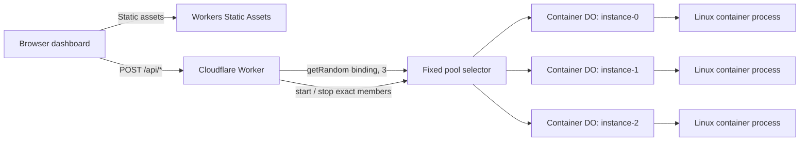

# Workers Containers Warm Pool POC Sprint

## Sprint Metadata

| Field | Value |
| --- | --- |
| Project | `warm-pool-poc` |
| Status | Planned |
| Target duration | 1-2 engineering days |
| Pool size | 3 containers |
| Instance type | `lite` |
| Primary outcome | Repeatable cold-versus-warm demonstration |
| Documentation baseline | Cloudflare docs and package source verified 2026-08-20 |

## Objective

Build the smallest useful repository that demonstrates an application-managed warm pool using Cloudflare Workers Containers.

The POC must visibly prove that:

1. A fixed set of container instances can be started before work arrives.
2. Requests can be randomly distributed across that fixed set.
3. Warm requests reuse already-running container processes.
4. Prewarming moves startup cost out of the user-facing job path.
5. The pool can be stopped and restarted so the demonstration is repeatable.

This repository demonstrates a pattern, not a managed Cloudflare warm-pool or autoscaling feature.

## Product Statement

Use this wording in the UI, README, and live demonstration:

> Cloudflare Containers does not currently provide managed stateless autoscaling or a managed warm-pool mode. This POC implements a fixed warm pool in application code, prewarms its members, and routes work across them.

## Sprint Scope

### Included

- One Worker with a Container-enabled Durable Object class.
- Three fixed `lite` container instances.
- Deterministic, parallel prewarming of all three members.
- Random routing of jobs with `getRandom(binding, 3)`.
- Explicit stop/reset control for repeatable demonstrations.
- A dependency-free Node.js container application.
- A transparent three-second synthetic initialization delay.
- A transparent 500 ms simulated job.
- A small responsive browser dashboard.
- Structured Worker and container logs.
- Local Docker-based development.
- A deployed `workers.dev` demonstration.
- An automated smoke-test script.
- A README with setup, architecture, limitations, and demo instructions.

### Excluded

- R2 input or output.
- Cloudflare Queues, retries, or a dead-letter queue.
- Durable job-state tracking.
- Cron Triggers or Durable Object alarms.
- Dynamic pool sizing or autoscaling.
- A real ML model or video-processing workload.
- Throughput, bandwidth, or cost benchmarking.
- Placement controls or multi-region orchestration.
- Production authentication and authorization.
- Production availability guarantees.

## Success Criteria

| ID | Requirement | Evidence | Pass condition |
| --- | --- | --- | --- |
| SC-01 | Pool size is fixed | Wrangler config and logs | No more than three running instances |
| SC-02 | Prewarm covers the whole pool | `/api/pool/prewarm` response | Three unique boot IDs are returned |
| SC-03 | Prewarm is parallel | Prewarm timing | Startup is approximately one startup interval, not three serialized intervals |
| SC-04 | Cold path is visible | First job after stop | End-to-end latency includes at least the three-second synthetic delay |
| SC-05 | Warm path is visible | Jobs after prewarm | Normal processing is approximately 500 ms plus network overhead |
| SC-06 | Processes are reused | Dashboard results | Boot IDs and start times remain unchanged across warm jobs |
| SC-07 | Warm hold is visible | Repeat after 60 seconds | The same boot IDs are returned without startup delay |
| SC-08 | Restart is visible | Stop, then run again | New boot ID appears after restart |
| SC-09 | Work is distributed | Multi-job dashboard run | Responses come from members of the prewarmed pool |
| SC-10 | Demo is repeatable | Smoke script | Stop, cold, prewarm, warm, and cleanup sequence passes |
| SC-11 | Deployment is usable | Public URL | Dashboard and APIs work on the deployed Worker |
| SC-12 | Claims are accurate | UI and README review | Synthetic delay is not described as native platform cold-start time |

## Architecture



### Request Paths

```text
Prewarm:
Dashboard -> Worker -> instance-0, instance-1, instance-2 in parallel
                     -> startAndWaitForPorts()
                     -> GET /health on each process

Work:
Dashboard -> Worker -> getRandom(WARM_POOL, 3)
                     -> selected Durable Object
                     -> selected running container
                     -> POST /work

Reset:
Dashboard -> Worker -> instance-0, instance-1, instance-2 in parallel
                     -> stop()
```

## Locked Technical Decisions

### Pool Configuration

| Setting | Value | Reason |
| --- | --- | --- |
| Pool size | `3` | Large enough to show distribution, small enough for a light POC |
| Instance type | `lite` | Lowest-cost option suitable for a synthetic workload |
| `max_instances` | `3` | Prevents the demonstration from exceeding the intended pool |
| `defaultPort` | `8080` | Conventional application port |
| `sleepAfter` | `10m` | Keeps the pool warm during the demo without a scheduled keep-alive |
| `enableInternet` | `false` | The phase-one container requires no outbound Internet access |
| Startup delay | `3000 ms` | Makes expensive initialization visible and repeatable |
| Job duration | `500 ms` | Makes warm processing visible without slowing the demo excessively |

### Pool Member Naming

The pinned `@cloudflare/containers` helper currently implements `getRandom(binding, N)` by selecting one of these names:

```text
instance-0
instance-1
...
instance-(N-1)
```

The deterministic prewarm and stop operations must address those same names with `getContainer()`.

Required safeguards:

- Pin `@cloudflare/containers` to an exact version.
- Define the `POOL_SIZE` and member-name generation in one Worker module.
- Add an integration smoke test proving that all job boot IDs belong to the prewarmed set.
- Revalidate the helper source before upgrading the package.
- Do not silently upgrade this dependency.

If the helper's naming contract changes, replace both operations with a shared explicit selector rather than retaining mismatched routing.

### Synthetic Startup Delay

The container waits three seconds before opening port `8080`. This represents application initialization such as loading a model or building an in-memory index.

The dashboard must label this as `simulated application initialization`. The result must not be presented as a benchmark of Cloudflare's native container startup time.

### Warm Definition

For this POC, an instance is considered warm when:

- Its process is running.
- Port `8080` is ready.
- `/health` returns a boot ID.
- A subsequent job returns the same boot ID without the startup delay.

There is no separate persistent job-state store in this sprint.

## Planned Repository Layout

```text
warm-pool-poc/
├── container/
│   └── server.mjs
├── public/
│   ├── app.js
│   ├── index.html
│   └── styles.css
├── scripts/
│   └── smoke.mjs
├── src/
│   └── index.ts
├── Dockerfile
├── package-lock.json
├── package.json
├── README.md
├── sprint.md
├── tsconfig.json
├── worker-configuration.d.ts
└── wrangler.jsonc
```

## Configuration Plan

`wrangler.jsonc` will define:

- Worker name `warm-pool-poc`.
- Entry point `src/index.ts`.
- Compatibility date matching the implementation date.
- One container class named `DemoContainer`.
- Image path `./Dockerfile`.
- Instance type `lite`.
- Maximum concurrent instances `3`.
- Durable Object binding named `WARM_POOL`.
- A SQLite-backed Durable Object migration.
- Static assets from `./public`.
- Worker-first routing for `/api/*`.
- Observability enabled.

The Worker class will define:

- `defaultPort = 8080`.
- `sleepAfter = "10m"`.
- `enableInternet = false`.

## API Contract

All API responses use JSON and include `Cache-Control: no-store`.

### `GET /api/health`

Purpose: Prove that the Worker is reachable without starting a container.

Expected response:

```json
{
  "ok": true,
  "service": "warm-pool-poc",
  "poolSize": 3,
  "timestamp": "2026-08-20T00:00:00.000Z"
}
```

Acceptance:

- Returns `200`.
- Does not contact the container binding.

### `POST /api/pool/prewarm`

Purpose: Start every fixed pool member and wait until all members are ready.

Behavior:

1. Build stubs for `instance-0`, `instance-1`, and `instance-2`.
2. Start all three concurrently with `Promise.allSettled()`.
3. Use `startAndWaitForPorts()` for readiness.
4. Fetch `/health` from every successfully started member.
5. Return per-member timing, identity, and error information.
6. Return a non-success status if any member fails.

Expected response shape:

```json
{
  "ok": true,
  "poolSize": 3,
  "totalMs": 3421,
  "members": [
    {
      "name": "instance-0",
      "ok": true,
      "startupMs": 3310,
      "instanceId": "container-hostname",
      "bootId": "uuid",
      "startedAt": "2026-08-20T00:00:00.000Z"
    }
  ]
}
```

Acceptance:

- Returns three member records.
- Successful response has three unique boot IDs.
- Already-warm calls complete without another synthetic startup delay.
- Partial failures identify the failed member instead of hiding the result.

### `POST /api/pool/stop`

Purpose: Stop every pool member so cold behavior can be demonstrated again.

Behavior:

1. Build the same three deterministic member stubs.
2. Call `stop()` concurrently.
3. Wait for all stop operations to settle.
4. Return per-member status.

Expected response shape:

```json
{
  "ok": true,
  "totalMs": 420,
  "members": [
    {
      "name": "instance-0",
      "ok": true
    }
  ]
}
```

Acceptance:

- Calling stop multiple times is safe for the demo workflow.
- The next job starts a new process and returns a new boot ID.

### `POST /api/jobs`

Purpose: Simulate one stateless job routed to the fixed pool.

Request body:

```json
{
  "jobId": "optional-client-generated-id"
}
```

Behavior:

1. Generate a job ID when one is not supplied.
2. Select a member with `getRandom(env.WARM_POOL, POOL_SIZE)`.
3. Forward a normalized `POST /work` request to the selected container.
4. Measure Worker-side elapsed time.
5. Return the container metadata plus the job ID and total timing.

Expected response shape:

```json
{
  "ok": true,
  "jobId": "job-123",
  "instanceId": "container-hostname",
  "bootId": "uuid",
  "startedAt": "2026-08-20T00:00:00.000Z",
  "requestCount": 4,
  "processingMs": 501,
  "workerElapsedMs": 527
}
```

Acceptance:

- Only `POST` is accepted.
- Invalid JSON receives `400`.
- Container failures produce a structured `502` response.
- Worker errors do not expose stack traces to the browser.

### Unknown Routes

Acceptance:

- Unknown `/api/*` routes return structured JSON `404` responses.
- Non-API paths are handled by Workers Static Assets.

## Container Application Contract

The container will use the Node.js standard library only.

### Startup

- Read `STARTUP_DELAY_MS`, defaulting to `3000`.
- Generate one process-level UUID as `bootId`.
- Record one process-level ISO timestamp as `startedAt`.
- Read the operating-system hostname as `instanceId`.
- Wait for the configured initialization delay.
- Start an HTTP server on `0.0.0.0:8080`.
- Log a structured `container.ready` event.

### `GET /health`

- Return `200` JSON.
- Return identity and boot metadata.
- Do not apply the 500 ms job delay.
- Do not increment the work-request counter.

### `POST /work`

- Reject unsupported methods.
- Read a small JSON body.
- Wait for `WORK_DELAY_MS`, defaulting to `500`.
- Increment the process-level request counter.
- Return identity, timing, job ID, and request count.
- Support concurrent requests without blocking the Node.js event loop.

### Shutdown

- Handle `SIGTERM` and `SIGINT`.
- Stop accepting new requests.
- Close the HTTP server cleanly.
- Log a structured `container.stopping` event.
- Exit after active requests finish or a short safety timeout expires.

### Docker Image

- Use a small official Node.js image.
- Build for `linux/amd64`.
- Copy only the container application.
- Set production environment defaults.
- Expose port `8080` for local development.
- Run as a non-root user when supported by the selected base image.
- Avoid package installation because the server has no external dependencies.

## Dashboard Requirements

### Controls

| Control | Action |
| --- | --- |
| Stop Pool | Calls `/api/pool/stop` |
| Send One Job | Calls `/api/jobs` once |
| Prewarm Pool | Calls `/api/pool/prewarm` |
| Run 12 Jobs | Calls `/api/jobs` 12 times concurrently |
| Clear Results | Clears browser-only results |

### Presentation

- Show the fixed pool size prominently.
- State that the warm pool is application managed.
- State that the three-second initialization is simulated.
- Show current action and loading state.
- Disable conflicting lifecycle buttons while an action is running.
- Display one result row per job.
- Display client-observed latency.
- Display instance ID, shortened boot ID, start time, and request count.
- Group job counts by boot ID.
- Show cold and warm summary timings.
- Clearly display API errors.
- Work on desktop and mobile.
- Use semantic HTML and keyboard-accessible controls.
- Use no frontend framework and no charting dependency.

### Browser State

- Keep results in memory only.
- Do not use D1, KV, Durable Object storage, or browser persistence.
- Clear stale results on page reload.

## Observability Plan

### Worker Events

Log structured objects with these event names:

```text
pool.prewarm.started
pool.prewarm.member.ready
pool.prewarm.member.failed
pool.prewarm.completed
pool.stop.started
pool.stop.member.completed
pool.stop.completed
job.started
job.completed
job.failed
```

Include these fields where applicable:

- `event`
- `jobId`
- `poolSize`
- `memberName`
- `bootId`
- `elapsedMs`
- `status`
- `errorName`

### Container Events

Log these structured events to stdout:

```text
container.initializing
container.ready
container.work.started
container.work.completed
container.stopping
```

### Logging Rules

- Do not log request bodies beyond the job ID.
- Do not log secrets or authorization headers.
- Keep one start and one completion event per action.
- Enable Wrangler observability so Worker, Durable Object, and container logs are visible in the dashboard.

## Work Breakdown

### WP-00: Confirm Prerequisites

Estimate: 30 minutes

Tasks:

- [ ] Confirm Node.js and npm are installed.
- [ ] Confirm Docker Desktop or another Docker-compatible engine is running.
- [ ] Confirm Wrangler authentication with the intended Cloudflare account.
- [ ] Confirm the account can deploy Workers Containers.
- [ ] Confirm a `workers.dev` route is available.
- [ ] Confirm the deployed POC may run three `lite` instances.

Exit gate:

- [ ] A trivial local Docker command succeeds.
- [ ] Wrangler can identify the authenticated account.

### WP-01: Scaffold the Repository

Estimate: 60 minutes

Tasks:

- [ ] Initialize the npm project.
- [ ] Add TypeScript and Wrangler development dependencies.
- [ ] Pin `@cloudflare/containers` to an exact version.
- [ ] Add `dev`, `typecheck`, `smoke`, `deploy`, and `tail` scripts.
- [ ] Create the planned directory structure.
- [ ] Add strict TypeScript configuration.
- [ ] Generate Worker binding types.
- [ ] Add a focused `.gitignore`.
- [ ] Configure Worker static assets.
- [ ] Configure observability.

Exit gate:

- [ ] `npm install` succeeds.
- [ ] `npm run typecheck` succeeds with an empty Worker scaffold.
- [ ] Wrangler validates the configuration.

### WP-02: Build the Container Application

Estimate: 90 minutes

Tasks:

- [ ] Implement process identity and timestamps.
- [ ] Implement configurable startup delay.
- [ ] Implement `GET /health`.
- [ ] Implement `POST /work`.
- [ ] Implement request counting.
- [ ] Implement structured logs.
- [ ] Implement JSON error responses.
- [ ] Implement graceful signal handling.
- [ ] Create the `linux/amd64` Dockerfile.
- [ ] Run the image directly with Docker.

Exit gate:

- [ ] Port `8080` does not open until the startup delay completes.
- [ ] `/health` returns stable identity for the process lifetime.
- [ ] `/work` returns after approximately 500 ms.
- [ ] Repeated work calls increment `requestCount`.
- [ ] Restarting the image changes `bootId`.
- [ ] `SIGTERM` produces a clean shutdown log.

### WP-03: Implement the Container Class and Worker API

Estimate: 2 hours

Tasks:

- [ ] Export `DemoContainer` from `src/index.ts`.
- [ ] Configure port, sleep timeout, and outbound Internet policy.
- [ ] Define `POOL_SIZE = 3` once.
- [ ] Define deterministic pool-member names once.
- [ ] Implement API routing.
- [ ] Implement the Worker health endpoint.
- [ ] Implement parallel deterministic prewarm.
- [ ] Implement parallel stop/reset.
- [ ] Implement `getRandom` job routing.
- [ ] Normalize the forwarded container request path to `/work`.
- [ ] Add timing and structured error handling.
- [ ] Add no-store response headers.
- [ ] Add structured Worker logs.

Exit gate:

- [ ] All four API routes return their planned response shapes.
- [ ] Prewarm returns exactly three unique boot IDs.
- [ ] Job responses use only boot IDs returned by prewarm.
- [ ] Stop followed by a job returns a new boot ID.

### WP-04: Build the Dashboard

Estimate: 2 hours

Tasks:

- [ ] Create the responsive page shell.
- [ ] Add product-truth and synthetic-delay disclosures.
- [ ] Add the five planned controls.
- [ ] Add action loading and disabled states.
- [ ] Add results and error tables.
- [ ] Add latency summary cards.
- [ ] Add per-instance request counts.
- [ ] Add a cold-versus-warm comparison.
- [ ] Add mobile styling.
- [ ] Verify keyboard navigation and visible focus states.

Exit gate:

- [ ] All lifecycle and job operations can be run without terminal commands.
- [ ] Twelve jobs execute concurrently from the browser.
- [ ] Results clearly show process reuse.
- [ ] Errors do not leave controls permanently disabled.

### WP-05: Add the Smoke Test

Estimate: 90 minutes

Tasks:

- [ ] Accept a base URL as a command-line argument.
- [ ] Check Worker health.
- [ ] Stop the pool.
- [ ] Send one cold job and record its timing.
- [ ] Stop the pool again.
- [ ] Prewarm all three members.
- [ ] Assert three unique prewarmed boot IDs.
- [ ] Send 12 warm jobs concurrently.
- [ ] Assert every job boot ID belongs to the prewarmed set.
- [ ] Assert warm jobs do not report the synthetic startup delay.
- [ ] Stop the pool in a `finally` cleanup path.
- [ ] Print a compact JSON and human-readable summary.

Exit gate:

- [ ] Smoke test exits `0` on success.
- [ ] Smoke test exits non-zero with an actionable message on failure.
- [ ] Cleanup runs after both success and failure.

### WP-06: Verify Locally

Estimate: 60 minutes

Tasks:

- [ ] Run the Worker and container with `npm run dev`.
- [ ] Run the smoke test against `http://localhost:8787`.
- [ ] Execute the dashboard demo sequence.
- [ ] Verify Worker logs.
- [ ] Verify container logs.
- [ ] Test at a narrow mobile viewport.
- [ ] Run type checking again.

Exit gate:

- [ ] The local smoke test passes twice consecutively.
- [ ] The full dashboard sequence is repeatable.
- [ ] No unexpected fourth instance is observed.

### WP-07: Deploy and Verify

Estimate: 60 minutes

Tasks:

- [ ] Deploy with Wrangler.
- [ ] Record the deployed Worker URL.
- [ ] Run the smoke test against the deployed URL.
- [ ] Verify correlated Worker, Durable Object, and container logs.
- [ ] Verify the 60-second warm-hold case.
- [ ] Test the dashboard on desktop and mobile.
- [ ] Stop the pool after verification.

Exit gate:

- [ ] Deployed smoke test passes.
- [ ] The 60-second test returns unchanged boot IDs.
- [ ] The deployed dashboard is ready for the five-minute demonstration.

Note: Container Workers use Durable Objects, so normal Worker preview URLs are not available. Final validation must use local development and an actual deployed Worker.

### WP-08: Document and Hand Off

Estimate: 60 minutes

Tasks:

- [ ] Document prerequisites.
- [ ] Document local development.
- [ ] Document deployment.
- [ ] Add the architecture diagram.
- [ ] Add the exact demo runbook.
- [ ] Add expected response examples.
- [ ] Add cleanup instructions.
- [ ] Add troubleshooting guidance.
- [ ] Add the phase-two backlog.
- [ ] State all non-goals and accuracy caveats.

Exit gate:

- [ ] A new user can deploy the POC by following only the README.
- [ ] A presenter can run the demo by following only the demo section.
- [ ] No documentation calls the pattern managed autoscaling or a managed warm-pool feature.

## Verification Matrix

| Test | Setup | Action | Expected result |
| --- | --- | --- | --- |
| Worker health | None | `GET /api/health` | `200`, pool size `3`, no container startup |
| Cold job | Pool stopped | `POST /api/jobs` | New boot ID and visible startup delay |
| Parallel prewarm | Pool stopped | `POST /api/pool/prewarm` | Three unique boot IDs, all ready |
| Idempotent prewarm | Pool warm | Prewarm again | Same boot IDs and no initialization delay |
| Warm job | Pool warm | One job | Same boot ID set, approximately 500 ms work |
| Warm burst | Pool warm | 12 concurrent jobs | All succeed and use the prewarmed set |
| Warm hold | Pool warm | Wait 60 seconds, then send jobs | Same boot IDs remain |
| Stop | Pool warm | `POST /api/pool/stop` | All three stop operations settle |
| Restart | Pool stopped | Prewarm again | Three new boot IDs |
| Invalid JSON | Any | Send malformed job body | Structured `400` response |
| Wrong method | Any | `GET /api/jobs` | Structured `405` response |
| Unknown API | Any | Request unknown `/api/*` | Structured `404` response |
| Static dashboard | Any | `GET /` | Dashboard loads without starting a container |
| Cleanup | Pool warm | Run smoke cleanup | Pool is stopped |

## Latency Interpretation

The POC will report observed timings but avoid brittle performance promises.

Expected pattern:

| Measurement | Expected observation |
| --- | --- |
| Cold job | At least 3000 ms synthetic initialization plus platform and network time |
| Cold parallel prewarm | Approximately one parallel startup window plus platform overhead |
| Warm job processing | Approximately 500 ms inside the demo application |
| Warm end-to-end job | Approximately 500 ms plus Worker, Durable Object, container, and network overhead |

Passing the sprint depends on a clear relative cold-versus-warm difference, not an exact Cloudflare platform latency number.

## Demo Runbook

### Pre-Demo

- [ ] Open the deployed dashboard.
- [ ] Confirm `/api/health` is healthy.
- [ ] Run the deployed smoke test.
- [ ] Stop the pool.
- [ ] Clear dashboard results.
- [ ] Optionally open live logs in a second window.

### Live Sequence

1. Explain that this is an application-managed fixed pool of three containers.
2. Point out the disclosed three-second simulated initialization cost.
3. Click **Stop Pool** to establish a known state.
4. Click **Send One Job**.
5. Show that the user-facing cold job pays initialization plus processing time.
6. Click **Stop Pool** again.
7. Click **Prewarm Pool**.
8. Show three unique boot IDs and parallel startup timing.
9. Click **Run 12 Jobs**.
10. Show lower latency, reused boot IDs, and increasing request counts.
11. Wait 60 seconds while discussing the architecture.
12. Click **Run 12 Jobs** again.
13. Show that the same processes remained warm.
14. Click **Stop Pool** after the demonstration.

### Talk Track

> The application explicitly starts three known container instances before work arrives. Once ready, normal jobs use `getRandom` to route across that fixed set. The first initialization cost is moved into the prewarm operation, so the jobs themselves reuse running processes. The ten-minute idle timeout keeps them available across a batch gap. This is an application pattern, not managed autoscaling.

### Recovery

| Symptom | Recovery |
| --- | --- |
| Pool expired before the demo | Run **Prewarm Pool** again |
| Only part of prewarm succeeds | Stop the pool, retry prewarm, inspect member error |
| Job returns a new boot ID unexpectedly | Explain host lifecycle is not guaranteed, then prewarm again |
| Random sample looks uneven | Increase the job sample; do not claim strict round-robin behavior |
| Deployed API fails | Use local demo as fallback and inspect correlated logs |
| Dashboard state is confusing | Click **Clear Results**, stop, and restart the sequence |

## Risks and Mitigations

| Risk | Impact | Mitigation |
| --- | --- | --- |
| `getRandom` member naming changes | Prewarm and work target different sets | Pin dependency and enforce boot-ID integration test |
| Random routing appears uneven in 12 jobs | Audience may expect round robin | Describe routing as random and use a larger sample if needed |
| Synthetic delay is mistaken for native cold start | Misleading performance claim | Label it in UI, README, API description, and talk track |
| Pool expires during presentation | Warm jobs become cold | Use a ten-minute timeout and prewarm immediately before demo |
| Platform restarts a running instance | Boot ID changes | Treat warm availability as a pattern, not an uptime guarantee |
| Apple Silicon image mismatch | Deployment build fails | Build and test explicitly for `linux/amd64` |
| Public lifecycle endpoints are abused | Unwanted starts, stops, or cost | Use a temporary deployment; add Access or a demo token before broad sharing |
| Local behavior differs from production | Demo surprises after deployment | Run the same smoke test locally and against the deployed URL |
| Preview URL is expected | Test URL is unavailable | Use local development and a real deployment because Containers use Durable Objects |
| Stop/start operations overlap | Intermittent lifecycle errors | Disable conflicting UI actions and await all lifecycle operations |
| One member fails to start | Pool is partially warm | Return per-member results and fail the prewarm operation clearly |

## Security and Cost Guardrails

- Keep `max_instances` at `3`.
- Disable outbound Internet access in the phase-one container.
- Do not include account IDs, tokens, or secrets in source control.
- Stop the pool at the end of smoke tests and demonstrations.
- Avoid exposing the POC broadly without Cloudflare Access or a demo token.
- Keep request bodies small and reject malformed payloads.
- Return generic error messages to clients and detailed diagnostics only in logs.
- Do not use customer data in the synthetic job payload.

## Definition of Done

- [ ] All sprint exit gates pass.
- [ ] Repository layout matches the planned structure or deviations are documented.
- [ ] Type checking passes.
- [ ] Local smoke test passes twice.
- [ ] Deployed smoke test passes.
- [ ] Prewarm returns three unique boot IDs.
- [ ] Warm jobs reuse the prewarmed boot-ID set.
- [ ] Sixty-second warm-hold test passes.
- [ ] Stop and restart produce new boot IDs.
- [ ] Dashboard works on desktop and mobile.
- [ ] Observability includes Worker, Durable Object, and container events.
- [ ] README supports setup, deployment, demo, cleanup, and troubleshooting.
- [ ] Synthetic initialization is disclosed everywhere it is measured.
- [ ] The pool is stopped after final validation.
- [ ] No R2, Queue, job tracker, or keep-alive scope has leaked into phase one.

## Phase-Two Backlog

These items are intentionally blocked until the phase-one definition of done is complete.

| Priority | Item | Outcome |
| --- | --- | --- |
| P1 | R2 input and output | Process a real object key and write a deterministic result key |
| P1 | Presigned R2 access | Allow the container to read and write without exposing broad credentials |
| P1 | Queue producer and consumer | Decouple submission from dispatch and provide backpressure |
| P1 | Retry and DLQ behavior | Demonstrate failed-job recovery and inspection |
| P2 | Job tracker | Persist queued, running, completed, and failed states |
| P2 | Scheduled keep-alive | Hold the pool through idle windows longer than `sleepAfter` |
| P2 | Real initialization artifact | Replace the synthetic delay with a representative model or data load |
| P2 | Pool-size parameterization | Compare pool sizes such as 1, 3, and 6 |
| P3 | Throughput benchmark | Measure scaling and per-instance ceilings |
| P3 | Cross-cloud output | Measure outbound transfer to the target cloud |
| P3 | Placement investigation | Observe where pool members start and how that affects latency |

## Source References

- Containers overview: <https://developers.cloudflare.com/containers/>
- Containers get started: <https://developers.cloudflare.com/containers/get-started/>
- Container class API: <https://developers.cloudflare.com/containers/container-class/>
- Stateless instances: <https://developers.cloudflare.com/containers/examples/stateless/>
- Scaling and routing: <https://developers.cloudflare.com/containers/platform-details/scaling-and-routing/>
- Local development: <https://developers.cloudflare.com/containers/local-dev/>
- Containers FAQ: <https://developers.cloudflare.com/containers/faq/>
- Wrangler container configuration: <https://developers.cloudflare.com/workers/wrangler/configuration/#containers>
- Workers Static Assets: <https://developers.cloudflare.com/workers/static-assets/>
- Package source: <https://github.com/cloudflare/containers>

## Sprint Start Decision

Implementation can begin when WP-00 prerequisites are confirmed. Work proceeds in order from WP-01 through WP-08, and no phase-two item enters the sprint until the phase-one definition of done is satisfied.
